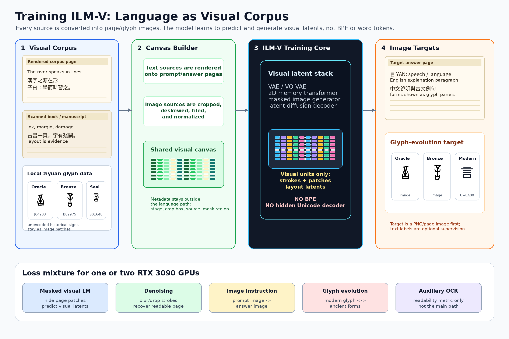
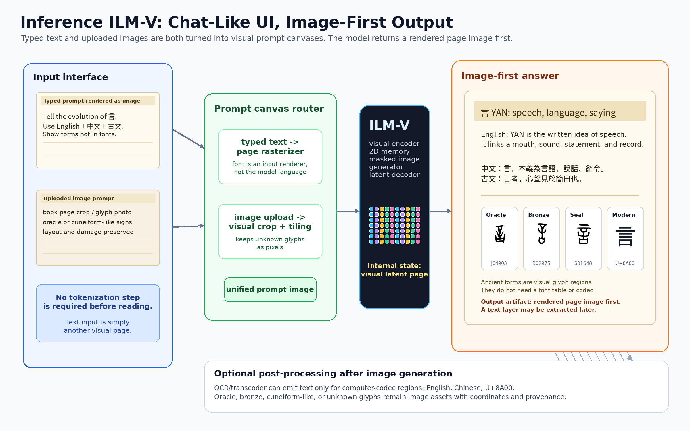

[English](README.md) · [العربية](i18n/README.ar.md) · [Español](i18n/README.es.md) · [Français](i18n/README.fr.md) · [日本語](i18n/README.ja.md) · [한국어](i18n/README.ko.md) · [Tiếng Việt](i18n/README.vi.md) · [中文 (简体)](i18n/README.zh-Hans.md) · [中文（繁體）](i18n/README.zh-Hant.md) · [Deutsch](i18n/README.de.md) · [Русский](i18n/README.ru.md)


[](https://github.com/lachlanchen/lachlanchen/blob/main/figs/banner.png)

# Imagized Language Model (ILM)


*Image-native language modeling concept: a writing image enters ILM-V, the model reasons in visual latent space, and the answer is rendered as an image. The glyph panels use local hanziyuan-derived ziyuan data for the evolution of `言` (YAN, U+8A00).*

## Image-First Training And Inference



Training treats language as a visual corpus. Typed text, scanned pages, book images, and historical glyph data are all converted into page/glyph canvases; the model predicts visual latents and output images rather than text tokens.



Inference keeps the same contract. A chat UI may accept typed text or uploaded images, but typed text is first rendered as an image prompt. The model returns a rendered page image; OCR/transcoding is only a post-process for spans that exist in computer codecs, while historical or unencoded glyphs remain image regions.

ILM is a research codebase exploring **text-as-image generation**: it encodes language into compact, image-like tensors and generates text with diffusion-style iterative refinement. The representation factors sentences into meta-elements (grammar, semantics, tone, emotion) and hierarchical, memory-like codes for words and characters. This unifies ideas from discrete diffusion, superposition/disentanglement, structured embeddings, and glyph-aware character modeling.

> The repository intentionally keeps a practical etymology pipeline and long-horizon ILM experimentation side-by-side.

## 📌 Overview

This repository has two active tracks:

1. Historic Chinese glyph etymology ingestion (scraping/parsing/storage/preview).
2. ILM glyph/image modeling experiments (token glyph rendering, codebooks, frame packing, diffusion/inpainting, evaluation/reporting).

This README also documents both tracks and keeps the etymology workflow as a first-class, reproducible path.

## 🔗 Key Links

| Area | Path |
|---|---|
| Conceptual write-up | `docs/imagized-language-model.md` |
| Code plan and metrics | `docs/ilm-visual-diffusion-code-plan.md` |
| Embedding "color" plan | `docs/embedding-color-plan.md` |
| Development notes/plan | `docs/development-plan.md` |
| Etymology module readme | `ilm/etymology/README.md` |

## ✨ Features

- 🏺 Etymology ingestion from `hanziyuan` and `chineseetymology`-style sources.
- 🌐 Robust AJAX + HTML ingestion path with retries, throttling, and cache.
- 🧩 Stage-labeled glyph extraction including `` and CSS `background-image` data URIs.
- 🗃️ SQLite-backed storage for chars/glyph metadata plus filesystem asset layout.
- 🖥️ Tornado web UI for ad-hoc ingest + gallery preview.
- 🔤 Glyph rendering utilities for multilingual token images.
- 🧠 Product-code style embedding/codebook modules.
- 🧱 Sentence frame packing and diffusion/inpainting training/evaluation scripts.
- 📊 Reporting and visualization scripts for embedding and pipeline inspection.
- 📄 Publication artifacts in LaTeX/PDF under `publication/`.

## 🧱 Project Structure

```text
.
├── README.md
├── AGENTS.md
├── configs/
│   ├── color.yaml
│   └── diffusion.yaml
├── docs/
├── i18n/
├── ilm/
│   ├── code/
│   ├── data/
│   ├── datasets/
│   ├── db/
│   ├── diffusion/
│   ├── encoders/
│   ├── english_tiles/
│   ├── etymology/
│   ├── frames/
│   ├── models/
│   └── utils/
├── scripts/
├── publication/
├── assets/
├── logs/
└── *.ipynb
```

## 🧰 Prerequisites

| Requirement | Notes |
|---|---|
| Python `3.10+` | Core runtime |
| `pip` | Package installation |
| Optional GPU | Helpful for PyTorch CUDA training scripts |
| Optional LaTeX toolchain | Needed for publication builds |

Assumption note: there is currently no single root dependency lock/spec file (`pyproject.toml`, `requirements.txt`, etc.), so dependencies are inferred from imports and script usage.

## ⚙️ Installation

### Minimal (etymology toolkit)

```bash
python -m venv .venv
source .venv/bin/activate
pip install --upgrade pip
pip install requests beautifulsoup4 tornado
```

### Extended (modeling/training workflows)

```bash
python -m venv .venv
source .venv/bin/activate
pip install --upgrade pip
pip install requests beautifulsoup4 tornado pyyaml numpy pillow matplotlib torch
```

If a specific script needs additional packages, install them from the import error shown by that script.

## 🚀 Usage

### Quick Start: Historic Glyph Ingestion (CLI)

1. Hanziyuan (recommended): char-only AJAX flow

```bash
PYTHONPATH=. python scripts/ingest_etymology.py --site hanziyuan --char 中
```

2. ChineseEtymology (direct URL)

```bash
PYTHONPATH=. python scripts/ingest_etymology.py --site chineseetymology --url "https://www.chineseetymology.org/CharacterEtymology.aspx?characterInput=%E4%B8%AD"
```

3. Batch file ingestion (lines can be `char\turl`, `url`, or `char url`)

```bash
PYTHONPATH=. python scripts/ingest_etymology.py --from-file urls.txt
```

### Outputs

| Output Type | Location |
|---|---|
| Files | `data/historic/glyphs/<char>/<stage>/<label>.<ext>` |
| Cache | `data/historic/cache/*.html` |
| DB | `data/historic/etymology.sqlite3` |

### Web Demo (optional)

```bash
PYTHONPATH=. python scripts/serve_etymology.py
```

Open `http://127.0.0.1:8888`, choose site, enter a character (for example `中`).

### Polite Crawling and Site Respect

- The fetcher uses per-host throttling, retries with backoff, and caching.
- Keep delays `>= 0.5s`, avoid bursts, and honor site terms/robots/licensing.
- Do not bypass paywalls or interactive protections.
- If you see `403`/`429`, slow down and retry later.

### Additional ILM Workflows

These scripts exist and are actively part of the repo surface, but they are research workflows and may require prepared local datasets/checkpoints.

1. Data download/prep

```bash
python scripts/download_alpaca.py --outdir data/raw
python scripts/download_corpora.py --out data/raw
python scripts/sample_paragraphs.py --out data/processed/test_100.jsonl
python scripts/build_images_common_freq.py --out data/processed/images_common_freq --size 128 --en 5000 --zh 5000
```

2. Glyph DB lifecycle

```bash
python scripts/glyphdb_init.py --db data/glyphdb/glyphs.sqlite3
python scripts/glyphdb_ingest_index.py --db data/glyphdb/glyphs.sqlite3 --index data/processed/images_common_freq/index.tsv
```

3. Code/color model training

```bash
python scripts/train_color_codes.py --config configs/color.yaml
python scripts/train_codes_from_qa.py --en-json data/raw/alpaca_en.json --zh-json data/raw/alpaca_zh.json --epochs 1
python scripts/train_ilmglyph_codes.py --en data/raw/alpaca_en.json --zh data/raw/alpaca_zh.json --out artifacts/ilm_glyph_train
```

4. Diffusion/inpainting

```bash
python scripts/train_diffusion.py --config configs/diffusion.yaml
python scripts/train_inpaint_frames.py --ckpt-code artifacts/ilm_glyph_train/ckpt_epoch1.pt --out artifacts/inpaint
```

5. Evaluation/reporting

```bash
python scripts/eval_color_codes.py --checkpoint artifacts/color_codes_e1.pt
python scripts/eval_diffusion.py --checkpoint artifacts/diffusion_unet.pt
python scripts/eval_qa_retrieval.py --checkpoint artifacts/color_codes_qa.pt
python scripts/report_ilmglyph_pipeline.py --ckpt artifacts/ilm_glyph_train/ckpt_epoch1.pt --lang en --text "hello world"
```

## 🧩 Configuration

Primary YAML configs:

- `configs/color.yaml`
  - data path: `data/processed/images_common_freq/index.tsv`
  - model/code params: `d_glyph`, `d_code`, `K`, `C`, temperature/anneal
  - optimizer/log settings

- `configs/diffusion.yaml`
  - input JSONL: `data/processed/test_100.jsonl`
  - frame/grid + model size settings
  - train mask ratio range and checkpoint settings

Override settings via CLI flags where supported (`--epochs`, `--batch-size`, `--lr`, etc.).

## 🧪 Examples

- Build a single English tile glyph:

```bash
python scripts/build_english_tile_glyph.py "language" artifacts/language_tile --save-tensor
```

- Run inpainting demo with trained checkpoints:

```bash
python scripts/inpaint_demo.py \
  --ckpt-code artifacts/ilm_glyph_train/ckpt_epoch1.pt \
  --ckpt-inpaint artifacts/inpaint/ckpt_epoch1.pt \
  --lang en \
  --text "the quick brown fox jumps" \
  --mode infill \
  --out artifacts/inpaint_demo
```

- Bulk ingest common characters from Hanziyuan:

```bash
PYTHONPATH=. python scripts/bulk_ingest_hanziyuan.py --limit 200 --resume
```

## 📝 Development Notes

- This is a research repository with both robust CLIs and exploratory artifacts (including notebooks and prototype scripts).
- Generated large files are intended for `data/` and `artifacts/` (both ignored in `.gitignore`).
- Publication source and PDFs are under `publication/`; helper build script: `scripts/latex_build.sh`.
- Collaboration/process conventions are documented in `AGENTS.md`.

## 🛠️ Troubleshooting

- `ModuleNotFoundError: ilm...`
  - Run scripts from repo root.
  - Use `PYTHONPATH=.` for scripts that expect local package resolution.

- `FileNotFoundError` for data/index/checkpoints
  - Run prerequisite data/build scripts first.
  - Confirm defaults such as `data/processed/images_common_freq/index.tsv` and `data/processed/test_100.jsonl` exist.

- CUDA/device issues
  - Switch to CPU with script flags/config (`device: cpu` or `--device cpu`).

- Missing package errors
  - Install required dependency from the specific script import path (`torch`, `pyyaml`, `Pillow`, etc.).

- HTTP `403` / `429` while scraping
  - Increase `--delay`, retry later, and keep requests polite.

## 🗺️ Roadmap

- Continue maturing the text-as-image ILM training/eval runbooks beyond the etymology-first quick start.
- Improve environment reproducibility (single authoritative dependency spec).
- Expand tests/CI coverage for research scripts and pipeline glue.
- Iterate on hierarchical codebooks, diffusion objectives, and controllability channels.
- Consolidate docs across `docs/`, script help text, and publication artifacts.

For deeper conceptual and staged planning details, see:

- `docs/imagized-language-model.md`
- `docs/ilm-visual-diffusion-code-plan.md`
- `docs/development-plan.md`

## 🤝 Contributing

- Follow `AGENTS.md` for conventions (atomic commits, push after change, no credentials in code).
- Group related edits in focused commits with conventional messages.
- Prefer reproducible script invocations with explicit flags and input paths.
- For scraping-related changes, preserve throttling/cache behavior and site-respect constraints.

## ❤️ Support

| Donate | PayPal | Stripe |
| --- | --- | --- |
| [](https://chat.lazying.art/donate) | [](https://paypal.me/RongzhouChen) | [](https://buy.stripe.com/aFadR8gIaflgfQV6T4fw400) |

## 📄 License

No top-level license file is currently present in this repository.

Assumption note: treat the project as research code with unspecified licensing until a `LICENSE` file is added by maintainers.
