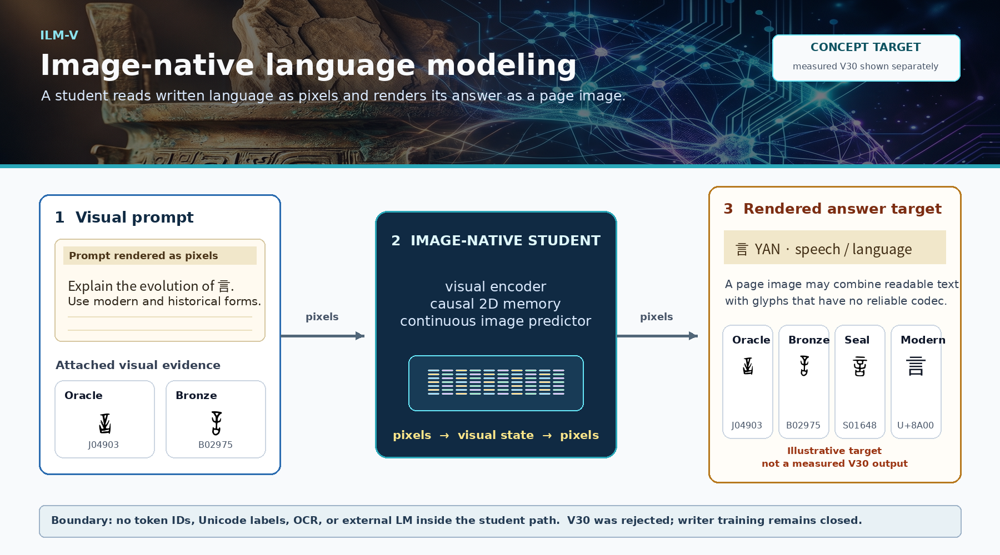

[English](README.md) · [العربية](i18n/README.ar.md) · [Español](i18n/README.es.md) · [Français](i18n/README.fr.md) · [日本語](i18n/README.ja.md) · [한국어](i18n/README.ko.md) · [Tiếng Việt](i18n/README.vi.md) · [中文 (简体)](i18n/README.zh-Hans.md) · [中文（繁體）](i18n/README.zh-Hant.md) · [Deutsch](i18n/README.de.md) · [Русский](i18n/README.ru.md)


[](https://github.com/lachlanchen/lachlanchen/blob/main/figs/banner.png)

# Imagized Language Model (ILM)




*Image-native language modeling concept: a writing image enters ILM-V, the model reasons in visual latent space, and the answer is rendered as an image. The glyph panels use local hanziyuan-derived ziyuan data for the evolution of `言` (YAN, U+8A00).*

## Research North Star: A Visual Word-Origin Book

The concrete product target is an independent image-native model that accepts a
rendered English or Chinese question, or a photographed page, and emits a
readable answer **as a page image**. A word-origin answer should combine modern
English/Chinese explanation with real provenance-linked oracle, bronze, seal,
clerical, traditional, simplified, manuscript, or unencoded forms. OCR may add
a searchable sidecar after inference; the UI may display that text beside the
native answer image, but it is not the model's language channel.

The interface still behaves like a normal prompt box. Typed text is rendered
into a clean prompt band; an optional book page, inscription, or glyph image is
placed beside or below it on the same visual canvas. The model can therefore
answer ordinary typed questions or questions grounded in an attached page
without receiving hidden text metadata.

The deployed student must not call Qwen, an OCR engine, a tokenizer, a Unicode
lookup, or a glyph database to decide its answer. External models and extracted
text may help build and audit an offline curriculum, but every student batch and
checkpoint must pass a boundary receipt showing that its learned path contains
only writing pixels and continuous visual states. The measurable roadmap and
source-book policy are in
[`docs/first-imagized-language-model-goal.md`](docs/first-imagized-language-model-goal.md)
and
[`references/word_origin_ilm_dataset_plan.md`](references/word_origin_ilm_dataset_plan.md).

## Latest Causal Test: V19 Rejected


V19 tested the next proposed correction instead of assuming it worked. A clean
`2,358,977`-parameter global planner was first trained from scratch on a new
salted split. Its weights and the V16 retina were then frozen while a
`764,545`-parameter adapter learned from the retina's continuous `4x4x192`
spatial field. The target image supplied loss only. The student still received
no token IDs, Unicode IDs, OCR, strings, character labels, lookup, codebook, or
external language model.

On a fresh 512-candidate development audit, dense pixel F1 is `0.7278`, but the
correct field beats a shuffled field by only **`0.0088`** and a zero field by
only **`0.0054`**. The prospectively fixed margins were `>0.12` and `>0.03`.
Overall F1 (`0.6710`) and identity top-1 (`72.66%`) also miss their fixed gates.

| V19 development gate | Measured | Required | Result |
|---|---:|---:|:---:|
| Overall pixel F1 | `0.6710` | `>0.68` | fail |
| Dense pixel F1 | `0.7278` | `>0.58` | pass |
| Dense gain over shuffled field | **`+0.0088`** | `>0.12` | fail |
| Dense gain over zero field | **`+0.0054`** | `>0.03` | fail |
| Identity top-1 | `72.66%` | `>75%` | fail |
| Target cosine | `0.8416` | `>0.84` | pass |

The automatic gate is rejected, so human review was not authorized and the
frozen split remains sealed. The result identifies a routing failure: an
optional local residual can polish a complete global writer without making
local topology necessary. V20 will make the retinal field the primary
high-frequency topology path and restrict global state to coarse semantics and
style. See the [full V19 result](docs/spatial-retinal-motor-plan-v19-result.md)
and the
[2026 continuous-sensory decision scan](references/continuous_sensory_language_scan_2026.md).

## Accepted Development Proof: Visual Motor Plan V18


V18 is a real `2,358,977`-parameter deterministic visual motor planner trained
for 1,600 updates on one RTX 4090. It receives a continuous `192`-dimensional
state read from a different-font image plus a separate style image and emits a
`32x32` continuous ink plan. Target pixels provide loss only. The learned path
has no token IDs, Unicode IDs, OCR, strings, character labels, output
vocabulary, glyph lookup, finite visual codebook, candidate classifier, or
external language model.

On a fresh 512-example **development-only** audit, V18 reaches **73.63%** global
visual-identity top-1 versus **0.98%** after shuffling only intended states.
Target cosine is **0.8462** versus `0.0716`; pixel F1 is **0.6577** versus
`0.3129`. Ink occupancy is identical in both branches. Most reviewed simple and
medium forms are recognizable, while dense forms can still merge strokes.

| Fresh development measurement | Correct intent | Shuffled intent | Result |
|---|---:|---:|---|
| Global visual identity top-1 | **73.633%** | 0.977% | strong causal control |
| Target cosine | **0.8462** | 0.0716 | gain `+0.7746` |
| Pixel F1 | **0.6577** | 0.3129 | automatic topology gate passes |
| Human review | simple/medium readable | unrelated forms | dense forms still fail |
| Peak allocated CUDA memory | **0.778 GiB** | - | far below 4090 capacity |

This breaks a categorical claim: structured writing can be learned and emitted
as continuous image topology by a small consumer-GPU model without a token
output table. It does not prove autonomous language generation. V18 is supplied
the intended state, the human gate lacked a prespecified numeric rubric, and
the new frozen bank remains untouched. The full protocol, limitations, and
reproduction receipt is in
[`docs/visual-motor-plan-v18-result.md`](docs/visual-motor-plan-v18-result.md).

## Prior Causal Actuator: V17


V17 is a real `5,729,921`-parameter visual actuator trained for 1,600 updates on
one RTX 4090. It receives a `192`-dimensional state read from a different-font
image of the intended form plus a continuous style image, then generates
`32x32` ink pixels. The target image supplies loss only; its spatial pixels do
not enter the condition. The learned path has no token IDs, Unicode IDs, OCR,
character labels, output vocabulary, visual codebook, candidate classifier,
glyph lookup, or external language model.

On one untouched frozen split of 512 generated examples, V17 obtains **58.59%**
global visual-identity top-1 versus **0.98%** when intended states are shuffled
while style and initial noise remain fixed. Target-state cosine is **0.7130**
versus `0.0861`, a gain of `+0.6269`. The intervention establishes that a small
continuous visual state causally controls generated writing pixels rather than
merely copying style.

| Frozen actuator gate | Correct state | Shuffled state | Result |
|---|---:|---:|---|
| Global visual identity top-1 | **58.594%** | 0.977% | passes causal-control gate |
| Target cosine | **0.7130** | 0.0861 | gain `+0.6269` |
| Pixel F1 | **0.4385** | 0.2800 | **fails required 0.5000** |
| Human readability | rejected | rejected | pseudo-characters remain |
| Peak allocated CUDA memory | **1.588 GiB** | - | fits far below 4090 capacity |

This breaks a categorical claim, not the whole language problem: a consumer GPU
can train a compact non-token visual state to control image generation. V17 is
still rejected as a readable actuator. Its mostly pseudo-character outputs show
that retinal identity can be optimized without preserving exact stroke
topology. It is also an isolated actuator test supplied with the intended state,
not autonomous next-language generation. V16 remains below a symbolic bigram.

V18 implements the correction: it decodes continuous intent into a directly
supervised spatial **visual motor plan** and makes readable writing emerge on
development data. V17 remains the frozen causal-control baseline. Its complete
selection, frozen receipt, limitations, and reproduction command are in
[`docs/visual-state-actuator-v17-result.md`](docs/visual-state-actuator-v17-result.md).

## Language Core: Predictive Visual Field V16


V16 is a real `16,471,809`-parameter image-only causal state model trained on
one RTX 4090. It adds a `6,001,536`-parameter residual multiscale memory, with
dilated local visual fields and global causal attention, to the proven V15
recurrent base. Its learned path receives sequences of `32x32` writing images
and produces continuous next-image states. It has no token IDs, Unicode IDs,
OCR, character labels, output vocabulary, visual codebook, candidate
classifier, or external language model.

On the unchanged frozen 512-form, four-view Chinese benchmark, the selected
continuous proposal obtains **6.264%** top-1 (`112/1,788`), versus **3.971%**
with only the last image, **1.734%** unigram, **0.224%** random dynamics,
**0.195%** chance, and **13.143%** symbolic bigram. Full image history adds
`+0.0773` normalized target log-probability. The parallel stochastic field
obtains **3.691%**, versus **3.244%** last-only, with sampled-state context
cosine gain `+0.0795`.

| Frozen gate | V15 | V16 | Result |
|---|---:|---:|---|
| Proposal full-context top-1 | `5.872%` | **`6.264%`** | +7 correct contexts; directional only |
| Proposal last-image top-1 | `4.418%` | **`3.971%`** | V16 context separation is larger |
| Proposal context log-probability gain | `+0.0707` | **`+0.0773`** | full history helps |
| State-flow full-context top-1 | `3.412%` | **`3.691%`** | beats last-only and unigram |
| Symbolic bigram | `13.143%` | `13.143%` | **not beaten** |
| Peak allocated CUDA memory | `1.181 GiB` | `1.479 GiB` | fits far below 4090 capacity |
| Coupled pixel actuator | absent | absent | isolated V18 planner is readable on development, not yet coupled |

This breaks a narrow but important claim: a small model can learn causal
language signal directly from rendered writing images on a consumer GPU. It
does **not** yet establish general language understanding, readable image
generation, historical question answering, or parity with an LLM. Seven extra
correct frozen contexts are not a statistically established architecture win.
The V16 selection, compute, gate, and limitation receipt is in
[`docs/predictive-visual-field-v16-memory-result.md`](docs/predictive-visual-field-v16-memory-result.md);
the V8-V15 history remains in
[`docs/predictive-visual-field-v15-result.md`](docs/predictive-visual-field-v15-result.md).

## Paradigm: Separate Language From Drawing


RFLM V7 exposed a structural error: one conditional pixel flow was being asked
to discover the next linguistic identity and render its strokes in the same
operation. V14 through V16 now implement the first half of a factorized solution
without relaxing the image-only boundary:

1. A retina learns a continuous manifold directly from writing images.
2. A causal field predicts a low-variance **continuous visual proposal**.
3. A hyperspherical flow models a distribution over alternative next states.
4. A deterministic visual motor planner renders intended topology; V18 makes
   simple and medium held-out forms readable on development data.
5. Optional stochastic flow can refine style only after topology is stable.
6. The retina will reread the rendered pixels and feed them back into the field.

There is no nearest-character lookup or output vocabulary. The continuous state
proof now passes random, last-only, unigram, context-use, and target-signal
gates. It still fails the bigram language gate. V18 passes automatic development
topology gates but is not frozen-promoted because its human rubric was
underspecified and dense forms still fail. V19 then rejects an additive spatial
residual as the repair: correct, shuffled, and zero spatial fields produce
nearly the same output. The autonomous write-reread loop remains withheld until
a topology-necessary local route and the language core pass independently.

The strict student boundary remains:

```text
writing pixels -> continuous visual dynamics -> continuous ink pixels
```

The student receives no strings, token IDs, Unicode IDs, OCR transcript,
character labels, external language model, or discrete visual codebook. Typed
input is supported only by deterministic rasterization before this boundary.
An uploaded page can enter directly as pixels.

### Earlier precursor: Retinal Flow V7


The earlier runnable model is an 11.69M-parameter **Retinal Flow Language
Model**, a concrete
read-predict-write-reread loop:

1. A small convolutional retina reads ordered `32x32` grayscale fixations.
2. A three-layer recurrent visual field integrates the fixation history.
3. A continuous energy function scores arbitrary candidate images; it has no
   character output table.
4. A conditional rectified flow writes the next fixation directly in pixel
   space.
5. The model rereads its generated ink, selects a candidate by visual energy,
   and feeds those pixels back into the recurrent state.

### Measured status, not a capability claim

V7 kept the model at `11,690,244` parameters, added 800 updates on one RTX
4090, and generated `25.3` visual cells per second in its matched run. It added
normalized context advantage against independent image anchors and
backpropagation through sampled flow endpoints. V6 and V7 were tested on the
same 512 common Han characters, four font views, 2,423 eligible held-out
contexts, and frozen bank SHA-256.

| Gate | V6 closed loop | V7 selected step 5,800 | Interpretation |
|---|---:|---:|---|
| Retina oracle top-1 | `98.18%` | `98.27%` | Basic cross-font perception is not the main bottleneck. |
| Full-context top-1 | `1.20%` | **`2.31%`** | V7 beats last-only (`2.02%`) and unigram (`1.86%`), but not bigram (`13.58%`). |
| Normalized context log-probability gain | `-0.9066` | **`-0.2155`** | The calibrated deficit shrank by 76%, but full history still lowers mean target probability. |
| Generated context cosine gain | `+0.0077` | **`+0.0303`** | V7 passes the held-out generated-signal gate. |
| Late/early autonomous ink | `1.168` | `1.050` | Both loops keep nontrivial ink without late occupancy drift. |
| Sparse autonomous cells | `18.75%` | `15.63%` | V7 is denser, but its continuation is still unreadable. |


**Verdict: V7 is rejected as a language model.** It establishes a useful
training correction, not a complete language system. Raw target energy was
positive while normalized target probability was negative, proving that raw
score margins were an invalid acceptance measure. V7 does not prove readable
continuation, historical question answering, efficiency over a text LLM, or
Qwen-8B parity. The result motivates the Predictive Visual Field separation
shown above.

## Audit The V19 Spatial Test

Reproduce the fresh V19 development audit. The evaluator verifies the clean
global-baseline hash and cannot access the sealed frozen split:

```bash
CUDA_VISIBLE_DEVICES=0 PYTHONPATH=. python scripts/eval_spatial_motor_plan_development.py \
  --checkpoint artifacts/spatial_motor_plan_v19_pilot/checkpoint_latest.pt \
  --out artifacts/spatial_motor_plan_v19_step1600_development_audit \
  --samples 128 --batch-size 32 --num-workers 8 \
  --sample-count 32 --sample-columns 8 --device cuda --precision bf16
```

The fixed protocol, full training commands, hashes, and failed gate are in
[`docs/spatial-retinal-motor-plan-v19-result.md`](docs/spatial-retinal-motor-plan-v19-result.md).

## Run The Visual Motor Plan

Audit the selected V18 checkpoint on fresh development renderings. This command
cannot access the sealed frozen split:

```bash
CUDA_VISIBLE_DEVICES=0 PYTHONPATH=. python scripts/eval_visual_motor_plan_development.py \
  --checkpoint artifacts/visual_motor_plan_v18_pilot/checkpoint_selected_development.pt \
  --out artifacts/visual_motor_plan_v18_step1400_development_audit_v2 \
  --samples 128 --batch-size 32 --num-workers 8 \
  --sample-count 32 --sample-columns 8 --device cuda --precision bf16
```

The evaluator refuses to overwrite an existing receipt. Full training settings
and the sealed-development decision are in
[`docs/visual-motor-plan-v18-result.md`](docs/visual-motor-plan-v18-result.md).

## Run The V17 Baseline

Evaluate the selected V17 checkpoint once on its frozen record split:

```bash
CUDA_VISIBLE_DEVICES=0 PYTHONPATH=. python scripts/eval_visual_state_actuator.py \
  --checkpoint artifacts/visual_state_actuator_v17_pilot/checkpoint_step_0001600.pt \
  --out artifacts/visual_state_actuator_v17_frozen_eval \
  --samples 128 --batch-size 32 --num-workers 8 \
  --sample-count 12 --device cuda --precision bf16
```

The evaluator refuses to overwrite an existing frozen receipt. Full training
settings and the rejected readability audit are in
[`docs/visual-state-actuator-v17-result.md`](docs/visual-state-actuator-v17-result.md).

## Run The Predictive Visual Field

Evaluate a trained PVF checkpoint on the fixed image bank:

```bash
CUDA_VISIBLE_DEVICES=0 PYTHONPATH=. python scripts/eval_predictive_visual_field.py \
  --checkpoint artifacts/predictive_visual_field_v16_memory_pilot/checkpoint_step_0002200.pt \
  --out artifacts/predictive_visual_field_v16_step2200_eval \
  --device cuda \
  --precision bf16
```

The implementation, exact V16 continuation settings, checkpoint-selection rule,
and metric definitions are recorded in
[`docs/predictive-visual-field-v16-memory-result.md`](docs/predictive-visual-field-v16-memory-result.md).
Training and evaluation artifacts remain git-ignored.

## Run The Retinal Precursor

Build the provenance-bearing public-domain Chinese manifest:

```bash
PYTHONPATH=. python scripts/build_visual_grammar_manifest.py \
  --wikisource-root ../Books/resources/curated-books/chinese-classics/public-domain-canon \
  --out data/visual_grammar/chinese_wikisource_public_domain.jsonl
```

Train the current combined RFLM objective from scratch on one 24 GiB GPU:

```bash
CUDA_VISIBLE_DEVICES=0 PYTHONPATH=. python scripts/train_retinal_flow_lm.py \
  --manifest data/visual_grammar/chinese_wikisource_public_domain.jsonl \
  --out artifacts/retinal_flow_chinese_anchor_identity \
  --sequence-length 48 \
  --energy-positions-per-sequence 8 \
  --batch-size 32 \
  --maximum-steps 6000 \
  --context-anchor-bank-size 512 \
  --context-anchor-views 4 \
  --context-advantage-weight 0.5 \
  --context-advantage-margin 0.5 \
  --sampled-identity-weight 0.2 \
  --sampled-identity-steps 2 \
  --rollout-start-step 800 \
  --rollout-ramp-steps 400 \
  --rollout-batch-size 8 \
  --rollout-steps 2 \
  --rollout-candidates 2 \
  --rollout-sample-steps 2 \
  --precision bf16
```

The exact measured V7 continuation command, frozen-bank receipt, and autonomous
comparison are recorded in
[`docs/retinal-flow-v7-anchor-identity-result.md`](docs/retinal-flow-v7-anchor-identity-result.md).

Run the strict fixed-bank evaluation:

```bash
CUDA_VISIBLE_DEVICES=0 PYTHONPATH=. python scripts/eval_retinal_flow_lm.py \
  --checkpoint artifacts/retinal_flow_chinese_anchor_identity/checkpoint_latest.pt \
  --bank-size 512 \
  --prototype-views 4 \
  --evaluation-samples 3000 \
  --generation-contexts 192 \
  --out artifacts/retinal_flow_chinese_anchor_identity/fixed_glyph_bank
```

Generate an autonomous image continuation from typed or image input:

```bash
CUDA_VISIBLE_DEVICES=0 PYTHONPATH=. python scripts/infer_retinal_flow_lm.py \
  --checkpoint artifacts/retinal_flow_chinese_anchor_identity/checkpoint_latest.pt \
  --text '天地玄黃，宇宙洪荒。日月盈昃，辰宿列張。' \
  --new-cells 32 \
  --candidate-samples 8 \
  --out artifacts/retinal_flow_chinese_anchor_identity/autonomous_demo
```

The primary inference artifact is `complete_page.png`; `receipt.json` records
the model boundary, parameter count, throughput, VRAM, font hashes, every
candidate-selection step, and early/late autonomous trajectory summaries.
Generated checkpoints and data remain git-ignored.

The earlier whole-page U-Net, latent diffusion, associative-memory, and causal
InkStream implementations remain as baselines. They are not the current model.

ILM is a research codebase for **language learned and generated as visible
writing**. Its current experiment predicts continuous retinal states with a
causal proposal and hyperspherical flow, then tests visual actuation separately.
V18 writes recognizable development forms through a deterministic spatial motor
plan. V19 shows that simply adding local retinal features as a residual does not
make those features causally responsible for topology. The next experiment is a
field-primary motor route, deliberately kept separate from the still-sub-bigram
language core. Older structured embeddings, codebooks, and page diffusion
experiments remain available as falsified or comparative baselines; they do not
define the current model boundary.

> The repository intentionally keeps a practical etymology pipeline and long-horizon ILM experimentation side-by-side.

## 📌 Overview

This repository has three connected tracks:

1. Retinal-flow image-native language modeling and strict held-out evaluation.
2. Historic Chinese glyph etymology ingestion and provenance-preserving assets.
3. Earlier glyph, codebook, diffusion, folio, and InkStream baselines retained
   for reproducibility.

This README documents all three tracks and keeps the etymology workflow as a first-class, reproducible path.

## 🔗 Key Links

| Area | Path |
|---|---|
| Conceptual write-up | `docs/imagized-language-model.md` |
| Current engineering goal | `docs/first-imagized-language-model-goal.md` |
| V19 spatial causal-test result | `docs/spatial-retinal-motor-plan-v19-result.md` |
| 2026 continuous-sensory research scan | `references/continuous_sensory_language_scan_2026.md` |
| V18 visual motor-plan result | `docs/visual-motor-plan-v18-result.md` |
| V17 causal actuator result | `docs/visual-state-actuator-v17-result.md` |
| V16 predictive visual-field result | `docs/predictive-visual-field-v16-memory-result.md` |
| V7 anchor-identity experiment | `docs/retinal-flow-v7-anchor-identity-result.md` |
| Closed-loop V6 experiment | `docs/retinal-flow-v6-closed-loop-result.md` |
| Research dossier and evidence | `references/image-native-language-model-research.md` |
| Archived diffusion plan | `docs/ilm-visual-diffusion-code-plan.md` |
| Archived embedding "color" plan | `docs/embedding-color-plan.md` |
| Historical development plan | `docs/development-plan.md` |
| Etymology module readme | `ilm/etymology/README.md` |

## ✨ Features

- 🏺 Etymology ingestion from `hanziyuan` and `chineseetymology`-style sources.
- 👁️ Continuous foveal retina with recurrent visual context and cross-font invariance.
- ✒️ Deterministic continuous visual motor plan for directly supervised stroke topology.
- 🖋️ Conditional pixel-space rectified-flow writer with a differentiable write-read cycle.
- 🔁 Autonomous image-only inference with candidate rereading, energy reranking, and pixel feedback.
- 🧭 Training on exact model-induced visual rollouts with state alignment, next-image energy, and recovery flow.
- 🧪 Fixed 512-character visual-bank evaluation against random, unigram, and bigram baselines.
- 🌐 Robust AJAX + HTML ingestion path with retries, throttling, and cache.
- 🧩 Stage-labeled glyph extraction including `` and CSS `background-image` data URIs.
- 🗃️ SQLite-backed storage for chars/glyph metadata plus filesystem asset layout.
- 🖥️ Tornado web UI for ad-hoc ingest + gallery preview.
- 🔤 Glyph rendering utilities for multilingual token images.
- 🧠 Product-code style embedding/codebook modules.
- 🧱 Sentence frame packing and diffusion/inpainting training/evaluation scripts.
- 📊 Reporting and visualization scripts for embedding and pipeline inspection.
- 📄 Publication artifacts in LaTeX/PDF under `publication/`.

## 🧱 Project Structure

```text
.
├── README.md
├── AGENTS.md
├── configs/
│   ├── color.yaml
│   └── diffusion.yaml
├── docs/
├── i18n/
├── ilm/
│   ├── code/
│   ├── data/
│   ├── datasets/
│   ├── db/
│   ├── diffusion/
│   ├── encoders/
│   ├── english_tiles/
│   ├── etymology/
│   ├── frames/
│   ├── models/
│   ├── visual_lm/
│   └── utils/
├── scripts/
├── publication/
├── assets/
├── logs/
└── *.ipynb
```

## 🧰 Prerequisites

| Requirement | Notes |
|---|---|
| Python `3.10+` | Core runtime |
| `pip` | Package installation |
| Optional GPU | Helpful for PyTorch CUDA training scripts |
| Optional LaTeX toolchain | Needed for publication builds |

Assumption note: there is currently no single root dependency lock/spec file (`pyproject.toml`, `requirements.txt`, etc.), so dependencies are inferred from imports and script usage.

## ⚙️ Installation

### Minimal (etymology toolkit)

```bash
python -m venv .venv
source .venv/bin/activate
pip install --upgrade pip
pip install requests beautifulsoup4 tornado
```

### Extended (modeling/training workflows)

```bash
python -m venv .venv
source .venv/bin/activate
pip install --upgrade pip
pip install requests beautifulsoup4 tornado pyyaml numpy pillow matplotlib torch fonttools
```

If a specific script needs additional packages, install them from the import error shown by that script.

## 🚀 Usage

### Quick Start: Historic Glyph Ingestion (CLI)

1. Hanziyuan (recommended): char-only AJAX flow

```bash
PYTHONPATH=. python scripts/ingest_etymology.py --site hanziyuan --char 中
```

2. ChineseEtymology (direct URL)

```bash
PYTHONPATH=. python scripts/ingest_etymology.py --site chineseetymology --url "https://www.chineseetymology.org/CharacterEtymology.aspx?characterInput=%E4%B8%AD"
```

3. Batch file ingestion (lines can be `char\turl`, `url`, or `char url`)

```bash
PYTHONPATH=. python scripts/ingest_etymology.py --from-file urls.txt
```

### Outputs

| Output Type | Location |
|---|---|
| Files | `data/historic/glyphs/<char>/<stage>/<label>.<ext>` |
| Cache | `data/historic/cache/*.html` |
| DB | `data/historic/etymology.sqlite3` |

### Web Demo (optional)

```bash
PYTHONPATH=. python scripts/serve_etymology.py
```

Open `http://127.0.0.1:8888`, choose site, enter a character (for example `中`).

### Polite Crawling and Site Respect

- The fetcher uses per-host throttling, retries with backoff, and caching.
- Keep delays `>= 0.5s`, avoid bursts, and honor site terms/robots/licensing.
- Do not bypass paywalls or interactive protections.
- If you see `403`/`429`, slow down and retry later.

### Additional ILM Workflows

These scripts exist and are actively part of the repo surface, but they are research workflows and may require prepared local datasets/checkpoints.

1. Data download/prep

```bash
python scripts/download_alpaca.py --outdir data/raw
python scripts/download_corpora.py --out data/raw
python scripts/sample_paragraphs.py --out data/processed/test_100.jsonl
python scripts/build_images_common_freq.py --out data/processed/images_common_freq --size 128 --en 5000 --zh 5000
```

2. Glyph DB lifecycle

```bash
python scripts/glyphdb_init.py --db data/glyphdb/glyphs.sqlite3
python scripts/glyphdb_ingest_index.py --db data/glyphdb/glyphs.sqlite3 --index data/processed/images_common_freq/index.tsv
```

3. Code/color model training

```bash
python scripts/train_color_codes.py --config configs/color.yaml
python scripts/train_codes_from_qa.py --en-json data/raw/alpaca_en.json --zh-json data/raw/alpaca_zh.json --epochs 1
python scripts/train_ilmglyph_codes.py --en data/raw/alpaca_en.json --zh data/raw/alpaca_zh.json --out artifacts/ilm_glyph_train
```

4. Diffusion/inpainting

```bash
python scripts/train_diffusion.py --config configs/diffusion.yaml
python scripts/train_inpaint_frames.py --ckpt-code artifacts/ilm_glyph_train/ckpt_epoch1.pt --out artifacts/inpaint
```

5. Evaluation/reporting

```bash
python scripts/eval_color_codes.py --checkpoint artifacts/color_codes_e1.pt
python scripts/eval_diffusion.py --checkpoint artifacts/diffusion_unet.pt
python scripts/eval_qa_retrieval.py --checkpoint artifacts/color_codes_qa.pt
python scripts/report_ilmglyph_pipeline.py --ckpt artifacts/ilm_glyph_train/ckpt_epoch1.pt --lang en --text "hello world"
```

## 🧩 Configuration

Primary YAML configs:

- `configs/color.yaml`
  - data path: `data/processed/images_common_freq/index.tsv`
  - model/code params: `d_glyph`, `d_code`, `K`, `C`, temperature/anneal
  - optimizer/log settings

- `configs/diffusion.yaml`
  - input JSONL: `data/processed/test_100.jsonl`
  - frame/grid + model size settings
  - train mask ratio range and checkpoint settings

Override settings via CLI flags where supported (`--epochs`, `--batch-size`, `--lr`, etc.).

## 🧪 Examples

- Build a single English tile glyph:

```bash
python scripts/build_english_tile_glyph.py "language" artifacts/language_tile --save-tensor
```

- Run inpainting demo with trained checkpoints:

```bash
python scripts/inpaint_demo.py \
  --ckpt-code artifacts/ilm_glyph_train/ckpt_epoch1.pt \
  --ckpt-inpaint artifacts/inpaint/ckpt_epoch1.pt \
  --lang en \
  --text "the quick brown fox jumps" \
  --mode infill \
  --out artifacts/inpaint_demo
```

- Bulk ingest common characters from Hanziyuan:

```bash
PYTHONPATH=. python scripts/bulk_ingest_hanziyuan.py --limit 200 --resume
```

## 📝 Development Notes

- This is a research repository with both robust CLIs and exploratory artifacts (including notebooks and prototype scripts).
- Generated large files are intended for `data/` and `artifacts/` (both ignored in `.gitignore`).
- Publication source and PDFs are under `publication/`; helper build script: `scripts/latex_build.sh`.
- Collaboration/process conventions are documented in `AGENTS.md`.

## 🛠️ Troubleshooting

- `ModuleNotFoundError: ilm...`
  - Run scripts from repo root.
  - Use `PYTHONPATH=.` for scripts that expect local package resolution.

- `FileNotFoundError` for data/index/checkpoints
  - Run prerequisite data/build scripts first.
  - Confirm defaults such as `data/processed/images_common_freq/index.tsv` and `data/processed/test_100.jsonl` exist.

- CUDA/device issues
  - Switch to CPU with script flags/config (`device: cpu` or `--device cpu`).

- Missing package errors
  - Install required dependency from the specific script import path (`torch`, `pyyaml`, `Pillow`, etc.).

- HTTP `403` / `429` while scraping
  - Increase `--delay`, retry later, and keep requests polite.

## 🗺️ Roadmap

- Implement continuous next-retina flow as the primary language distribution; keep pixel flow as a conditioned actuator.
- Add fast, line, and page visual states only through measured ablations, starting with the smallest causal state flow.
- Require full visual context to beat last-fixation, unigram, and bigram baselines.
- Require stable, readable 32-cell autonomous continuations before scaling width or corpus size.
- Add multiscale page memory and provenance-gated historical glyph composition only after the causal gate passes.
- Improve environment reproducibility with one authoritative dependency specification and focused tests.

For deeper conceptual and staged planning details, see:

- `docs/imagized-language-model.md`
- `docs/ilm-visual-diffusion-code-plan.md`
- `docs/development-plan.md`

## 🤝 Contributing

- Follow `AGENTS.md` for conventions (atomic commits, push after change, no credentials in code).
- Group related edits in focused commits with conventional messages.
- Prefer reproducible script invocations with explicit flags and input paths.
- For scraping-related changes, preserve throttling/cache behavior and site-respect constraints.

## ❤️ Support

| Donate | PayPal | Stripe |
| --- | --- | --- |
| [](https://chat.lazying.art/donate) | [](https://paypal.me/RongzhouChen) | [](https://buy.stripe.com/aFadR8gIaflgfQV6T4fw400) |

## 📄 License

No top-level license file is currently present in this repository.

Assumption note: treat the project as research code with unspecified licensing until a `LICENSE` file is added by maintainers.
