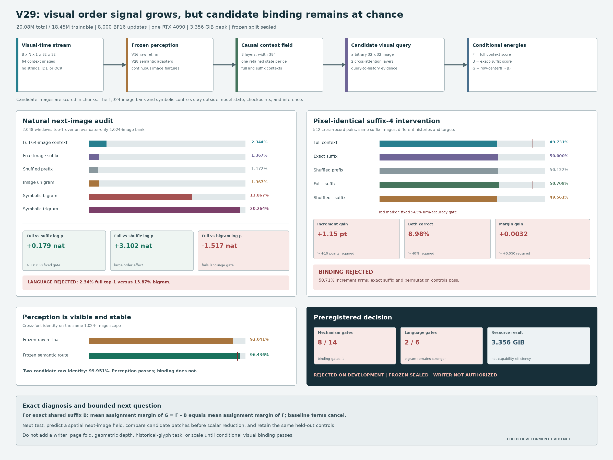

# Conditional Visual Density Ratio V29: Development Result

Date: 2026-08-13

## Verdict

V29 is **rejected as a selected visual-language mechanism** under its
preregistered development protocol. The frozen partition remains sealed and
writer training is not authorized.

This is a completed negative experiment, not a broken run. The fixed model
trains for all 8,000 updates, remains finite, preserves an image-only student
boundary, writes every checkpoint atomically, and completes the deterministic
audit. All perception, suffix-equality, candidate-permutation, leakage, and
resource controls pass.

The learned critic detects natural sequence order but does not bind a candidate
image to the context that licenses it. On 2,048 development windows, full
context improves target log probability by `0.179446` nat over the exact
four-image suffix and by `3.102479` nat over suffix-preserving prefix shuffle.
Full 1,024-way top-1 reaches `2.3438%`, above image unigram (`1.3672%`) but far
below symbolic bigram (`13.8672%`) and trigram (`20.2637%`).

On 512 cross-record pairs with pixel-identical final four glyphs, the
full-minus-suffix increment reaches `50.7080%` arm accuracy and `8.9844%`
both-correct. Its shuffled-prefix control reaches `49.5605%`, leaving only a
`1.1475` percentage-point gain. Full score alone is `49.7314%`, also chance.

V29 passes `8/14` mechanism gates and `2/6` language gates. Passing exactness,
identity, equivariance, boundary, and memory gates cannot substitute for the
failed conditional-binding and language gates.



## Fixed System

The authoritative writing object is an ordered volume of images:

```text
natural sample:  B x 65 x 1 x 32 x 32
context:         B x 64 x 1 x 32 x 32
exact suffix:    B x  4 x 1 x 32 x 32
candidate:       arbitrary 1 x 32 x 32 image
output:          scalar candidate-conditioned visual energy
```

Reading time is the second axis. A `32 x 32 x N` volume or tiled page is an
invertible view of these ordered visual cells, not a new language channel.

The student receives floating image tensors only. It receives no string,
byte, token ID, Unicode ID, character ID, OCR transcript, glyph lookup,
discrete codebook, vocabulary embedding, vocabulary logits, symbolic n-gram,
or external language-model state. The 1,024-image training bank is a host-side
contrast set. It is absent from model state and checkpoints and is not an
inference requirement.

V29 loads the frozen V16 retina, both frozen V28 semantic adapters, and the
trainable V28 causal context field. V28 future heads are discarded. For an
image `x`, frozen perception gives raw and semantic visual vectors:

\[
r(x)=\operatorname{normalize}(R_0(x)),\qquad
z(x)=\operatorname{normalize}(A_{28}(r(x))).
\]

An eight-layer width-384 causal field retains one state per context image:

\[
H_T=C_\theta([r(x_1);z(x_1)],\ldots,[r(x_T);z(x_T)])
\in\mathbb R^{T\times384}.
\]

An arbitrary candidate image `y` forms a visual query. Two six-head
cross-attention layers let that query inspect every retained context state. A
relation head scores the final query, its update, and their elementwise
interaction:

\[
q_0=W_y[r(y);z(y)],\qquad
q_{l+1}=\operatorname{EvidenceLayer}_l(q_l,H_T),
\]

\[
\rho_\theta(H_T,y)=
M_\theta([q_2;q_2-q_0;q_2\odot q_0]).
\]

The full, suffix-only, and incremental scores are

\[
F(P,S,y)=\rho_\theta(H(P,S),y),\qquad
B(S,y)=\rho_\theta(H(S),y),
\]

\[
G(P,S,y)=F(P,S,y)-B(S,y).
\]

Candidate rows are centered before incremental contrast. Training combines
full, suffix, and incremental 1,024-way image contrast; ordered-versus-shuffled
increment margin; symmetric two-by-two full and incremental assignment; and
per-row positive and shuffle margins. The perception path stays frozen.

The model has `20,080,961` parameters, of which `18,451,585` are trainable.
The fixed run performs 8,000 BF16 AdamW updates on one RTX 4090. Training plus
the complete development audit takes `4,956.14` seconds (`82.60` minutes) and
peaks at `3.356465 GiB` allocated CUDA memory.

## Fixed Receipts

- 7,017 public-domain Chinese records from 16 Wikisource works;
- 6,608 training, 190 development, and 219 sealed frozen identifiers;
- 32,768 deterministic training suffix-4 pairs with different record
  identifiers and different targets;
- 2,048 natural development windows and 512 development suffix-4 pairs;
- corpus SHA-256:
  `76048753b52735d14c98f0d9e4eb8d751401fe8810e82eaaaebff517f6866c03`;
- V28 source checkpoint SHA-256:
  `22503464cf5f5e8ed2d6adebbd6c794f6bc9b2836f978872027cb51712c7f64f`;
- frozen V16 retina SHA-256:
  `90791001203640f0de66316cf2e30b3e2c588480fef0e3d9d4f6283ba043ecbe`;
- candidate canonical-pixel SHA-256:
  `fbcce3b2661b6eca7697d631772a84043f42495afd289d067d5ea2d7384d50ce`;
- candidate two-view image SHA-256:
  `3d536fdb06b795080e7e0c8814b8b155b37221dd3c7986a025e96badb003bc31`;
- protocol SHA-256:
  `4cb17b793de051d858418d3ec0a4cb08b2928308c2d8e56530fc5655d9ffad0f`;
- final checkpoint SHA-256:
  `a8ec991968b577518d801090f5953406de13c688552107f26ac400fc2d508b8a`;
  and
- development audit SHA-256:
  `16645844dd0b9dd4fb1e5157edbdd20d6e13b34b201c1147c177ac52464a5108`.

The final checkpoint excludes optimizer and RNG state and contains no training
candidate images or form labels. Its source, corpus, protocol, pair, font,
retina, and candidate-bank receipts match the fixed run.

## Natural-Language Evidence

The evaluator-only 1,024-form image bank never enters the deployed model.
Unigram, bigram, and trigram controls are host-only diagnostics built from the
training partition.

| Development measure | Measured | Fixed requirement | Result |
|---|---:|---:|:---:|
| Full-context top-1 | `0.023438` | `>=0.15` | fail |
| Full-context top-5 | `0.063965` | diagnostic | - |
| Suffix-4 top-1 | `0.013672` | diagnostic | - |
| Shuffled-prefix top-1 | `0.011719` | diagnostic | - |
| Increment top-1 | `0.023438` | diagnostic | - |
| Shuffled increment top-1 | `0.008789` | diagnostic | - |
| Image-unigram top-1 | `0.013672` | control | full `+0.009766` |
| Symbolic-bigram top-1 | `0.138672` | benchmark | full below |
| Symbolic-trigram top-1 | `0.202637` | diagnostic | full below |
| Full minus unigram top-1 | `+0.009766` | `>0.03` | fail |
| Full minus bigram top-1 | `-0.115234` | `>0.01` | fail |
| Full minus bigram log probability | `-1.516622` nat | `>0.05` | fail |
| Full minus suffix-4 log probability | `+0.179446` nat | `>0.03` | pass |
| Full minus shuffled log probability | `+3.102479` nat | `>0.03` | pass |
| Raw-retina cross-font identity top-1 | `0.920410` | diagnostic | - |
| Frozen-semantic cross-font identity top-1 | `0.964355` | `>=0.95` | pass |
| Student boundary clean | `1.0` | required | pass |
| Training bank absent from checkpoint | `1.0` | required | pass |
| Peak allocated CUDA memory | `3.356465 GiB` | `<18 GiB` | pass |

Earlier ordered images strongly affect the score assigned to the true target:
shuffling the prefix costs more than three nats. That is not enough. The full
distribution ranks the target correctly in only `2.34%` of 1,024-way cases,
and a simple text-derived bigram is almost six times as accurate. V29 learns a
global natural-order signal without learning a useful conditional visual
choice rule.

## Pixel-Identical Suffix Intervention

The primary causal audit uses cross-record context pairs whose final four
writing forms and rendered pixels are exactly equal but whose next images
differ. Candidate order is independently randomized in two unseen development
fonts.

| Suffix-4 pair measure | Measured | Fixed requirement | Result |
|---|---:|---:|:---:|
| Suffix pixel equality | `1.0` | exact | pass |
| Suffix score-row equality | `1.0` | exact | pass |
| Raw-retina two-candidate identity | `0.999512` | `>=0.99` | pass |
| Full-context arm accuracy | `0.497314` | `>0.65` | fail |
| Full-context both-correct | `0.038086` | `>0.40` | fail |
| Suffix-only arm accuracy | `0.500000` | exact chance | pass |
| Shuffled-prefix arm accuracy | `0.501221` | control | chance |
| Increment arm accuracy | `0.507080` | `>0.65` | fail |
| Increment both-correct | `0.089844` | `>0.40` | fail |
| Shuffled increment arm accuracy | `0.495605` | control | chance |
| Increment minus shuffled accuracy | `+0.011475` | `>0.10` | fail |
| Increment mean margin | `+0.005103` | diagnostic | - |
| Increment minus shuffled mean margin | `+0.003167` | `>0.05` | fail |
| Maximum candidate-permutation score error | `0.0` | `<1e-5` | pass |
| Candidate-permutation accuracy agreement | `1.0` | exact | pass |

The tiny increment advantage does not approach any binding threshold. Exact
suffix rows, zero permutation error, balanced row accuracy, and `99.9512%`
raw two-candidate identity exclude fixed candidate position, unequal suffix
input, and gross candidate invisibility as explanations.

## Algebraic Diagnosis

The density-ratio motivation remains valid for natural candidate distributions:

\[
F(P,S,y)\approx\log\frac{p(y\mid P,S)}{q(y)},\qquad
B(S,y)\approx\log\frac{p(y\mid S)}{q(y)},
\]

so

\[
G(P,S,y)=F-B\approx
\log\frac{p(y\mid P,S)}{p(y\mid S)}.
\]

However, the exact-suffix two-by-two intervention exposes an important
limitation. Because both context rows share one exact suffix, their baseline
score vectors are identical. For the diagonal assignment, write this common
baseline as `(b_1,b_2)`. The mean correct-minus-incorrect margin is

\[
\begin{aligned}
&\tfrac12[(G_{11}-G_{12})+(G_{22}-G_{21})]\\
={}&\tfrac12[(F_{11}-b_1-F_{12}+b_2)
 +(F_{22}-b_2-F_{21}+b_1)]\\
={}&\tfrac12[(F_{11}-F_{12})+(F_{22}-F_{21})].
\end{aligned}
\]

The suffix terms cancel exactly. Row centering also leaves within-row margins
unchanged. V29 can redistribute margin between the two rows and can change
row-wise probabilities, but suffix subtraction cannot increase the aggregate
paired assignment margin beyond what the full critic already learned.

The fixed audit reflects this identity: full and incremental mean margins are
both exactly `0.0051032770`. Across all 801 training log records, the maximum
absolute difference between logged full and incremental pair mean margins is
also `0.0`.

Therefore the observed failure is not repaired by estimating a better suffix
baseline. The candidate-query critic itself fails to learn a transferable
context-candidate interaction. Natural ordered-versus-shuffled gain can rise
while matched candidate binding stays at chance.

## Training Diagnostics Are Not The Verdict

The final 1,000-update training window has mean natural increment order gain
`7.097695` nat, paired increment arm accuracy `0.516250`, paired both-correct
`0.107813`, and paired loss `0.697772`. These values use changing training
examples, small two-candidate batches, and augmented training fonts. They are
optimization diagnostics, not substitutes for the fixed held-out audit. No
checkpoint was selected from them and no threshold changed after measurement.

## What The Result Means

V29 establishes six bounded facts:

1. **Candidate-conditioned image scoring is executable on one GPU.** A compact
   critic reads an ordered `N x 1 x 32 x 32` visual stream and an arbitrary
   candidate image without a deployed token vocabulary or candidate bank.
2. **The fixed perception basis is not the immediate bottleneck.** Same-scope
   cross-font identity is `96.4355%`, and pairwise candidate visibility is
   `99.9512%`.
3. **The causal field learns natural order information.** Full target log
   probability substantially beats suffix and shuffled-prefix controls.
4. **Order detection is not candidate binding.** Exact-suffix pair assignment
   remains at chance, and full ranking remains far below a symbolic bigram.
5. **A shared suffix baseline cannot repair aggregate pair margin.** Its terms
   cancel exactly in the two-by-two assignment contrast.
6. **Low resource use is not an efficiency claim.** `3.356465 GiB` peak memory
   is a resource measurement for a rejected model, not capability-normalized
   superiority over a token language model.

The result rejects this V29 critic and loss as a selected mechanism. It does
not reject image-native language modeling, the ordered visual-cell interface,
or continuous image generation. It does not establish a general ILM.

## Next Controlled Question

Any V30 proposal should test whether **spatially explicit visual prediction can
bind context to a candidate image**, rather than changing only the baseline,
sequence dimensionality, or parameter count.

A bounded hypothesis is a causal visual field that predicts the next image's
continuous patch map before scalar scoring. An arbitrary candidate is encoded
into the same patch map, and compatibility is computed locally before
aggregation:

\[
\widehat Z_{t+1}=D_\theta(H_t)\in\mathbb R^{h\times w\times d},
\qquad
Z(y)=E_0(y)\in\mathbb R^{h\times w\times d},
\]

\[
s(H_t,y)=\sum_{u,v}
\operatorname{sim}(\widehat Z_{t+1}^{u,v},Z(y)^{u,v}).
\]

This forces context to construct a candidate-specific spatial expectation and
produces an inspectable compatibility field. A matched bilinear scorer should
serve as a parameter- and compute-controlled baseline. The existing 1,024-way
natural audit, exact-suffix pairs, unseen fonts, candidate permutation, and
student-boundary controls should remain unchanged.

This direction must be preregistered separately before implementation. V29
does not authorize a writer, page fold, third geometric axis, historical-glyph
answer generator, frozen evaluation, or larger model.

## Reproduction

Run the fixed evidence path:

```bash
CUDA_VISIBLE_DEVICES=0 PYTHONPATH=. \
  python scripts/train_conditional_visual_density_ratio_v29.py \
  --device cuda \
  --out artifacts/conditional_visual_density_ratio_v29_evidence \
  --num-workers 4
```

Re-run only the fixed development audit:

```bash
CUDA_VISIBLE_DEVICES=0 PYTHONPATH=. \
  python scripts/eval_conditional_visual_density_ratio_v29.py \
  --checkpoint \
    artifacts/conditional_visual_density_ratio_v29_evidence/checkpoint_final.pt \
  --device cuda \
  --out artifacts/conditional_visual_density_ratio_v29_audit
```

Regenerate the checked result figure:

```bash
python publication/ilm-image-native/generate_v29_result_figure.py
```

Primary local receipts:

- `artifacts/conditional_visual_density_ratio_v29_evidence/development_audit.json`;
- `artifacts/conditional_visual_density_ratio_v29_evidence/checkpoint_final.pt`;
  and
- `artifacts/conditional_visual_density_ratio_v29_evidence/train.jsonl`.

Model artifacts remain ignored by Git. The implementation, preregistered
protocol, result receipt, and evidence-derived figure are tracked.
