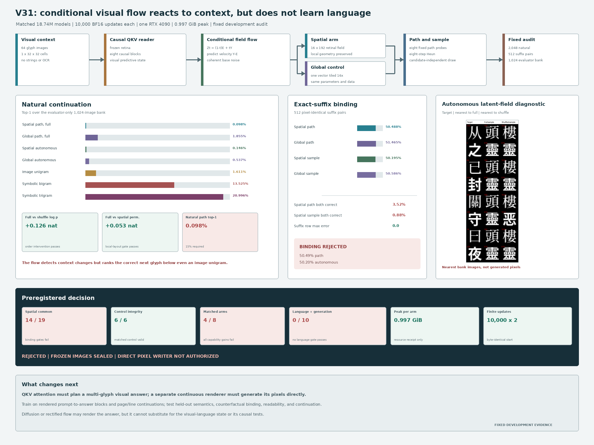
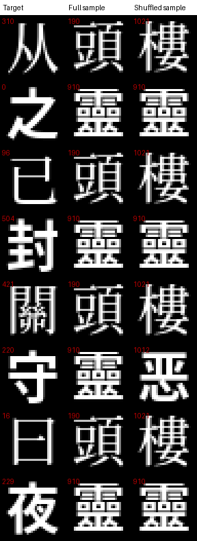

# Conditional Visual Field Flow V31: Development Result

Date: 2026-08-13

Status: fixed development audit complete; mechanism rejected; frozen evaluation
and writer training not authorized

## Verdict

V31 is **rejected as an image-native language mechanism** under its
preregistered development gates.

The experiment asked whether a coherent conditional flow over continuous
retinal fields could repair V30's deterministic averaging failure. Both
parameter-identical 18.74M-parameter arms completed 10,000 finite BF16 updates
from byte-identical initialized states. The spatial route became sensitive to
visual order and local spatial permutation, and its autonomous fields were
diverse and context dependent. Those properties did not produce conditional
language:

- natural path top-1 was `0.0977%` for the spatial route and `1.8555%` for the
  global control;
- the image-unigram, symbolic-bigram, and symbolic-trigram baselines reached
  `1.6113%`, `13.5254%`, and `20.9961%` respectively;
- exact-suffix path assignment was `50.4883%` for spatial and `51.4648%` for
  global, effectively chance;
- autonomous exact-suffix assignment was `50.1953%` for spatial;
- the spatial route passed `14/19` common gates, global passed `6/6` integrity
  gates, matched arms passed `4/8` gates, and spatial language and generation
  passed `0/10` gates.

The generated object in V31 is a continuous latent retinal field, not a pixel
image. The nearest-image sheet below is an evaluator diagnostic: each generated
field is paired with its nearest glyph in an external 1,024-image bank. The
nearest glyph is **not** direct model output.





## Tested System

Each input example is a causal stream of 64 rendered Chinese glyph images:

```text
B x 64 x 1 x 32 x 32 images
    -> frozen visual retina
    -> eight-block causal visual reader
    -> context-conditioned velocity field
    -> path score or autonomous Heun sample
```

The student receives pixels and continuous visual tensors. Character strings,
Unicode values, OCR output, symbolic token IDs, and the evaluator candidate bank
are excluded from model input, trainable state, checkpoints, and generation.

For normalized target retinal field \(Y\), coherent base field \(E\), context
state \(h\), and time \(t\), V31 uses the linear conditional-flow path

\[
Z_t=(1-t)E+tY,
\qquad
u^*(Z_t,t,h)=Y-E.
\]

The trainable velocity field \(v_\theta\) minimizes

\[
\mathcal{L}_{\mathrm{flow}}
=
\mathbb{E}_{h,Y,E,t}
\left[
\left\|v_\theta(Z_t,t,h)-(Y-E)\right\|_2^2
\right].
\]

V31 uses one coherent base vector tiled over the field. Independent patch noise
is forbidden so one draw selects one global visual alternative. The spatial arm
predicts a `16 x 192` retinal field. The matched global control predicts one
semantic vector tiled across all 16 cells.

Candidate scoring is evaluator-only. For fixed probe times \(t_k\), a candidate
field is compared to the learned conditional velocity along its base-to-target
path. Autonomous generation integrates the learned field with eight-step Heun
sampling. Neither path scoring nor nearest-image reporting gives the student a
candidate list.

## Fixed Evidence

| Receipt | SHA-256 |
|---|---|
| Protocol | `92b6f70975dffe25723e332268b8929fa547b9d848a296f9ed80968cf798f8f7` |
| Spatial checkpoint | `9808e9966b02c2f200cc91d8c63e611c9dd52692903d7b51ab5131d0ee05859f` |
| Global checkpoint | `485011a4db854626b468bf7dba93962ce0ed22a98020282aa19c4ba06d999b7e` |
| Development audit | `530c21d3d0f14e67e6616780a63d061c02f0a3ca22cf78849c914a65b8630985` |
| Comparison receipt | `2e97b7324c6dcbbf004737b3d5b6d832145b90791ce1310fc2bcbbbc870f1859` |
| Autonomous nearest-image sheet | `d57656cbb66c33a8f6c3f07b8eecdee7a460d5d675836d0a1eeb645d1b8384d0` |

The fixed audit uses 2,048 natural windows, 512 exact-suffix pairs, a 1,024-image
evaluator-only bank, eight path probes, and eight autonomous samples per
condition with eight-step Heun integration. Frozen-partition images were never
instantiated.

## Matched Training

| Property | Spatial field | Global control |
|---|---:|---:|
| Total parameters | 18,736,577 | 18,736,577 |
| Trainable parameters | 17,107,201 | 17,107,201 |
| Finite BF16 updates | 10,000 | 10,000 |
| Initialized-state SHA-256 | `0682269c...2ad3d3` | `0682269c...2ad3d3` |
| Peak allocated VRAM | 0.997 GiB | 0.997 GiB |
| Training time | 4,217.57 s | 4,470.01 s |

The sub-1-GiB measurement establishes that this rejected probe was inexpensive.
It does not establish capability-normalized efficiency or parity with any LLM,
OCR system, or image generator.

## Natural Continuation Audit

All top-1 measurements use the same evaluator-only 1,024-image bank.

| Measure | Spatial | Global |
|---|---:|---:|
| Cross-font candidate visibility | 96.3379% | 96.4355% |
| Path, full context top-1 | **0.0977%** | 1.8555% |
| Path, suffix-4 top-1 | 0.1465% | 1.3672% |
| Path, shuffled-prefix top-1 | 0.0000% | 0.7812% |
| Path, spatially permuted top-1 | 0.9277% | 1.8555% |
| Autonomous, full-context top-1 | **0.1465%** | 0.5371% |
| Autonomous, shuffled-prefix top-1 | 0.0000% | 0.0000% |
| Mean target rank, best of eight samples | 425.78 | 103.04 |
| Sample pairwise cosine distance | 0.3024 | 0.9331 |
| Same-noise full/shuffled displacement | 5.7369 | 1.2940 |

External baselines on the same 2,048 windows were:

| Baseline | Top-1 | Mean target log probability |
|---|---:|---:|
| Image unigram | 1.6113% | -6.3651 |
| Symbolic bigram | 13.5254% | -4.9125 |
| Symbolic trigram | 20.9961% | -5.1169 |

The spatial path's full-context mean target log probability (`-6.9316`) exceeds
its shuffled-prefix value (`-7.0575`) by `0.1259` nat. Its full-versus-spatially
permuted gain is `0.0527` nat. These fixed intervention gates pass. The ranking
results show why those effects are insufficient: the model reacts to order and
layout without assigning probability to the correct next glyph.

## Exact-Suffix Binding Audit

The 512 pair specifications have different targets but pixel-identical last
four context cells. Exact suffix-only rows are equal to machine precision.

| Measure | Spatial | Global |
|---|---:|---:|
| Path full-context arm accuracy | **50.4883%** | 51.4648% |
| Path both-correct rate | 3.5156% | 7.8125% |
| Path full-minus-shuffle arm accuracy | 1.2207% | 2.6855% |
| Path full-minus-shuffle mean margin | 0.00529 | 0.01511 |
| Autonomous full-context arm accuracy | **50.1953%** | 50.5859% |
| Autonomous both-correct rate | 0.8789% | 4.5898% |

The spatial arm changes under patch permutation, while the global arm is
exactly invariant. Yet spatial assignment does not beat the matched global
control and remains at chance. This rejects the claim that local flow geometry
provides usable context-to-next-writing binding.

## Gate Decision

| Gate family | Passed | Total | Decision |
|---|---:|---:|---|
| Spatial common | 14 | 19 | fail |
| Global integrity | 6 | 6 | pass |
| Matched arms | 4 | 8 | fail |
| Spatial language and generation | 0 | 10 | fail |

The five failed spatial-common gates are path pair arm accuracy, pair
both-correct rate, full-minus-shuffle assignment accuracy, full-minus-shuffle
margin, and paired spatial-permutation effect. All four matched capability-gain
gates fail. All ten language and generation gates fail.

## Diagnosis

V31 rules out a narrow idea, not continuous visual language modeling in
general. A one-glyph conditional flow can learn path regularity, order
sensitivity, local geometry, diversity, and condition dependence while failing
the language relation needed to select the next written form. Moreover, its
generated latent field has no direct raster decoder, so nearest-bank inspection
cannot establish writing ability.

The next proof should therefore change the random variable and the task:

1. predict a multi-glyph answer or continuation **raster block**, rather than a
   one-glyph retinal field;
2. let causal QKV attention build a visual predictive state from prompt images;
3. train a direct coarse-to-fine continuous renderer conditioned on that state;
4. mix page/line continuation with rendered instruction-to-answer examples;
5. test held-out compositional semantics, counterfactual prompt binding,
   readable direct pixels, and closed-loop continuation;
6. keep LocalLLM outside the student as an optional offline curriculum author;
7. use open corpora for the reproducible benchmark and local books only through
   a provenance-tracked preparation layer.

Diffusion or rectified flow may implement the renderer, but it is not the
language mechanism by itself. The causal visual state and direct answer-region
tests must carry the language claim.

## Reproduction

```bash
CUDA_VISIBLE_DEVICES=0 PYTHONPATH=. \
  python scripts/train_conditional_visual_field_flow_v31.py \
  --route-mode spatial-field \
  --out artifacts/conditional_visual_field_flow_v31_spatial_evidence

CUDA_VISIBLE_DEVICES=0 PYTHONPATH=. \
  python scripts/train_conditional_visual_field_flow_v31.py \
  --route-mode global-control \
  --out artifacts/conditional_visual_field_flow_v31_global_control_evidence

CUDA_VISIBLE_DEVICES=0 PYTHONPATH=. \
  python scripts/eval_conditional_visual_field_flow_v31.py

PYTHONPATH=publication/ilm-image-native \
  python publication/ilm-image-native/generate_v31_result_figure.py
```

The canonical protocol is
[`references/conditional_visual_field_flow_v31_protocol.md`](../references/conditional_visual_field_flow_v31_protocol.md).
The pre-experiment research decision is
[`references/conditional_visual_field_flow_v31_research.md`](../references/conditional_visual_field_flow_v31_research.md).
