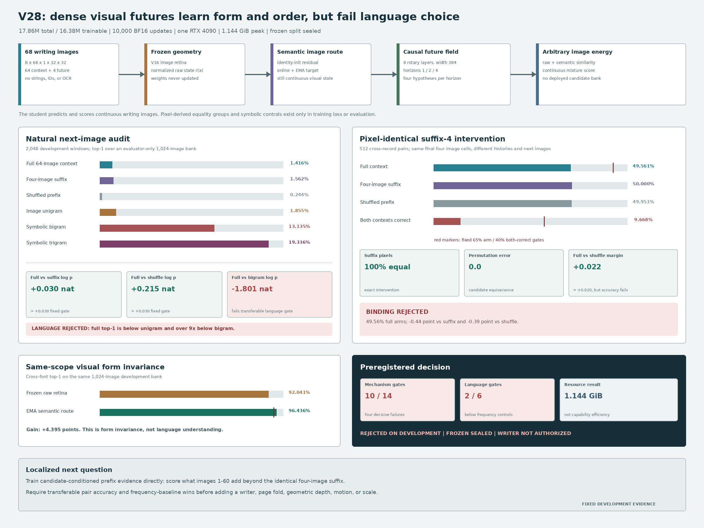

# Dense Visual Future Energy V28: Development Result

Date: 2026-08-13

## Verdict

V28 is **rejected as a selected visual-language mechanism** under its
preregistered development protocol. The frozen partition remains sealed and
writer training is not authorized.

This is a clean negative result rather than a failed run. The fixed model
trains for all 10,000 updates, remains finite, preserves an image-only student
boundary, and completes every deterministic audit. It improves cross-font
identity over the same 1,024-way scope from `92.0410%` in the frozen raw retina
to `96.4355%` in the EMA semantic route. Full context also improves target log
probability by `0.030369` nat over the same four-glyph suffix and by `0.215112`
nat over a suffix-preserving prefix shuffle.

Those effects do not become useful next-writing choice. On 2,048 development
windows, full-context 1,024-way top-1 is `1.4160%`, below image unigram
(`1.8555%`), symbolic bigram (`13.1348%`), and symbolic trigram (`19.3359%`).
On 512 cross-record pairs with pixel-identical final four glyphs, full context
reaches `49.5605%` arm accuracy and `9.6680%` both-correct, while suffix-only is
exactly `50%` and shuffled-prefix context is `49.9512%`. The full score has a
larger mean margin than the shuffled score, but it does not bind each context
to the correct candidate.

V28 passes `10/14` mechanism gates and `2/6` language gates. Passing safety,
identity, equivariance, and control gates cannot substitute for the failed
binding and language gates.



## Fixed System

The authoritative sample is an ordered volume of writing images:

```text
natural stream: B x 68 x 1 x 32 x 32
context:        B x 64 x 1 x 32 x 32
future cells:   horizons 1, 2, and 4
candidate:      arbitrary 1 x 32 x 32 image
output:         four-component continuous visual distribution
```

The student receives floating image tensors only. It receives no strings,
bytes, token IDs, Unicode IDs, character IDs, OCR transcript, glyph lookup,
discrete codebook, persistent candidate bank, or external language-model
state. Temporary equality groups used by the loss are derived from canonical
pixels outside the student and never enter inference.

A frozen V16 retina maps each cell image to a normalized raw visual vector
`r`. A residual semantic adapter starts as an exact identity and learns a
second normalized vector `e`; a stop-gradient exponential-moving-average copy
provides target semantics. An eight-layer width-384 causal rotary field reads
the concatenated raw and semantic sequence. For horizon
`h in {1,2,4}`, it emits four normalized raw hypotheses, four semantic
hypotheses, and mixture weights:

\[
H_{1:t}=F([r_1;e_1],\ldots,[r_t;e_t]),
\]

\[
\{q^{r}_{h,k},q^{e}_{h,k},\pi_{h,k}\}_{k=1}^{4}
=P_h(H_t).
\]

An arbitrary candidate image `Y` is scored without a vocabulary table:

\[
s_h(X,Y)=\log\sum_{k=1}^{4}\pi_{h,k}
\exp\left(\tau_r q^{r\top}_{h,k}r(Y)
+\tau_e q^{e\top}_{h,k}e_{\mathrm{EMA}}(Y)\right).
\]

Training combines weighted multi-positive dense future contrast at 16
stratified positions, a strictly proper empirical energy score over continuous
raw hypotheses, same-scope cross-font semantic identity, symmetric two-by-two
assignment on suffix-matched pairs, and explicit full-versus-suffix/shuffled
order losses. The retina remains frozen throughout.

The complete system has `17,859,142` parameters, of which `16,377,990` are
trainable. The single fixed run performs 10,000 BF16 AdamW updates on one RTX
4090. Training plus the full development audit takes `7,134.82` seconds
(`118.91` minutes) and peaks at `1.144400 GiB` allocated CUDA memory.

## Fixed Receipts

- 7,017 public-domain Chinese records from 16 Wikisource works;
- 6,608 training, 190 development, and 219 sealed frozen identifiers;
- 32,768 deterministic training suffix-4 pairs with different record
  identifiers and different targets;
- 2,048 natural development windows and 512 development suffix-4 pairs;
- corpus SHA-256:
  `76048753b52735d14c98f0d9e4eb8d751401fe8810e82eaaaebff517f6866c03`;
- frozen V16 retina SHA-256:
  `90791001203640f0de66316cf2e30b3e2c588480fef0e3d9d4f6283ba043ecbe`;
- protocol SHA-256:
  `b8e515d27f619033f53a04d1afd3ff8d71ba0dd68484728f2f4c1b68a7780f7f`;
- final checkpoint SHA-256:
  `22503464cf5f5e8ed2d6adebbd6c794f6bc9b2836f978872027cb51712c7f64f`;
  and
- development audit SHA-256:
  `2cb73707a01fccb5bef750690014a2729b6235941a4de33ccdfdb600e8f0fb3d`.

The final checkpoint excludes optimizer and RNG state and contains no training
identity images. Its embedded source, corpus, protocol, pair, font, and retina
receipts match the fixed run.

## Natural-Language Evidence

The evaluator-only 1,024-form image bank never enters the deployed model.
Unigram, bigram, and trigram controls are host-only diagnostics built from the
training partition.

| Development measure | Measured | Fixed requirement | Result |
|---|---:|---:|:---:|
| Full-context top-1 | `0.014160` | `>=0.15` and beat controls | fail |
| Full-context top-5 | `0.035156` | diagnostic | - |
| Last-only top-1 | `0.004395` | diagnostic | - |
| Suffix-4 top-1 | `0.015625` | diagnostic | - |
| Shuffled-prefix top-1 | `0.002441` | diagnostic | - |
| Image-unigram top-1 | `0.018555` | control | full below |
| Symbolic-bigram top-1 | `0.131348` | benchmark | full below |
| Symbolic-trigram top-1 | `0.193359` | diagnostic | full below |
| Full minus unigram top-1 | `-0.004395` | `>0.03` | fail |
| Full minus bigram top-1 | `-0.117188` | `>0.01` | fail |
| Full minus bigram log probability | `-1.801083` nat | `>0.05` | fail |
| Full minus suffix-4 log probability | `+0.030369` nat | `>0.03` | pass |
| Full minus shuffled log probability | `+0.215112` nat | `>0.03` | pass |
| Raw-retina 1,024-way identity top-1 | `0.920410` | same-scope control | - |
| EMA-semantic 1,024-way identity top-1 | `0.964355` | `>=0.95` | pass |
| EMA minus raw same-scope identity | `+0.043945` | `>=0.02` | pass |
| Student boundary clean | `1.0` | required | pass |
| Peak allocated CUDA memory | `1.144400 GiB` | `<18 GiB` | pass |

Full context improves probability assigned to the true image relative to
suffix and shuffled controls, so the causal field is not wholly blind to
earlier order. But ranking remains poor: suffix-only top-1 is slightly higher
than full-context top-1, and a simple training-text bigram is more than nine
times as accurate. The fixed gates correctly reject a model that shifts target
probability without producing reliable language choice.

## Pixel-Identical Suffix Intervention

The primary causal audit uses cross-record context pairs whose final four
characters and rendered suffix pixels are exactly equal but whose next
characters differ. Candidate order is independently randomized in two unseen
development fonts.

| Suffix-4 pair measure | Measured | Fixed requirement | Result |
|---|---:|---:|:---:|
| Suffix pixel equality | `1.0` | exact | pass |
| Candidate permutation score error | `0.0` | `<1e-5` | pass |
| Candidate permutation accuracy agreement | `1.0` | exact | pass |
| Raw V16 two-candidate identity accuracy | `0.999512` | diagnostic | - |
| Full-context arm accuracy | `0.495605` | `>0.65` | fail |
| Full-context both-correct rate | `0.096680` | `>0.40` | fail |
| Last-only arm accuracy | `0.500000` | exact chance | pass |
| Suffix-4 arm accuracy | `0.500000` | exact chance | pass |
| Shuffled-prefix arm accuracy | `0.499512` | control | chance |
| Full minus suffix-4 accuracy | `-0.004395` | `>0.15` | fail |
| Full minus shuffled accuracy | `-0.003906` | `>0.05` | fail |
| Full minus shuffled mean margin | `+0.022070` | `>0.02` | pass |

The margin gate passes while accuracy gates fail. This indicates that a subset
of examples receives larger correct margins, but the effect is not distributed
reliably across pairs. Exact suffix controls, zero permutation error, and
`99.9512%` two-candidate raw identity exclude evaluator imbalance, fixed
candidate position, and gross candidate invisibility. They do not prove that
the learned causal field binds history to future identity.

## Training Diagnostics Are Not The Verdict

During the final 100-update training window, in-batch dense retrieval and some
pair batches improved. Those values use training examples, small changing
candidate sets, and augmented training fonts. They are useful optimization
diagnostics but are not comparable to the deterministic 1,024-way and 512-pair
development audits. No checkpoint was selected from them, and no threshold was
revised after seeing the result.

## What The Result Means

V28 establishes five bounded facts:

1. **The proposed visual-time interface is executable.** Ordered Chinese
   writing is consumed directly as an `N x 1 x 32 x 32` image stream and scored
   as continuous future-image distributions without a deployed vocabulary.
2. **A lightweight semantic visual route can improve form invariance.** On the
   same 1,024-way scope, cross-font identity rises by `4.3945` percentage points
   while the frozen raw geometry is retained.
3. **The model detects some information beyond the last four images.** Full
   target log probability and pair mean margin beat order controls.
4. **That information is not converted into reliable conditional choice.**
   Full-context ranking loses to unigram and bigram, and matched-pair assignment
   remains at chance.
5. **Low resource use is not yet an efficiency claim.** `1.144400 GiB` peak
   allocated memory is a resource measurement for a rejected model, not
   capability-normalized superiority over a token LM.

The result rejects this V28 training and scoring mechanism. It does not reject
image-native language modeling, and it does not establish a general ILM.

## Next Controlled Question

V29 should ask whether **incremental evidence from the prefix can bind an
arbitrary candidate image to its context**, rather than whether a larger or
higher-dimensional visual stream helps.

A minimal next mechanism is a candidate-conditioned visual cloze field:

\[
\Delta s(X,Y)=s(X_{1:64},Y)-s(X_{61:64},Y),
\]

where the same candidate image attends to retained per-cell causal states and
the loss directly compares the correct and incorrect `Delta s` inside dense
suffix-collision buckets. This cancels candidate frequency and suffix evidence
and trains only the contribution of earlier visual history. Collision buckets
should be resampled online so each context relation receives repeated evidence,
while development identifiers remain disjoint.

The acceptance test remains image-only and simple: full context must improve
both accuracy and margin over exact suffix and suffix-preserving shuffle
controls, and must beat unigram and bigram before any writer, page fold, 3D
geometry, historical-glyph answer, or larger model is authorized. The 3D
`N x C x H x W` stream is already a valid interface description; adding a
geometric depth axis cannot repair failed conditional binding by itself.

## Reproduction

Run the fixed evidence path:

```bash
CUDA_VISIBLE_DEVICES=0 PYTHONPATH=. \
  python scripts/train_dense_visual_future_energy_v28.py \
  --device cuda \
  --out artifacts/dense_visual_future_energy_v28_evidence \
  --num-workers 4
```

Re-run only the fixed development audit:

```bash
CUDA_VISIBLE_DEVICES=0 PYTHONPATH=. \
  python scripts/eval_dense_visual_future_energy_v28.py \
  --checkpoint \
    artifacts/dense_visual_future_energy_v28_evidence/checkpoint_final.pt \
  --device cuda \
  --out artifacts/dense_visual_future_energy_v28_audit
```

Regenerate the checked result figure:

```bash
python publication/ilm-image-native/generate_v28_result_figure.py
```

Primary local receipts:

- `artifacts/dense_visual_future_energy_v28_evidence/development_audit.json`;
- `artifacts/dense_visual_future_energy_v28_evidence/checkpoint_final.pt`; and
- `artifacts/dense_visual_future_energy_v28_evidence/train.jsonl`.

Model artifacts remain ignored by Git. The implementation, preregistered
protocol, result receipt, and evidence-derived figure are tracked.
