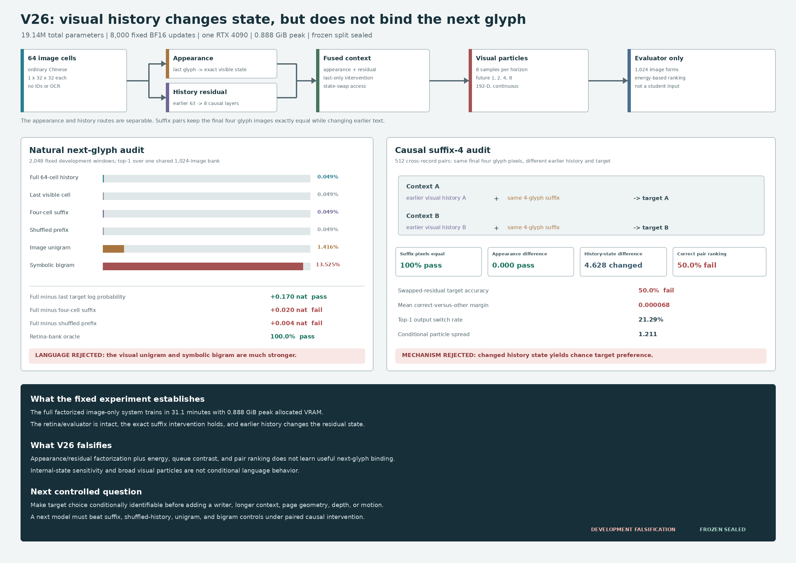

# Factorized Visual Context V26: Development Result

Date: 2026-08-13

## Verdict

V26 is **rejected as both a visual-context mechanism and a natural-Chinese
language model** under its preregistered development protocol.

The model does react internally to earlier writing. For suffix-matched pairs,
the final four glyph images are pixel-identical, the last-glyph appearance
states are exactly equal, and the mean difference between history residuals is
`4.628258`. Full history also improves target log probability over last-only by
`0.170451` nat, passing that one mechanism gate.

The changed state does not produce the correct conditional decision. Suffix-4
pair ranking and swapped-residual target accuracy are both exactly `0.500`,
with mean correct-versus-other score margin only `0.0000677`. Full-history
top-1 is `0.0488%`, below the image unigram (`1.4160%`) and symbolic bigram
(`13.5254%`). The frozen partition remains sealed and no writer is trained.



## Fixed Experiment

Every natural sample contains 64 ordered grayscale glyph images and eight
future glyph images:

\[
X\in[0,1]^{B\times64\times1\times32\times32},\qquad
Y\in[0,1]^{B\times8\times1\times32\times32}.
\]

The student receives floating image tensors, continuous noise, and states
derived from those images. It receives no strings, bytes, token or Unicode
IDs, character labels, OCR transcript, glyph lookup, source identifier,
candidate bank, or external language-model state.

The model factorizes the final visible form from earlier history. A frozen V16
retina maps the last image to appearance state `a`; an eight-layer width-384
causal visual field maps the preceding 63 images to residual `r`. Their fused
state is

\[
s=\operatorname{RMSNorm}\!\left(A(a)+\sigma(G)\odot C(r)\right).
\]

For future offsets 1, 2, 4, and 8, one conditional head maps `s`, horizon, and
Gaussian noise to eight continuous 192-dimensional retina particles. There is
no vocabulary projection or persistent glyph prototype table. Training uses a
proper empirical energy score, an image-derived detached visual queue,
multi-positive contrast, and natural suffix-pair ranking.

The complete system has `19,142,721` parameters, of which `16,476,865` are
trainable. The fixed run performs 8,000 BF16 AdamW updates on one RTX 4090. It
finishes in `1,863.27` seconds (`31.05` minutes) with `0.888403 GiB` peak
allocated CUDA memory.

V26 reuses the V25 public-domain corpus and record partitions:

- 7,017 records from 16 Chinese works;
- 6,608 training, 190 development, and 219 sealed frozen groups;
- manifest SHA-256:
  `76048753b52735d14c98f0d9e4eb8d751401fe8810e82eaaaebff517f6866c03`;
- protocol SHA-256:
  `dcfa5b974e617be8a7995dd0f4bb123094837d74c587e48b2ce987785b899df1`;
  and
- final checkpoint SHA-256:
  `065f84e1a7dc44ca8c304018c4eb9b29bfbcaef8f24b9e99ca0c84a3d6db6e1d`.

The evaluator alone constructs a two-font 1,024-form visual bank and symbolic
frequency controls. A perfect `1.0` retina-bank oracle confirms that the bank
and frozen visual sensor can recover the intended target row. The model's poor
ranking therefore cannot be attributed to an evaluator that cannot see the
glyph identities.

## Natural-Language Evidence

The fixed natural audit contains 2,048 development windows.

| Development measure | Measured | Fixed requirement | Result |
|---|---:|---:|:---:|
| Full-history top-1 | `0.000488` | diagnostic | - |
| Full-history top-5 | `0.003906` | diagnostic | - |
| Last-only top-1 | `0.000488` | diagnostic | - |
| Suffix-4 top-1 | `0.000488` | diagnostic | - |
| Shuffled-prefix top-1 | `0.000488` | diagnostic | - |
| Image-unigram top-1 | `0.014160` | control | below |
| Symbolic-bigram top-1 | `0.135254` | benchmark | below |
| Full minus last top-1 | `0.000000` | `>0.020` | fail |
| Full minus unigram top-1 | `-0.013672` | `>0.030` | fail |
| Full minus last target log probability | `+0.170451` | `>0.10` | pass |
| Full minus suffix-4 target log probability | `+0.019729` | `>0.03` | fail |
| Full minus shuffled target log probability | `+0.003692` | `>0.03` | fail |
| Full target log probability | `-6.932756` | diagnostic | - |
| Full nearest-target cosine | `0.160451` | diagnostic | - |
| Full particle spread | `1.210599` | diagnostic | - |
| Retina-bank oracle top-1 | `1.0` | `>=0.99` | pass |
| Student boundary clean | `1.0` | required | pass |
| Peak allocated CUDA memory | `0.888403 GiB` | `<18 GiB` | pass |

The suffix-length sweep does not show a stable rise with more history. Top-1
is `0.000977` at two cells and `0.000488` at 4, 8, 16, 32, and 64 cells.
Full-history target log probability is only `0.019729` nat above suffix-4 and
`0.003692` nat above a prefix shuffle that preserves the final four cells.

The image unigram and symbolic bigram are evaluator baselines, not student
inputs. V26 falls below both. It therefore fails the additional language gates
as well as the mechanism gates.

## Pixel-Identical Suffix Intervention

The primary causal audit contains 512 cross-record pairs. Pair members end in
the same four characters, use the same font and augmentation draw for those
cells, and have different earlier histories and different next glyphs.

| Suffix-4 pair measure | Measured | Fixed requirement | Result |
|---|---:|---:|:---:|
| Suffix pixel equality | `1.0` | exact | pass |
| Mean appearance-state difference | `0.0` | exact | pass |
| Mean history-residual difference | `4.628258` | diagnostic | changed |
| Correct two-way pair ranking | `0.500000` | `>0.65` | fail |
| Swapped-residual target accuracy | `0.500000` | `>0.65` | fail |
| Mean correct-versus-other margin | `0.0000677` | diagnostic | near zero |
| Top-1 output switch rate | `0.212891` | diagnostic | - |
| Both pair targets top-1 correct | `0.025391` | diagnostic | - |

This is the central result. The intervention proves that the history branch is
not numerically constant, but its target preference is at chance. The suffix-8
diagnostic agrees: pair ranking is `0.501953` and swapped-residual accuracy is
`0.501953`.

The swap metric and ordinary two-way pair metric are algebraically equivalent
for this implementation because suffix-matched members have the same
appearance state. They are reported separately to preserve the preregistered
API intervention, not as independent evidence.

## What The Result Means

V26 falsifies a specific proposed repair to V25: separating exact appearance
from a causal history residual, representing uncertainty with eight continuous
particles, and combining energy, visual-queue contrast, multi-horizon futures,
and suffix-pair ranking is not sufficient to learn useful next-glyph binding
under this budget and objective.

The failure is localized more tightly than V25:

1. **Not a broken visual sensor.** The retina-bank oracle is perfect.
2. **Not a missing history signal.** Pixel-matched contexts produce materially
   different history residuals.
3. **Not a hidden symbolic shortcut.** The recursive image-only boundary audit
   passes.
4. **Not evidence for language.** Correct paired preference remains at chance,
   full top-1 is below unigram, and the symbolic bigram is about 277 times the
   model's top-1.
5. **Not an efficiency victory.** Runtime and VRAM are favorable resource
   measurements, but capability-normalized efficiency is not established.

The full-history particle set is broad (`1.210599` mean spread) while its best
particle remains weakly aligned with the target (`0.160451` cosine). Together
with near-zero pair margin and a final pair loss close to its zero-margin
value, this is consistent with a mostly global visual distribution that does
not become conditionally identifiable. That interpretation is diagnostic, not
a proof of the optimizer's unique failure mode.

The next experiment should remain at the 64-cell scale and make conditional
target binding the supervised object. It should require a context-dependent
decision against matched visual alternatives during every relevant update,
retain exact suffix/shuffle interventions, and demonstrate advantage over
unigram and bigram before authorizing a writer or longer lattice. Scaling pages,
depth, motion, or parameter count would not repair the observed causal failure
by itself.

## Reproduction

Run the fixed evidence path:

```bash
CUDA_VISIBLE_DEVICES=0 PYTHONPATH=. python scripts/train_factorized_visual_context_v26.py \
  --device cuda \
  --out artifacts/factorized_visual_context_v26_evidence
```

Regenerate the checked figure:

```bash
python publication/ilm-image-native/generate_v26_result_figure.py
```

Primary local receipts:

- `artifacts/factorized_visual_context_v26_evidence/development_audit.json`;
- `artifacts/factorized_visual_context_v26_evidence/checkpoint_final.pt`; and
- `artifacts/factorized_visual_context_v26_evidence/train.jsonl`.

The model artifacts are intentionally ignored by Git. Code, frozen protocol,
result document, and the evidence-derived figure are tracked.
