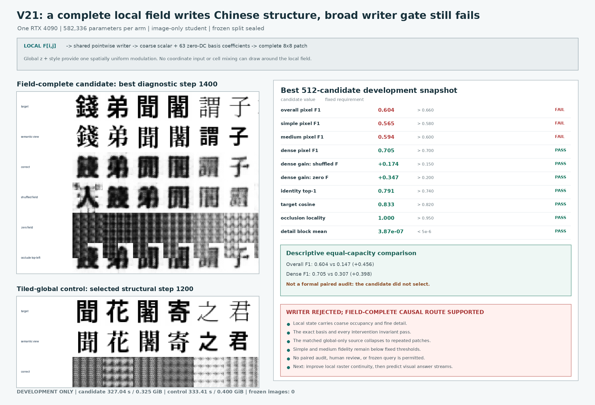

# Field-Complete Visual Writer V21: Development Result

Date: 2026-08-13

## Verdict

V21 is **rejected as a selected visual writer** and **retained as strong
field-complete causal-routing evidence**.

The candidate forces every `8x8` output patch, including its coarse occupancy
and 63 zero-DC detail coefficients, to originate from the corresponding cell
of a continuous `4x4x192` retinal field. At the best development diagnostic
snapshot (step `1,400`), dense F1 is `0.70535`, versus `0.53145` after
shuffling the field and `0.35880` after zeroing it. The gains `+0.17390` and
`+0.34654` pass their fixed causal gates. A quadrant occlusion changes the
matching output quadrant with locality exactly `1.0`. The exact-parameter
tiled-global control cannot form a spatial plan and collapses to a repeated
patch texture.

The stronger writer claim fails. Candidate overall F1 (`0.60378`), simple F1
(`0.56483`), and medium F1 (`0.59449`) miss their fixed thresholds. No
candidate checkpoint selects, so the paired evaluator, blinded readability
review, and frozen evaluation are forbidden. The result supports the local
field as a complete causal route; it does not establish a broadly readable
writer or a language model.



## Fixed Test

The candidate and control each have exactly `582,336` trainable parameters and
start from the same seeded initialization. Both use a frozen V16 image retina,
an image-derived global state, and an image-derived style state. They differ
only in the source supplied to the shared pointwise writer:

- **field-complete candidate:** source cell `(i,j)` is local retinal state
  `F[:, :, i, j]`;
- **tiled-global control:** every source cell is the same global state `z`.

There are no coordinates, positional parameters, spatial attention queries,
cell mixing, or global spatial projection. Global state and style provide only
spatially uniform FiLM modulation. Each source cell emits one coarse scalar and
63 coefficients in a fixed Walsh--Hadamard zero-DC basis. The 16 nonoverlapping
patches form the `32x32` output.

The target image supplies loss only. No string, token ID, Unicode ID, OCR
transcript, character label, glyph lookup, finite visual codebook, candidate
answer table, or external language model enters the student path.

The split and gates were fixed before implementation or training in the
[`V21 protocol`](../references/field_complete_writer_v21_protocol.md). The
salted partition contains `6,613` training records, `195` development records,
and `209` frozen records. Its frozen-identifier SHA-256 is
`e54972c435458d45f56287a3c16e53326c89b4e07383f9c6bdd63114f24db6b7`.
Both arms trained for exactly `1,600` updates on one RTX 4090. Validation used
`512` generated development candidates per snapshot; no frozen image was
instantiated.

## Candidate Gates

The preregistered rank is overall F1, dense F1, then earlier step. No checkpoint
passes every gate. Step `1,400` is therefore reported only as the best
diagnostic snapshot, not as a selected model.

| Fixed development gate | Measured | Required | Result |
|---|---:|---:|:---:|
| Overall pixel F1 | `0.60378` | `>0.66` | fail |
| Simple pixel F1 | `0.56483` | `>0.58` | fail |
| Medium pixel F1 | `0.59449` | `>0.60` | fail |
| Dense pixel F1 | `0.70535` | `>0.70` | pass |
| Dense gain over shuffled field | `+0.17390` | `>0.15` | pass |
| Dense gain over zero field | `+0.34654` | `>0.20` | pass |
| Identity top-1 | `79.102%` | `>74%` and above shuffled | pass |
| Target cosine | `0.83313` | `>0.82` and above shuffled | pass |
| Correct-vs-shuffled field L1 | `0.13977` | `>0.12` | pass |
| Correct-vs-zero field L1 | `0.37056` | `>0.15` | pass |
| Mean occlusion pixel change | `0.09264` | `>0.03` | pass |
| Occlusion locality | `1.00000` | `>0.95` | pass |
| Style-copy cosine | `0.08315` | `<0.30` | pass |
| Semantic-target L1 | `0.11973` | `>0.05` | pass |
| Fixed-basis DC leakage | `0.0` | `0.0` | pass |
| Basis Gram error | `0.0` | `<1e-6` | pass |
| Zero-source cell variation | `0.0` | `<1e-6` | pass |
| Detail block-mean magnitude | `3.87e-7` | `<5e-6` | pass |
| Decomposition error | `0.0` | `<1e-6` | pass |
| Frozen images instantiated | `0` | `0` | pass |

At the final step `1,600`, overall/simple/medium/dense F1 are
`0.60268/0.56957/0.58710/0.70115`. The same three quality gates remain false.
The final endpoint does not change the decision.

## Matched Control

The tiled-global control has no quality minimum because its purpose is to test
whether a spatially uniform source can substitute for the topographic field.
It passes the structural receipt and selects its best development snapshot at
step `1,200`.

| Development diagnostic | Field candidate step 1,400 | Tiled-global control step 1,200 | Descriptive difference |
|---|---:|---:|---:|
| Parameters | `582,336` | `582,336` | `0` |
| Overall F1 | `0.60378` | `0.14733` | `+0.45644` |
| Dense F1 | `0.70535` | `0.30741` | `+0.39794` |
| Identity top-1 | `79.102%` | `25.000%` | `+54.102 pp` |
| Target cosine | `0.83313` | `0.43322` | `+0.39991` |
| Field intervention effect | nonzero and local | exactly zero | expected |

This is a descriptive equal-capacity comparison, **not the formal paired
audit**. The snapshots use different development rendering seeds and steps,
and the paired evaluator accepts only a selected candidate. Because no candidate
selected, it must refuse before constructing a fresh paired dataset.

## What V21 Establishes

V20 made only zero-mean detail depend on the local field. V21 removes the
remaining global spatial route: coarse occupancy and fine detail both come
from each local cell, while global state can only modulate all cells uniformly.
Every algebraic and intervention invariant passes. The control's repeated
texture and the candidate's large shuffle/zero gaps show that a compact,
continuous, image-only local field can carry a complete spatial writing plan.

Visual inspection also identifies the next bottleneck. Nonoverlapping
pointwise `8x8` patches produce boundary seams, blur thin strokes, and lose
simple or medium structure even when dense occupancy is recovered. This is a
local raster-continuity problem, not evidence that the field is ignored. The
next writer test should add overlap or multiscale local continuity while
preserving an auditable topographic receptive field and bounded occlusion
effect.

V21 remains an isolated actuator supplied with a semantic image of the intended
form. It does not choose an answer from a prompt, predict future language state,
continue a book, answer etymology questions, emit a page stream or movie, or
establish efficiency over token models.

## Visual Prompt-to-Answer Contract

The product interface requested by the project is a Visual Language Stream:

\[
X_{\mathrm{prompt}}\in[0,1]^{T_p\times D\times H\times W\times C}
\quad\longrightarrow\quad
Y_{\mathrm{answer}}\in[0,1]^{T_a\times D\times H\times W\times C}.
\]

Typed text is deterministically rendered into prompt frames; photographed
pages, handwriting, and historical forms enter natively. The model's primary
answer is one or more generated image frames. `T_a=1` is an answer page,
`T_a>1` is an ordered text-image stream or movie, and `D>1` is a later depth
extension. OCR may transcribe encodable output afterward, but it is neither the
student's input representation nor its reasoning/output substrate.

The next language MVP must therefore learn a causal visual state transition
from prompt frames to answer frames. V21 supplies evidence about one possible
motor route only; its unselected weights must not be treated as an accepted
answer renderer.

## Reproduction Receipt

```bash
CUDA_VISIBLE_DEVICES=0 PYTHONPATH=. python scripts/train_field_complete_writer.py \
  --pvf-checkpoint artifacts/predictive_visual_field_v16_memory_pilot/checkpoint_step_0002200.pt \
  --route-mode field_complete \
  --out artifacts/field_complete_writer_v21_field_evidence_20260813

CUDA_VISIBLE_DEVICES=0 PYTHONPATH=. python scripts/train_field_complete_writer.py \
  --pvf-checkpoint artifacts/predictive_visual_field_v16_memory_pilot/checkpoint_step_0002200.pt \
  --route-mode tiled_global_control \
  --out artifacts/field_complete_writer_v21_control_evidence_20260813

CUDA_VISIBLE_DEVICES=0 PYTHONPATH=. python scripts/eval_field_complete_writer_development.py \
  --candidate-checkpoint artifacts/field_complete_writer_v21_field_evidence_20260813/checkpoint_latest.pt \
  --control-checkpoint artifacts/field_complete_writer_v21_control_evidence_20260813/checkpoint_latest.pt \
  --out artifacts/field_complete_writer_v21_paired_development_audit
```

The last command is expected to reject the unselected candidate before
evaluation. Evidence paths are intentionally ignored by Git; the tracked figure
is regenerated from their JSONL records and sample sheets.

| Artifact | SHA-256 |
|---|---|
| Candidate diagnostic checkpoint, step 1,400 | `ce55955b809d5f06397610ede8b33cd2b45d3e90d47d3bec16e53fcad84826ca` |
| Candidate final checkpoint | `2fb30faf8d4cccb1df57dbff3df5e234f4514dc19c9969100f679ef1c361d2f5` |
| Control selected checkpoint, step 1,200 | `eec165ddd0cd79714219b8a0156d2e6fa8622737de2926e824d563feec860d76` |
| Control final checkpoint | `dac17b35ded3ae7445c956239dcafa3ab8b1663163cc6cbe6bb7754d671663eb` |
| Candidate training log | `3cbf9d5f8b96d8f2513d509d8bf2475e2d8b56a1c8381427a12ee81c73b04702` |
| Control training log | `549efecafab187cf282999fd5bd3f70ebd1726ea2269995241fc77659b108812` |
| Candidate step-1,400 grid | `09f9e8b879d136fcb1628d2e0d901f2d09644123b525ee23c041dd48b3812f12` |
| Control step-1,200 grid | `b36cf6ffb9ecb4db5c671485bfeb85ed25f7230f4bf6b8f2bd8ef863ce7613b6` |
| Candidate protocol | `559147cff53c566aa6a689e7b8b9cf4c8f6d861e79b31f69f156cf7cfdab9ff6` |
| Control protocol | `85ca6a65b4f67c8628da5075fd4ff0f2778a9404e750de96a429aca0182813ac` |
| Tracked result figure | `5a2ed2f428993e85681f176d30c47afa4c2a1345418ace14fcc34aa287ad1b3c` |

Candidate training took `327.04 s` at `0.325 GiB` peak allocated CUDA memory.
Control training took `333.41 s` at `0.400 GiB`. These are mechanism-test
measurements, not full-model efficiency claims.
