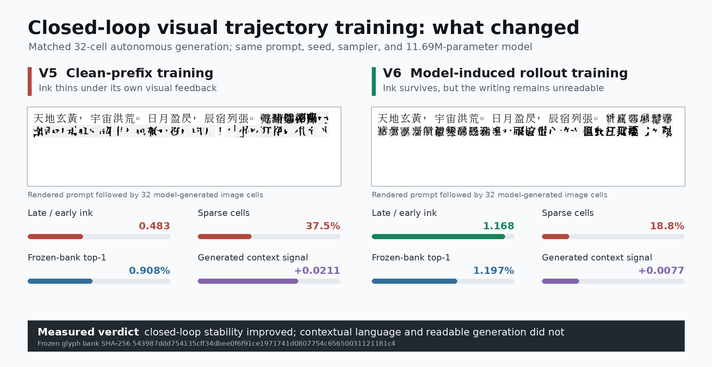

# The First Imagized Language Model: Engineering Goal

Date: 2026-08-12

## North star

Build an independent language model whose native computational object is
visible writing:

```text
typed text -> deterministic rasterizer --+
                                         +-> writing pixels -> ILM -> answer pixels
uploaded page / glyph / handwriting -----+
```

The rasterizer is a boundary adapter, not a tokenizer. After this boundary the
student receives only image tensors and continuous visual states. It must never
receive strings, token IDs, Unicode IDs, character labels, OCR transcripts, a
discrete glyph codebook, or an external language-model call. Its primary answer
is an image. OCR may create an optional searchable sidecar after inference.

This goal includes modern simplified and traditional Chinese, historical
writing, regional variants, handwriting, damaged print, and forms absent from
Unicode. It eventually includes image questions in Chinese or English and
image answers that combine readable explanation with provenance-linked oracle,
bronze, seal, clerical, manuscript, traditional, simplified, and Kanji forms.

## Current verdict

The repository now contains a complete 11.69M-parameter image-only student,
training loop, model-induced rollout objective, fixed-bank evaluator, and
autonomous inference loop. Neither the clean-prefix V5 run nor the closed-loop
V6 continuation passed the language-model gate.

It proved:

- a strict pixels-to-pixels student boundary;
- a cross-font visual alphabet;
- a recurrent state that changes candidate-image energies;
- direct continuous ink generation by conditional rectified flow;
- context-sensitive generated pixels;
- autonomous rereading and feedback without OCR or symbolic decoding; and
- improved long-rollout ink stability after training on its own sampled images.

It did not prove:

- prediction better than elementary symbolic language baselines;
- useful long-context visual language state;
- readable autonomous continuation, despite stable V6 ink occupancy;
- historical-form question answering;
- lower end-to-end cost than a text LLM; or
- parity with Qwen 8B.

The present MVP is therefore **rejected but informative**. Closed-loop visual
trajectory learning has now been tested: it fixes the loss-of-ink failure but
does not create contextual meaning. The next milestone is an image-only
full-history advantage objective plus differentiable sampled-image identity,
not a larger model.

## New paradigm: retinal flow language modeling

The current architecture is the **Retinal Flow Language Model (RFLM)**. It is a
causal probability model over a sequence of continuous image fixations:

\[
p_\Theta(x_{1:T}) = p(x_1)\prod_{t=1}^{T-1}
p_\Theta(x_{t+1}\mid x_{\leq t}),
\qquad x_t\in[0,1]^{H\times W}.
\]

The random variables are image regions. A fixation is no more a language token
than a camera frame is an object label: it is a continuous sensor observation.
The fixed grid in the MVP is an engineering scaffold that can later be replaced
by learned saccades without changing the model contract.

### 1. Read: continuous foveal retina

A convolutional retina maps a `32x32` ink image to a unit visual vector:

\[
z_t = \frac{R_\theta(x_t)}{\lVert R_\theta(x_t)\rVert_2},
\qquad z_t\in\mathbb{S}^{191}.
\]

Two renderings of the same visible content are paired only at the offline image
construction boundary. Cross-font contrastive and variance losses force the
retina to preserve stroke identity while suppressing font-specific nuisance.
Unsupported-font characters are excluded by actual font cmap coverage, so tofu
boxes cannot become an accidental visual class.

### 2. Remember: recurrent visual field

A three-layer GRU integrates ordered visual observations:

\[
h_t = G_\phi(h_{t-1}, z_t),
\qquad h_t\in\mathbb{R}^{384}.
\]

This state is not supervised with words or semantic IDs. It is trained only by
the compatibility and writing consequences of the next image. Dense causal
positions turn every 48-fixation page into multiple prediction problems.

### 3. Predict: energy over arbitrary images

The model does not classify into a finite character table. It scores any
candidate image through its retinal embedding:

\[
s_{t,j}=E_\psi(h_t,z_t,R_{\bar\theta}(c_j)).
\]

Multi-positive visual NCE treats near-identical candidate views as additional
positives, preventing the model from being penalized when two image renderings
carry the same visible form. The target retina is an exponential moving average
of the online retina.

### 4. Write: conditional pixel-space rectified flow

For a clean next fixation (x_{t+1}), noise \(\epsilon\), and time
\(\tau\in[0,1]\), training follows the straight path

\[
y_\tau=(1-\tau)x_{t+1}+\tau\epsilon,
\qquad u_\tau=\epsilon-x_{t+1}.
\]

The writer predicts this velocity from pixels and recurrent context:

\[
\hat u_\omega = F_\omega(y_\tau,\tau,h_t,z_t),
\qquad
\mathcal L_{\mathrm{flow}}=
\lVert\hat u_\omega-u_\tau\rVert_2^2.
\]

Time is biased toward high noise, where the target cannot be copied from the
input. Stroke weighting and endpoint supervision preserve sparse ink. Sampling
integrates the learned field from noise toward data in a small number of steps.

### 5. Reread: visual write-read consistency

The predicted clean endpoint at training time is

\[
\hat x_0 = y_\tau-\tau\hat u_\omega.
\]

It is passed through the frozen target retina and contrasted with independent
target renderings:

\[
\mathcal L_{\mathrm{cycle}}=
\operatorname{NCE}
\left(R_{\bar\theta}(\hat x_0),
      R_{\bar\theta}(x_{t+1}^{(1)}),
      R_{\bar\theta}(x_{t+1}^{(2)})\right).
\]

This connects writing quality to visual identity without asking OCR to read the
output.

### 6. Act: autonomous visual feedback

At inference the writer samples several candidate images, the retina rereads
them, and the energy model selects one:

\[
\hat x_{t+1}=\arg\max_{c\in\mathcal C_t}
E_\psi(h_t,z_t,R_{\bar\theta}(c)).
\]

The selected pixels are pasted into the page and become the next retinal input.
The model therefore lives under the image distribution that it creates. V6 also
uses this exact path during training. It removed the earlier monotonic ink drift,
but the selected images still have weak target identity and unreadable language.

## Why this is a different paradigm

RFLM is not OCR plus an LLM plus a renderer. OCR and text embeddings are absent
from the student path. It is not a byte, character, or subword model because its
random variable is a continuous image field. It is not a visual VQ language
model because it has no finite visual-code vocabulary. It is not generic page
diffusion because it preserves causal retinal state and rereads every generated
mark. It is not merely retrieval because the writer synthesizes new pixels.

The design combines four ideas that are individually established but not a
proof of visual language when isolated:

- foveated observation makes high-resolution writing locally affordable;
- joint-embedding prediction makes visual identity learnable across views;
- energy scoring avoids a fixed output alphabet; and
- flow matching supplies a continuous multimodal image distribution.

The scientific novelty claim must concern their strict image-only composition
and measured behavior. It must not claim that humans literally implement this
network or that the current run is a useful language model.

## Measured proof receipt

V5 and V6 used the same public-domain Chinese book manifest, eight Noto CJK font
files, model width, and fixed evaluation bank. Font bytes and SHA-256 hashes are
stored in every checkpoint and receipt. V6 resumed V5 for 1,600 updates with
two-step, two-candidate induced visual rollouts.

| Property | V5 | V6 closed loop |
|---|---:|---:|
| Parameters | 11,690,244 | 11,690,244 |
| Training peak VRAM | 2.56 GiB | 2.576 GiB |
| Held-out candidate bank | 512 x 4 image views | same bank and SHA-256 |
| Eligible held-out contexts | 2,423 | 2,423 |
| Random full-context top-1 | 0.041% | 0.041% |
| RFLM full-context top-1 | 0.908% | **1.197%** |
| RFLM full-context top-5 | 2.229% | **3.219%** |
| Last-fixation-only top-1 | 1.362% | 1.692% |
| Unigram top-1 | 1.857% | 1.857% |
| Symbolic bigram top-1 | 13.578% | 13.578% |
| Retina oracle top-1 | 97.648% | **98.184%** |
| Generated context cosine gain | **+0.0211** | +0.0077 |
| Generated sample target hit | **1.5625%** | 1.0417% |
| Autonomous late/early ink | 0.483 | **1.168** |
| Autonomous sparse cells | 37.5% | **18.75%** |
| Autonomous human readability | false | false |
| Acceptance | false | false |



The 98.18% oracle localizes the main bottleneck away from basic visual
perception. V6 improves full-context retrieval and fixes the measured loss of
ink, but full context is still worse than last-only and generated target signal
falls. The final rollout state cosine (`0.961`) is high while the selected-image
target cosine (`0.103`) is low. The model learns state recovery around wrong
pixels, not correct visual language.

The exact command, intermediate checkpoint table, bank hash, and autonomous
receipts are preserved in
[`retinal-flow-v6-closed-loop-result.md`](retinal-flow-v6-closed-loop-result.md).

## Implemented V6 algorithm: induced visual trajectories

For a clean image prefix, V6 runs the deployed two-step flow sampler, generates
two candidate bitmaps, rereads them with the target retina, and selects by the
deployed visual energy. The selected bitmap is detached, reread by the online
retina, and fed into the GRU. It adds

\[
\mathcal L_{\mathrm{roll}} =
0.15\mathcal L_{\mathrm{traj}} +
0.35\mathcal L_{\mathrm{energy}}^{\mathrm{roll}} +
0.30\mathcal L_{\mathrm{recovery}}.
\]

This is online model-induced sampling, not a replay queue. It trains the state,
energy, and recovery writer on the exact pixels the current model visits while
keeping memory bounded. The experiment validates the stability effect and
rejects the assumption that trajectory consistency alone yields semantics.

## Next learning algorithm: context advantage and sampled identity

The next stage targets the two failed measurements rather than increasing
capacity.

### Full-history advantage

For the same real next image `y`, form one continuous state from the full visual
prefix and one reset state from only the last image. Train the full state to
score `y` above the ablated state by a margin:

\[
\mathcal L_{\mathrm{ctx}}=
\max\left(0,m-s(y\mid h_{\mathrm{full}})+s(y\mid h_{\mathrm{last}})\right).
\]

A full-state NCE loss remains active so the network cannot win only by damaging
the last-only branch. No labels or IDs enter either state.

### Differentiable sampled endpoint

V6 stops gradients through candidate sampling. The next run differentiates
through one truncated two-step flow endpoint and aligns its reread identity to
independent target images:

\[
\mathcal L_{\mathrm{sample}}=
\operatorname{NCE}\left(
R(\hat x_0^{K=2}),\{R(y^{(v)})\}_{v=1}^{V}\right).
\]

This supervises the image distribution actually sampled at inference rather
than only a one-step denoising estimate. V6's stop-gradient trajectory and
recovery terms remain as stability regularizers.

### Deferred complexity

A stochastic recurrent field and a slow line/page state remain plausible, but
they are deferred. Add them only if the direct context and sampled-identity
objectives fail under the unchanged bank; otherwise extra capacity would obscure
which mechanism created predictive history.

## Acceptance gates for the next checkpoint

All gates are evaluated on a frozen manifest and glyph bank:

1. Full-context top-1 must exceed random, last-fixation-only, unigram, and the
   symbolic bigram baseline.
2. Full-context target energy and top-1 must exceed last-fixation ablations.
3. Generated context cosine gain must exceed `0.02` and the random branch by at
   least `0.01` on held-out fonts, matching the evaluator.
4. A 32-cell autonomous rollout must preserve nontrivial ink and remain human
   readable under a blinded rubric.
5. A visual identity evaluator may score output, but no evaluator signal may
   enter inference.
6. Student-boundary receipts must continue to report false for token IDs,
   Unicode IDs, OCR, visual codebooks, and external language models.
7. Scaling beyond the current width is allowed only after context advantage and
   sampled-endpoint identity improve at least two failed gates beyond V6.

## Dataset path

Large language datasets remain useful at the offline boundary:

1. Read an openly licensed text or instruction record.
2. Render it into multiple image trajectories with different font, form,
   spacing, direction, paper, blur, and scan damage.
3. Filter fonts by real glyph coverage.
4. Keep source rights, artifact path, transform, and hash in the manifest.
5. Delete strings before the student batch is formed.
6. Mix scanned books, handwriting, Kanji vectors, and historical glyph images
   without forcing unencoded forms through Unicode.

The local historical snapshot currently contains 9,055 characters and 84,642
glyph records across oracle, bronze, seal, and Liushutong stages. These assets
are evidence, not generic style targets. A factual etymology answer must copy or
cite attested source pixels; a synthesized form must be labeled synthesized.

## Capability stages

### P0: boundary and visual alphabet

Implemented. The model trains and infers with only continuous image tensors;
the fixed-bank oracle establishes cross-font visual identity.

### P1: causal visual language

Not achieved. V6 remains visually populated under autonomous feedback, but its
marks are unreadable and full-context prediction still loses to elementary
language baselines.

### P2: bounded visual instruction following

Rasterize openly licensed Chinese and English instruction pairs, train image
question to image answer trajectories, and evaluate task correctness plus
readability. Historical panels are provenance-gated source images.

### P3: bounded Qwen-8B comparison

Define a fixed benchmark for visual instruction following, bilingual questions,
historical-form recognition, and glyph-origin answers. Compare correctness,
legibility, provenance, latency, VRAM, parameters, and throughput. No general
parity claim is allowed.

### P4: broad image-native model

Scale only after P1 and P2. Add public-domain multilingual books, handwriting,
damaged manuscripts, learned saccades, multiscale page memory, and multi-page
dialogue.

## Efficiency claim

Image-native representation is a hypothesis, not automatically more efficient
than tokens. The current receipt shows that a complete 11.69M model fits easily
on one 4090 at 2.576 GiB peak allocation, but its accuracy is not competitive.
Future comparisons must report quality at equal tasks alongside VRAM, training
energy, latency, throughput, storage, and rendering cost. Parameter count alone
is not efficiency.

## Non-negotiable rules

- Do not call a smoke run trained.
- Do not call reconstruction language generation.
- Do not infer language ability from retina-oracle accuracy.
- Do not hide a symbolic vocabulary inside a visual codebook.
- Do not let OCR, text labels, or a teacher model enter the deployed student.
- Do not present a generated historical-looking glyph as attested evidence.
- Do not claim Qwen parity without a named benchmark and measurements.
- Preserve negative runs, manifests, fonts, hashes, metrics, and inference
  receipts as scientific evidence.
