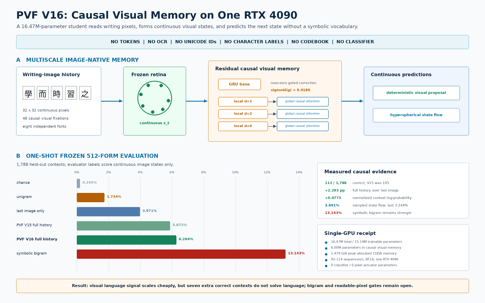
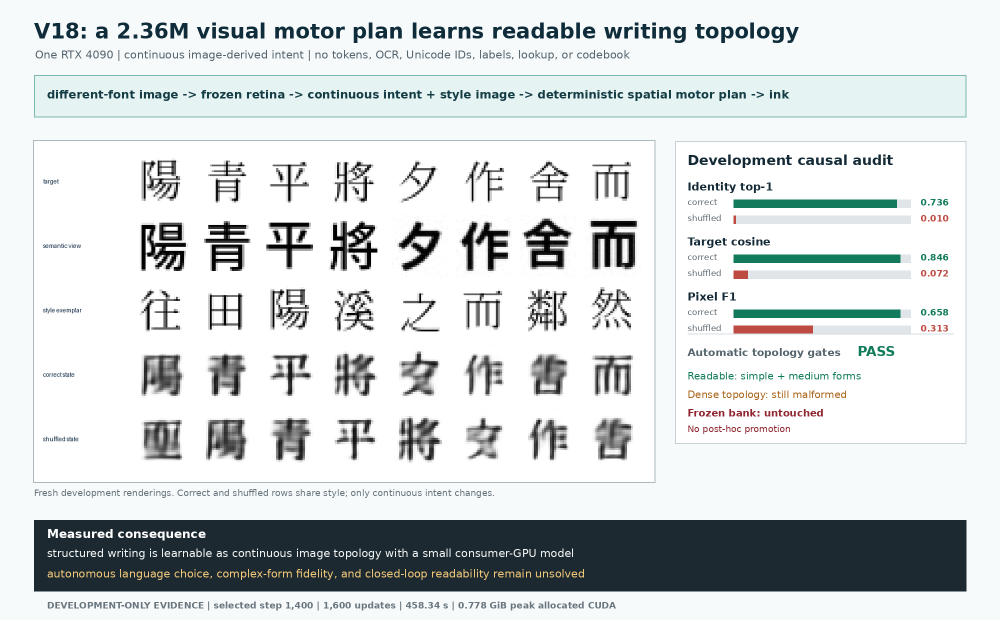
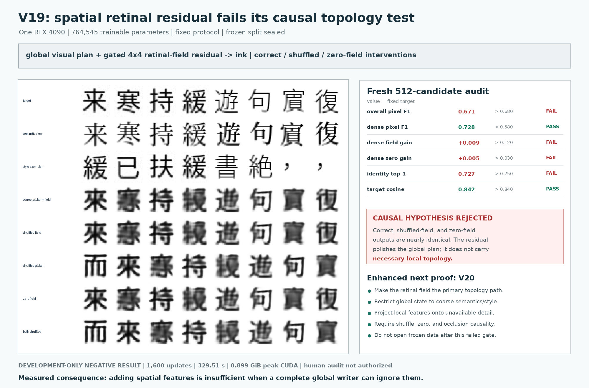

# The First Imagized Language Model: Engineering Goal

Date: 2026-08-13

## North star

Build an independent language model whose native computational object is
visible writing:

```text
typed text -> deterministic rasterizer --+
                                         +-> writing pixels -> ILM -> answer pixels
uploaded page / glyph / handwriting -----+
```

The rasterizer is a boundary adapter, not a tokenizer. After this boundary the
student receives only image tensors and continuous visual states. It must never
receive strings, token IDs, Unicode IDs, character labels, OCR transcripts, a
discrete glyph codebook, or an external language-model call. Its primary answer
is an image. OCR may create an optional searchable sidecar after inference.

This boundary is not based on the claim that transcription is unimportant.
Transcribing a photographed page is one useful image-to-image ILM task. The
point is that Unicode and token vocabularies are not universal interfaces to
written language: many historical, regional, handwritten, damaged, undeciphered,
or newly created forms are absent, ambiguous, or visually informative beyond a
coded transcript. Writing is itself language, not merely a container around an
abstract token sequence. An ILM should therefore be able to transcribe,
continue, translate, explain, compare, and generate writing without first
discarding its material form.

This goal includes modern simplified and traditional Chinese, historical
writing, regional variants, handwriting, damaged print, and forms absent from
Unicode. It eventually includes image questions in Chinese or English and
image answers that combine readable explanation with provenance-linked oracle,
bronze, seal, clerical, manuscript, traditional, simplified, and Kanji forms.

### Canonical input and output: Visual Language Stream

The page interface is one case of a more general continuous contract. Define a
Visual Language Stream (VLS) window as

\[
X\in[0,1]^{T\times D\times H\times W\times C},
\]

where `T` is ordered visual time or reading sequence, `D` is optional geometric
depth, `H,W` are spatial extent, and `C` is the sensory channel dimension. A
flat prompt image has `T=1,D=1`; a line or book is an ordered stream with
`T>1,D=1`; a captured or rendered 3D character has `D>1`; and a 3D writing
movie has both `T>1` and `D>1`. Missing axes collapse to length one, so the
small 2D experiment remains the same model contract rather than a separate
product.

The native learning problem is continuous future-field prediction,

\[
p_\theta(X_{t+1:t+k}\mid X_{\leq t}),
\]

followed by visual generation and rereading. Window boundaries are compute and
sensor boundaries, not a learned vocabulary. Chinese oracle, bronze, seal,
traditional, simplified, Kanji, Latin letters, and other writing systems remain
observations in the same field rather than separate token tables. Typed text,
mesh geometry, camera frames, and book pages are boundary adapters into VLS.

For prompt following, partition the stream into observed prompt frames and
generated answer frames:

\[
X_{\mathrm{prompt}}\in[0,1]^{T_p\times D\times H\times W\times C},
\qquad
Y_{\mathrm{answer}}\sim
p_\theta(\cdot\mid X_{\mathrm{prompt}}),
\quad
Y_{\mathrm{answer}}\in[0,1]^{T_a\times D\times H\times W\times C}.
\]

`T_a=1` is a generated answer page; `T_a>1` is an ordered text-image
continuation or movie. A typed question is first rendered into prompt frames;
a scan or inscription is already in the native representation. Understanding
is measured by held-out prompt-dependent answer behavior, not by input
reconstruction, OCR accuracy, glyph identity, or visual plausibility alone.

The first proof deliberately fixes `D=1` and small `T`: a bounded Chinese
image stream must be learned, predicted, written, and reread on one RTX 4090.
Only after that loop passes may the project add volumetric glyphs or character
movies. This ordering makes 3D and motion compatible extensions without
letting them obscure the core language-learning test.

### Product proof: the Visual Word-Origin Book

The first complete product is not an open-ended chatbot claim. It is a bounded,
auditable **Visual Word-Origin Book**:

```text
rendered English/Chinese question or photographed writing
    -> independent ILM visual reasoning
    -> rendered answer-page image
    -> optional post-hoc searchable text sidecar
```

The answer page must explain an English word or Chinese form in readable modern
language while preserving visual evidence that ordinary token output cannot
represent. For Chinese, it should place attested oracle, bronze, seal, clerical,
traditional, simplified, manuscript, and regional forms next to an explanation.
For unencoded Khitan, Tangut, Jurchen, Nôm, stone-inscription, handwritten, or
damaged marks, the image region remains the answer rather than being forced
through Unicode. Attested source pixels and model-synthesized forms must be
visually and metadata-distinguishable.

The first named benchmark contains 200 held-out questions: 100 Chinese
word/character-origin questions and 100 English word-origin questions, balanced
between typed-rendered and photographed/scanned prompts. It reports factual
answer correctness, modern-text readability, historical-form retrieval,
provenance accuracy, unencoded-region preservation, page-layout validity,
latency, peak VRAM, and blinded human preference. This benchmark defines the
meaning of "usable"; parameter count or attractive images alone do not.

### Independence boundary

Qwen, OCR, text corpora, and PDF extraction may be offline teachers or dataset
construction tools. They are absent from deployed ILM inference. A released
student is independent only when its checkpoint and runtime consume no strings,
token IDs, Unicode IDs, OCR transcripts, teacher logits, external model calls,
finite glyph lookup, or candidate answer database. Typed input is rasterized at
the UI boundary. The model's primary output is generated pixels; OCR is optional
post-processing and never changes the answer image. A user-facing response may
show both the native page image and this optional searchable/accessibility text,
with the source of each channel declared.

### Broader sensory-language hypothesis

Vision is the first testbed because pages provide ordered, persistent, and
auditable sensory evidence. The more general hypothesis is that language can be
modeled as continuous sensory fields rather than only symbols: retinal fields
for writing, and later waveform or time-frequency fields for speech and vocal
language. The shared abstraction would be perception, causal sensory memory,
continuous future-state prediction, motor generation, and self-perception of
the generated signal. This repository claims only the visual-writing evidence
measured here; speech adaptation is a future experiment, not a present result.

## Current verdict

The repository now contains eight complete experimental systems:

- RFLM V7 is an 11.69M-parameter pixels-to-pixels precursor with autonomous
  write-reread feedback. It produces stable but unreadable pseudo-glyphs.
- PVF V16 is a 16.47M-parameter image-to-continuous-image-state model. It adds
  residual multiscale causal visual memory to the V15 recurrent base and
  factorizes next-state prediction into a deterministic visual proposal and a
  stochastic hyperspherical field.
- Visual State Actuator V17 is a separate 5.73M-parameter
  continuous-state-to-pixel model. It receives a retinal state and style image,
  not a glyph ID or spatial target, and was trained on one RTX 4090.
- Visual Motor Plan V18 is a 2.36M-parameter deterministic
  continuous-state-to-ink model. It directly supervises stroke topology before
  any optional stochastic surface rendering.
- Spatial Retinal Motor Plan V19 is a 0.765M-parameter adapter over a clean,
  frozen V19-global planner. It tests whether a `4x4x192` retinal field causally
  repairs dense topology under five fixed interventions and a new sealed split.
- Retinal Topology Router V20 is a paired 0.506M-parameter-per-arm experiment.
  It structurally reserves within-block detail for the local `4x4x192` retinal
  field and compares it with an exactly parameter-matched global-repeat route.
- Field-Complete Visual Writer V21 is a paired 0.582M-parameter-per-arm
  experiment. It removes every global spatial drawing route and makes each
  local retinal cell emit both coarse occupancy and exact zero-DC detail for
  its corresponding output patch.
- Visual Binding Stream V22 is a paired 3.410M-parameter-per-arm image-prompt
  experiment. It reads six rendered frames and emits one answer image while a
  query-blind arm controls whether the final visual query is used.

On the unchanged frozen 512-form Chinese bank, V16's proposal reaches
**6.264%** top-1 (`112/1,788`), versus **3.971%** last-only, **1.734%**
unigram, **0.224%** random dynamics, and **13.143%** symbolic bigram. Its
normalized full-history gain is `+0.07732` nats. The state flow reaches
**3.691%**, versus **3.244%** last-only, with sampled context cosine gain
`+0.07947`. Both continuous branches pass their state gates; neither passes the
bigram language gate. V16 exceeds V15 by seven frozen contexts, which is a
directional result rather than a statistically established architecture win.

On one untouched 512-example actuator evaluation, V17 reaches **58.594%**
global visual identity top-1 versus **0.977%** when only the intended states are
shuffled. Target cosine is `0.71301` versus `0.08612`. This establishes causal
state control, but pixel F1 is `0.43849`, below the preregistered `0.50` gate,
and human inspection rejects readability. V17 is an isolated actuator supplied
with the intended state; it is not next-language generation.

On a fresh 512-example development audit, V18 reaches **73.633%** global visual
identity top-1 versus **0.977%** shuffled, target cosine `0.84618` versus
`0.07162`, and pixel F1 `0.65772` versus `0.31290`. Most simple and medium forms
are recognizable, while dense forms still merge strokes. V18 passes every
automatic development topology gate. Its frozen bank remains sealed because
the required human-review gate did not prespecify a numeric recognition rule.

V19 closes that methodological gap but rejects its architecture. On a fresh
512-candidate development audit, dense F1 is `0.72776`, yet the correct spatial
field improves dense F1 by only `+0.00879` over a shuffled field and `+0.00535`
over a zero field, against fixed requirements of `>0.12` and `>0.03`. Overall
F1 is `0.67104` against `>0.68`, and identity top-1 is `72.656%` against
`>75%`. The automatic gate fails; blinded human review is not authorized and
the new frozen bank remains sealed.

V20 repairs V19's routing failure but still rejects its writer. At the final
512-candidate development endpoint, correct-field dense F1 is `0.70131`, versus
`0.57953` with a shuffled field and `0.34003` with a zero field. The gains
`+0.12177` and `+0.36128` pass their fixed causal thresholds, and quadrant
occlusion locality is exactly `1.0`. The matched global-repeat control is
invariant to field interventions. However, candidate overall F1 (`0.63608`),
target cosine (`0.81519`), and the strict detail-mean invariant fail selection.
Its endpoint dense gain over the equal-capacity control is only `+0.01791`,
below the fixed `>0.03` paired margin. Neither arm selected; human review and
frozen evaluation remain forbidden.

V21 strengthens the routing result and again rejects the writer. At its best
development diagnostic step, correct-field dense F1 is `0.70535`, versus
`0.53145` after field shuffling and `0.35880` after zeroing, for gains of
`+0.17390` and `+0.34654`. Identity top-1 is `79.102%`, target cosine is
`0.83313`, occlusion locality is exactly `1.0`, and every fixed-basis and
decomposition invariant passes. The equal-parameter tiled-global control
collapses to repeated patches (`0.14733` overall F1 and `0.30741` dense F1 at
its selected structural step). Candidate overall (`0.60378`), simple
(`0.56483`), and medium (`0.59449`) F1 miss their fixed gates, so no candidate
selects. The descriptive arm comparison is not a formal paired audit; human and
frozen evaluation remain forbidden.

V22 is the first bounded prompt-to-answer image stream and rejects its binding
mechanism. At the fixed step-`1,600` development endpoint, query-aware
counterfactual switch accuracy is `0.00781`, versus `0.0` for the query-blind
control. Identity top-1 is `0.15918` versus `0.15332`; pixel F1 is `0.51067`
versus `0.51252`; and changing only the visible query changes candidate pixels
by `0.00890` mean L1. A reproducible endpoint audit finds that the candidate's
selector argmax is the operation frame for all `1,024/1,024` original and
counterfactual prompts. Mean query attention is `1.37e-13`. The writer learns a
weak operation-conditioned glyph prototype, not the visual relation. No
candidate selects, the paired evaluator refuses, and human/frozen stages remain
forbidden.

It proved:

- a strict image-only student boundary;
- a cross-font visual alphabet;
- a recurrent state whose prediction improves with more than the last image;
- a continuous visual proposal that beats random, unigram, and last-only
  branches without a character output table;
- a hyperspherical stochastic field with target-related samples and positive
  full-history probability gain;
- residual local/global causal visual memory within a strict image-only path;
- measurable visual-language learning with 16.47M parameters and 1.479 GiB peak
  allocated CUDA memory on one RTX 4090;
- strong held-out causal control of generated ink by a continuous retinal state
  with 5.73M trainable parameters and 1.588 GiB peak memory;
- recognizable development writing from a 2.36M-parameter deterministic visual
  motor planner using 0.778 GiB peak allocated CUDA memory;
- a clean five-branch causal audit showing that an optional spatial residual is
  not enough when a complete global planner can ignore local topology;
- a capacity-matched structural intervention showing that a continuous local
  retinal field can become necessary and exactly topographic for fine detail;
- a stricter capacity-matched intervention showing that the same local field
  can carry coarse occupancy and fine detail while every algebraic and local
  intervention invariant holds;
- a complete six-frame continuous image-prompt to answer-image implementation
  with a matched query-blind intervention and sealed unseen identities;
- direct continuous ink generation by conditional rectified flow;
- context-sensitive generated pixels;
- autonomous rereading and feedback without OCR or symbolic decoding;
- improved long-rollout ink stability after training on its own sampled images;
- useful gradients through a deployed two-step image sampler; and
- improved calibrated visual prediction from independent image anchors.

It did not prove:

- prediction better than a symbolic bigram baseline;
- broad complex-form visual-state output under a frozen protocol;
- a selected field-complete writer that is both causal and broadly readable;
- prompt-conditioned answer-image generation or a readable image stream; V22
  implements this interface but fails the causal prompt-binding gates;
- readable autonomous continuation, despite stable V6/V7 ink occupancy;
- historical-form question answering;
- lower end-to-end cost than a text LLM; or
- parity with Qwen 8B.

The present result is therefore an **accepted visual-state proof, accepted
development motor-plan proof, rejected additive-spatial repair, accepted local
topology-causality proof, accepted field-complete routing proof, rejected
V20/V21 writers, rejected V22 visual binder, and rejected autonomous
language-system proof**.
It breaks the narrower assumptions that image-native training on one consumer
GPU cannot acquire causal language structure or make continuous visual intent
produce recognizable writing. It does not justify claiming that language is
solved by image generation. V22 shows that merely adding a Transformer and a
single-frame soft selector is not a prompt-to-answer solution: a relational
answer must compare and compose several visible roles. The next milestone is a
multi-frame visual relation circuit whose causal graph forces query-to-label
matching and operation-conditioned glyph routing before writing. The causal
language core must still be strengthened independently against the bigram
baseline.

## Implemented paradigm: predictive visual fields

The current architecture is the **Predictive Visual Field (PVF)**:

```text
writing image -> retinal state -> causal visual field
              -> continuous proposal + distribution over next retinal state
              -> visual actuator -> writing image -> reread
```

It makes the language distribution explicit in an image-derived continuous
space before asking a decoder to draw pixels. This is not a discrete bottleneck:
the retinal state is produced by a convolutional image encoder, has no inverse
ID table, and may represent handwriting, damaged print, mixtures, and forms
absent from Unicode.

For visible fixation \(x_t\), let a slowly moving target retina provide

\[
z_t=R_{\bar\theta}(x_t),\qquad z_t\in\mathbb S^{d-1},
\]

and let a causal field integrate fast glyph-scale and slower line/page evidence,

\[
h_t=C_\phi(h_{t-1},R_\theta(x_t)).
\]

V16 augments the recurrent trajectory with three residual blocks combining
causal depthwise fields at dilations 1, 2, and 4 with global causal attention.
The correction is gated near zero so the trained V15 base remains the initial
function:

\[
h^{V16}_t=h^{R}_t+\sigma(g)W_o\operatorname{LN}
\left(M_\phi(h^R_{1:t},z_{1:t})\right).
\]

PVF first predicts a low-variance continuous mode,

\[
\mu_t=\frac{P_\psi([h_t,z_t])}{\lVert P_\psi([h_t,z_t])\rVert_2}
\in\mathbb S^{d-1}.
\]

This is an image-derived state, not an index. In parallel, PVF learns a
multimodal conditional distribution on the unit sphere. Let \(q_\tau\) follow
the geodesic from target \(z_{t+1}\) to random unit source \(\epsilon\), with
intrinsic tangent velocity \(u_\tau\). Then

\[
\mathcal L_{\mathrm{state\text{-}flow}}=
\left\|v_\eta(q_\tau,\tau,[h_t,z_t])-u_\tau\right\|_2^2.
\]

Sampling integrates the tangent field backward with the spherical exponential
map and yields intended next retinal states \(\hat z_{t+1}\), never character
indices. Image-only multiview anchors train object separation and full-history
advantage. Their labels and target indices do not enter the student and the bank
is not deployed.

V17 implements a separate visual actuator for an intended state:

\[
\hat x_{t+1}=W_\omega(\epsilon_x,h_t,\hat z_{t+1},R_\theta(x_t)),
\]

and is trained both in pixel flow space and through rereading,

\[
\mathcal L_{\mathrm{act}}=
\mathcal L_{\mathrm{pixel\text{-}flow}}+
\lambda\left[1-\cos\left(R_{\bar\theta}(\hat x_{t+1}),z_{t+1}\right)\right].
\]

At deployment there is no nearest-glyph projection, classifier table, Unicode
lookup, or token unembedding. The actual generated pixels are reread and become
the next observation. The writer is therefore a visual actuator for a planned
continuous state, rather than the sole place where language and typography
must emerge together. V17 proves the state changes generated identity, but its
blank spatial plan lets retinal similarity outrun correct stroke topology. V18
therefore adds a learned continuous motor plan

\[
p_\omega=D_\omega(\hat z_{t+1},E_s(x_t))\in[0,1]^{H\times W},
\]

supervised directly for stroke geometry before optional stochastic refinement.
The plan is decoded from image-derived state and style; it is not copied target
ink, an ID lookup, or a discrete codebook.

V19 exposes the retina's pre-pooling field

\[
F\in\mathbb R^{192\times4\times4}
\]

and adds a zero-initialized field adapter to a clean frozen global planner. Its
fixed audit compares correct, shuffled, zero, global-shuffled, and both-shuffled
conditions. Correct-field dense F1 (`0.72776`) is almost unchanged by shuffling
(`0.71898`) or zeroing (`0.72241`) the field. V19 therefore rejects optional
additive fusion: the local route exists but is not causally necessary.

V20 imposes a fixed coarse/detail factorization,

\[
p=\sigma\left(U(G(z,s))+(I-UD)H(F,s)\right),
\]

and compares it with an exactly parameter-matched route that repeats `z` over
the local grid. The candidate's field interventions now cause large,
topographically local changes, proving that the structural bottleneck works.
The same split also reveals its limitation: a field restricted to zero-mean
within-block detail cannot fully repair coarse occupancy, and floating-point
recentering misses the strict algebraic invariant. V20 is therefore causal but
unselected.










V16 replicates that the continuous state distribution uses causal visual
history and beats random, last-only, and unigram controls. It still falls 2.10
times below the symbolic bigram. The isolated V17 actuator demonstrates causal
state control, then deliberately rejects its own unreadable pixels so a good
retina score cannot be mistaken for writing.

## Earlier precursor: retinal flow language modeling

The earlier architecture is the **Retinal Flow Language Model (RFLM)**. It is a
causal probability model over a sequence of continuous image fixations:

\[
p_\Theta(x_{1:T}) = p(x_1)\prod_{t=1}^{T-1}
p_\Theta(x_{t+1}\mid x_{\leq t}),
\qquad x_t\in[0,1]^{H\times W}.
\]

The random variables are image regions. A fixation is no more a language token
than a camera frame is an object label: it is a continuous sensor observation.
The fixed grid in the MVP is an engineering scaffold that can later be replaced
by learned saccades without changing the model contract.

### 1. Read: continuous foveal retina

A convolutional retina maps a `32x32` ink image to a unit visual vector:

\[
z_t = \frac{R_\theta(x_t)}{\lVert R_\theta(x_t)\rVert_2},
\qquad z_t\in\mathbb{S}^{191}.
\]

Two renderings of the same visible content are paired only at the offline image
construction boundary. Cross-font contrastive and variance losses force the
retina to preserve stroke identity while suppressing font-specific nuisance.
Unsupported-font characters are excluded by actual font cmap coverage, so tofu
boxes cannot become an accidental visual class.

### 2. Remember: recurrent visual field

A three-layer GRU integrates ordered visual observations:

\[
h_t = G_\phi(h_{t-1}, z_t),
\qquad h_t\in\mathbb{R}^{384}.
\]

This state is not supervised with words or semantic IDs. It is trained only by
the compatibility and writing consequences of the next image. Dense causal
positions turn every 48-fixation page into multiple prediction problems.

### 3. Predict: energy over arbitrary images

The model does not classify into a finite character table. It scores any
candidate image through its retinal embedding:

\[
s_{t,j}=E_\psi(h_t,z_t,R_{\bar\theta}(c_j)).
\]

Multi-positive visual NCE treats near-identical candidate views as additional
positives, preventing the model from being penalized when two image renderings
carry the same visible form. The target retina is an exponential moving average
of the online retina.

### 4. Write: conditional pixel-space rectified flow

For a clean next fixation (x_{t+1}), noise \(\epsilon\), and time
\(\tau\in[0,1]\), training follows the straight path

\[
y_\tau=(1-\tau)x_{t+1}+\tau\epsilon,
\qquad u_\tau=\epsilon-x_{t+1}.
\]

The writer predicts this velocity from pixels and recurrent context:

\[
\hat u_\omega = F_\omega(y_\tau,\tau,h_t,z_t),
\qquad
\mathcal L_{\mathrm{flow}}=
\lVert\hat u_\omega-u_\tau\rVert_2^2.
\]

Time is biased toward high noise, where the target cannot be copied from the
input. Stroke weighting and endpoint supervision preserve sparse ink. Sampling
integrates the learned field from noise toward data in a small number of steps.

### 5. Reread: visual write-read consistency

The predicted clean endpoint at training time is

\[
\hat x_0 = y_\tau-\tau\hat u_\omega.
\]

It is passed through the frozen target retina and contrasted with independent
target renderings:

\[
\mathcal L_{\mathrm{cycle}}=
\operatorname{NCE}
\left(R_{\bar\theta}(\hat x_0),
      R_{\bar\theta}(x_{t+1}^{(1)}),
      R_{\bar\theta}(x_{t+1}^{(2)})\right).
\]

This connects writing quality to visual identity without asking OCR to read the
output.

### 6. Act: autonomous visual feedback

At inference the writer samples several candidate images, the retina rereads
them, and the energy model selects one:

\[
\hat x_{t+1}=\arg\max_{c\in\mathcal C_t}
E_\psi(h_t,z_t,R_{\bar\theta}(c)).
\]

The selected pixels are pasted into the page and become the next retinal input.
The model therefore lives under the image distribution that it creates. V6
uses this exact path during training. V7 additionally differentiates through a
short image endpoint. These changes remove the earlier monotonic ink drift and
strengthen held-out target signal, but the selected images remain unreadable.

## Why this is a different paradigm

RFLM and PVF are not OCR plus an LLM plus a renderer. OCR and text embeddings
are absent from the student path. They are not byte, character, or subword
models because their observed random variables are continuous image fields.
PVF's hidden random variable is also continuous and image-derived. Neither is a
visual VQ language model because neither has a finite visual-code vocabulary or
an inverse ID table. They are not generic page diffusion because they preserve
causal visual state and reread every generated mark. They are not merely
retrieval because the actuator synthesizes new pixels.

The design combines six ideas that are individually established but not a
proof of visual language when isolated:

- foveated observation makes high-resolution writing locally affordable;
- joint-embedding prediction makes visual identity learnable across views;
- deterministic continuous proposal supplies a low-variance language mode
  without a symbolic vocabulary;
- energy scoring supplies an evaluator without a fixed output alphabet;
- state flow supplies a continuous multimodal language distribution; and
- pixel flow supplies a continuous visual actuator.

The scientific novelty claim must concern their strict image-only composition
and measured behavior. It must not claim that humans literally implement this
network or that the current run is a useful language model.

## Measured proof receipt

The selected PVF V16 step 2,200 checkpoint uses the same fixed 512-form,
four-view bank as V15. It was chosen on the development image bank before the
external evaluation was run.

| Property | V15 step 2,000 | V16 step 2,200 |
|---|---:|---:|
| Parameters | 10,470,273 | 16,471,809 |
| Trainable parameters | 9,137,345 | 15,138,881 |
| Context-memory parameters | 0 | 6,001,536 |
| Proposal parameters | 3,547,968 | 3,547,968 |
| Classifier / pixel actuator parameters | 0 / 0 | 0 / 0 |
| Peak allocated VRAM | 1.181 GiB | 1.479 GiB |
| Eligible frozen contexts | 1,788 | 1,788 |
| Proposal full-context top-1 | 5.872% | **6.264%** |
| Proposal last-only top-1 | 4.418% | **3.971%** |
| Proposal normalized context gain | +0.07069 | **+0.07732** |
| State-flow full-context top-1 | 3.412% | **3.691%** |
| State-flow last-only top-1 | 2.685% | 3.244% |
| State-flow normalized context gain | +0.03032 | **+0.03579** |
| Unigram / bigram top-1 | 1.734% / 13.143% | same |
| Retina oracle top-1 | 98.546% | 98.546% |
| State/proposal acceptance | true / true | true / true |
| Bigram language acceptance | false | false |

The V16 selection, compute, and frozen receipt is in
[`predictive-visual-field-v16-memory-result.md`](predictive-visual-field-v16-memory-result.md).
The V17 isolated-actuator selection, causal intervention, readability rejection,
and compute receipt is in
[`visual-state-actuator-v17-result.md`](visual-state-actuator-v17-result.md).
The V18 topology-first development selection, fresh causal audit, sealed-frozen
decision, and compute receipt is in
[`visual-motor-plan-v18-result.md`](visual-motor-plan-v18-result.md).
The complete V8-V15 ablations remain in
[`predictive-visual-field-v15-result.md`](predictive-visual-field-v15-result.md).

### Retinal-flow precursor receipt

V6 and V7 use the same public-domain Chinese book manifest, eight Noto CJK font
files, model width, and fixed evaluation bank. Font bytes and SHA-256 hashes are
stored in checkpoints and receipts. V7 resumed V6 for 800 updates. Its training
image anchors use disjoint render seeds from the evaluator pixels.

| Property | V6 closed loop | V7 step 5,800 | V7 step 6,000 |
|---|---:|---:|---:|
| Parameters | 11,690,244 | 11,690,244 | 11,690,244 |
| Training peak VRAM | 2.576 GiB | about 3.0 GiB | about 3.0 GiB |
| Held-out candidate bank | 512 x 4 views | same bank and SHA-256 | same |
| Eligible held-out contexts | 2,423 | 2,423 | 2,423 |
| RFLM full-context top-1 | 1.197% | **2.311%** | 2.022% |
| RFLM full-context top-5 | 3.219% | **5.613%** | 5.324% |
| Last-fixation-only top-1 | 1.692% | 2.022% | 1.940% |
| Unigram top-1 | 1.857% | 1.857% | 1.857% |
| Symbolic bigram top-1 | 13.578% | 13.578% | 13.578% |
| Retina oracle top-1 | 98.184% | **98.267%** | 98.225% |
| Raw target-score gain | +2.806 | +2.463 | +2.510 |
| Normalized target-log-probability gain | **-0.9066** | **-0.2155** | -0.2195 |
| Generated context cosine gain | +0.0077 | +0.0303 | **+0.0318** |
| Autonomous late/early ink | 1.168 | **1.050** | not selected |
| Autonomous sparse cells | 18.75% | **15.63%** | not selected |
| Autonomous human readability | false | false | not evaluated |
| Acceptance | false | false | false |


The 98.27% oracle localizes the bottleneck away from basic cross-font
perception. V7 is a real improvement: it more than doubles V6 top-1, beats
last-only and unigram at the selected checkpoint, restores held-out generated
context signal, and closes about 76% of the calibrated context deficit. It is
still 5.9 times below the bigram, has negative mean normalized context gain,
and writes dense pseudo-glyphs rather than Chinese.

The exact V7 command, intermediate checkpoints, bank hash, and autonomous
receipt are preserved in
[`retinal-flow-v7-anchor-identity-result.md`](retinal-flow-v7-anchor-identity-result.md).
The V6 precursor remains in
[`retinal-flow-v6-closed-loop-result.md`](retinal-flow-v6-closed-loop-result.md).

## Implemented V6 and V7 algorithms

### V6: induced visual trajectories

For a clean image prefix, V6 runs the deployed two-step flow sampler, generates
two candidate bitmaps, rereads them with the target retina, and selects by the
deployed visual energy. The selected bitmap is detached, reread by the online
retina, and fed into the GRU. It adds

\[
\mathcal L_{\mathrm{roll}} =
0.15\mathcal L_{\mathrm{traj}} +
0.35\mathcal L_{\mathrm{energy}}^{\mathrm{roll}} +
0.30\mathcal L_{\mathrm{recovery}}.
\]

This is online model-induced sampling, not a replay queue. It trains the state,
energy, and recovery writer on the exact pixels the current model visits while
keeping memory bounded. The experiment validates the stability effect and
rejects the assumption that trajectory consistency alone yields semantics.

### V7: calibrated context and sampled identity

V7 replaces the raw target-energy margin with normalized visual likelihood. For
candidate image set \(\mathcal C\),

\[
\ell(y\mid h,\mathcal C)=s(y\mid h)-
\log\sum_{c\in\mathcal C}\exp s(c\mid h),
\]

\[
\mathcal L_{\mathrm{ctx}}=
\max\left(0,m-\ell(y\mid h_{\mathrm{full}},\mathcal C)
+\ell(y\mid h_{\mathrm{last}},\mathcal C)\right).
\]

The last branch is detached. The training-only candidate set is formed from
independently rendered images; positives are inferred by retinal similarity.
Anchor labels and target indices do not enter the student, and the bank is not
deployed. This is a finite visual curriculum, not a hidden output codebook.

V7 also differentiates through a truncated two-step flow endpoint:

\[
\mathcal L_{\mathrm{sample}}=
\operatorname{NCE}\left(
R(\hat x_0^{K=2}),\{R(y^{(v)})\}_{v=1}^{V}\right).
\]

This supervises images sampled by the numerical inference path rather than only
a one-step denoising estimate. V6's trajectory and recovery terms remain as
stability regularizers. V7 validates both corrections but rejects the monolithic
language-plus-rendering writer.

## Next proof: V23 compositional visual relation circuit

V22 implemented the first six-frame image-prompt to answer-image path, but its
single soft selector is the wrong computational primitive. The answer is not
contained in one prompt frame. It depends on a visual equality relation between
the query and two labels, two visible label/glyph bindings, and a visual
same/other operation. The entropy term made the selector confidently choose the
stable operation marker, while the writer learned an operation-conditioned
average glyph. Increasing width, steps, page size, or diffusion capacity would
leave that causal defect intact.

V23 therefore uses **relation before generation**. For the fixed bounded prompt
grammar

\[
(l_1,g_1,l_2,g_2,o,q),
\]

the frozen image retina produces continuous global and local states. A shared
visual comparator scores query-to-label equality,

\[
a_i=C_\theta(R(q),R(l_i)),\qquad
m_i=\operatorname{softmax}_{i\in\{1,2\}}(a_i),
\]

and an image-only operation reader produces a continuous same/other gate,

\[
s=\sigma(U_\theta(R(o))).
\]

The relation circuit composes them rather than attending over all six frames:

\[
w_i=s\,m_i+(1-s)(1-m_i),\qquad
\hat z=\sum_{i=1}^{2}w_i V_z(R_z(g_i)),\qquad
\hat F=\sum_{i=1}^{2}w_i V_F(R_F(g_i)).
\]

With two normalized match weights, `s=1` routes the visually matching glyph and
`s=0` routes the other glyph. The operation semantics and visual equality
function are learned from answer-image loss; no operation ID, label ID,
character ID, target index, string, token, Unicode value, OCR transcript, or
glyph lookup is provided. The fixed six-frame order is part of this bounded
visual grammar and must not be generalized into a claim about free-form
language syntax.

The proof has three ordered parts:

1. **Qualify and freeze the visual canonicalizer.** Train an image-only
   source-form-to-canonical-form writer on training identities, with development
   identities unseen. Select it under fixed F1, visual-identity, topology, and
   shuffled-source gates before training the binder. Freezing it prevents a
   binder/writer pair from jointly hiding an average-glyph shortcut.
2. **Train the relation circuit with exact interventions.** The candidate sees
   all six images. A parameter-matched query-blind control replaces only `q`
   with a continuous null image state; an operation-blind control replaces only
   `o`. Pair-order swaps must preserve the answer, query counterfactuals must
   switch it, and operation counterfactuals must invert it. Report match weights,
   operation gates, routed-state identity, final pixels, and every causal gain.
3. **Close the answer-image stream.** Once one-frame binding and writing both
   select, emit `Y_answer[:,0]`, reread it through the retina, and predict a
   second answer frame from visual state only. Extend to line/page streams only
   after prompt dependence survives that autonomous rereading step.

The broader recurrence remains

\[
(z_t,F_t)=R(x_t),\qquad
h_t=\mathcal M(h_{t-1},z_t,F_t),
\]

\[
(\hat z_{t+1},\hat F_{t+1})=P(h_t),\qquad
\hat x_{t+1}=W(\hat z_{t+1},\hat F_{t+1}),\qquad
h_{t+1}=\mathcal M(h_t,R(\hat x_{t+1})).
\]

It never emits a token or Unicode distribution. During teacher forcing, future
answer pixels supervise continuous state and writing losses; during evaluation,
the model consumes its generated image frames. Typed prompts are rendered only
at the boundary, and optional OCR remains a post-hoc accessibility adapter.

Three bottlenecks remain independent: relational prompt binding, readable
visual actuation, and predictive language memory stronger than visual and
symbolic context baselines. A larger decoder cannot substitute for any of
these causal proofs. The first complete ILM milestone remains a small Chinese
VLS that reads a previously unseen visual prompt, predicts the requested answer
state, writes one or more answer images, rereads them, and changes the answer
correctly under held-out visual counterfactuals without a deployed symbolic
path.

## Acceptance gates for the next checkpoint

All gates are evaluated on a frozen manifest and glyph bank:

1. Proposal and state-flow full-context top-1 must exceed last-fixation-only,
   unigram, and ultimately the symbolic bigram.
2. Full-history normalized target log probability must exceed last-only. Raw
   target energy is diagnostic only and can never satisfy this gate.
3. Sampled state context cosine gain must exceed `0.02` and the random branch by
   at least `0.01` on held-out fonts.
4. The isolated actuator must produce nontrivial ink whose reread state matches
   its sampled plan and remains readable under a prespecified blinded rubric.
   It must also show a preregistered advantage for the correct local field over
   shuffled, zero, and occluded fields. V21 passes every local-field causal and
   structural gate but fails simple, medium, and overall writer selection. The
   V22 overlapping writer reaches only `0.60196` oracle F1 against `>0.64`.
   Neither may be frozen-promoted through a post-hoc human gate.
5. The prompt-conditioned model must change its generated answer under held-out
   semantic prompt changes and beat exact query-blind and operation-blind
   controls. V22 fails with `0.00781` switch accuracy and operation-frame
   selector collapse. V23 must pass preregistered query and operation
   counterfactuals, pair-swap invariance, unseen-identity output, and routed-state
   diagnostics before any longer instruction curriculum. Input reconstruction,
   glyph retrieval, or selector movement alone cannot satisfy this gate.
6. The closed model must retain readability and prompt dependence over a fixed
   multi-frame autonomous rollout.
7. A visual identity evaluator may score output, but no evaluator signal may
   enter inference.
8. Student-boundary receipts must continue to report false for token IDs,
   Unicode IDs, OCR, visual codebooks, and external language models.
9. Scaling beyond the current width, page size, or 2D stream is allowed only
   after a causal-memory ablation and the isolated actuator pass their own
   gates.

## Dataset path

Large language datasets remain useful at the offline boundary:

1. Read an openly licensed text or instruction record.
2. Render it into multiple image trajectories with different font, form,
   spacing, direction, paper, blur, and scan damage.
3. Filter fonts by real glyph coverage.
4. Keep source rights, artifact path, transform, and hash in the manifest.
5. Delete strings before the student batch is formed.
6. Mix scanned books, handwriting, Kanji vectors, and historical glyph images
   without forcing unencoded forms through Unicode.

The local source-book registry now covers 11 works totaling 963,986,234 bytes,
including 9,361 PDF pages and one EPUB. It is registered by SHA-256 under
`references/source_books/manifest.json`; ignored symlinks avoid duplicating the
archives. Rights are unverified, so these books are private research,
source-comparison, and evaluation material only until each license is
documented. Redistributable pretraining must prefer public-domain or openly
licensed corpora. The sibling `ZhJpBook` OCR/PDF tools may produce auditable
offline sidecars, but extracted strings are deleted before student batches are
formed.

Book continuation is useful but not sufficient as "page n predicts page n+1"
alone: adjacent pages often begin a new topic and full-page pixels waste compute
on paper texture. The efficient curriculum samples line/fixation windows,
predicts the next visible region and its continuous retinal field, reconstructs
masked future regions, and only later composes full answer pages. Page-order
prediction remains a long-context auxiliary objective with shuffled-page and
same-layout controls.

The local historical snapshot currently contains 9,055 characters and 84,642
glyph records across oracle, bronze, seal, and Liushutong stages. These assets
are evidence, not generic style targets. A factual etymology answer must copy or
cite attested source pixels; a synthesized form must be labeled synthesized.

## Capability stages

### P0: boundary and visual alphabet

Implemented. The model trains and infers with only continuous image tensors;
the fixed-bank oracle establishes cross-font visual identity.

### P1: causal visual language

Partially achieved. V16's proposal and stochastic field both beat random,
last-only, and unigram while obtaining positive normalized context gain. The
proposal reaches 6.264%, but the symbolic bigram remains 13.143%. P1 is not
complete until the fixed bigram is beaten without labels entering the student.

### P1.5: readable visual actuation

Partially achieved. V17 proves continuous-state causal control at 58.594%
frozen top-1 versus 0.977% shuffled but fails readability. V18 produces
recognizable simple and medium development forms, reaching 73.633% top-1 and
0.65772 pixel F1 versus 0.977% and 0.31290 shuffled. V19 reaches 0.72776 dense
F1 but fails to use its local field causally: shuffled- and zero-field dense F1
remain 0.71898 and 0.72241. V20 makes local detail causal, with a `+0.12177`
dense advantage over shuffled field and `1.0` occlusion locality, but fails
overall quality, reread similarity, exact decomposition, and the paired-control
margin. V21 makes both occupancy and detail field-causal, with a `+0.17390`
dense advantage over shuffled field, `+0.34654` over zero field, and `1.0`
locality; all algebraic invariants pass. It still misses simple, medium, and
overall F1. V22 adds overlapping local patches, but its independently measured
oracle-writer F1 reaches only `0.60196` against the fixed `>0.64` gate. P1.5
remains incomplete until a continuity-preserving local writer passes automatic
selection, blinded readability, and a new frozen evaluation without glyph
lookup.

### P2: bounded visual instruction following

Started but not achieved. V22 implements a bounded six-frame Chinese visual
instruction and one-frame image answer, then rejects its single-selector
binding mechanism. V23 must first pass compositional same/other binding on
unseen forms. After that, rasterize openly licensed Chinese and English
instruction pairs, train image-question to image-answer trajectories, and
evaluate the 200-question Visual Word-Origin Book benchmark. Historical panels
are provenance-gated source images. P2 passes only if the independent model
produces readable answer pages, beats retrieval/template controls on factual
questions, preserves unencoded regions, changes answers under held-out prompt
counterfactuals, and passes a runtime receipt with no token/OCR/teacher/database
path. The model may output a single page or an ordered answer-image stream; OCR
remains optional post-hoc accessibility output.

### P3: bounded Qwen-8B comparison

Define a fixed benchmark for visual instruction following, bilingual questions,
historical-form recognition, and glyph-origin answers. Compare correctness,
legibility, provenance, latency, VRAM, parameters, and throughput. No general
parity claim is allowed.

### P4: broad image-native model

Scale only after P1 and P2. Add public-domain multilingual books, handwriting,
damaged manuscripts, learned saccades, multiscale page memory, and multi-page
dialogue. The VLS contract may then add geometric depth and time for 3D glyph
strings or character movies, using the same image-native causal and provenance
gates rather than a separate symbolic representation.

## Efficiency claim

Image-native representation is a hypothesis, not automatically more efficient
than tokens. V16 shows that a complete 16.47M visual-state model trains on one
4090 at 1.479 GiB peak allocated memory and learns real causal signal. V17 adds
a 5.73M trainable actuator at 1.588 GiB and learns strong state-dependent image
generation. V18 reduces the topology planner to 2.36M trainable parameters and
0.778 GiB while making many forms readable on development data. V19 adds only
0.765M trainable parameters, trains for 329.51 seconds at 0.899 GiB peak memory,
and still fails the local-causality gates. This is evidence that small
experiments can reject a mechanism cheaply, not evidence that image-native
language is already more efficient. V20 uses exactly 0.506M parameters per arm;
the candidate trains for 325.90 seconds at 0.323 GiB peak and the control for
327.11 seconds at 0.397 GiB. Those measurements establish cheap causal testing,
not task-level efficiency. V21 uses exactly 0.582M parameters per arm; candidate
and control train for 327.04 and 333.41 seconds at 0.325 and 0.400 GiB peak.
V21 establishes a stronger cheap routing result, not task-level efficiency.
V22 uses 3.410M trainable parameters per arm; candidate and control train for
258.70 and 255.11 seconds at 0.315 and 0.316 GiB peak. This shows that the
failed binding hypothesis was cheap to falsify and that GPU capacity was not
the bottleneck. It does not establish useful task efficiency. V16 remains below
a symbolic bigram, V18 is not a frozen broad-readability result, V19--V21 are
rejected writers, and V22 is a rejected prompt binder.
Future comparisons must report quality at equal tasks alongside VRAM, training
energy, latency, throughput, storage, and rendering cost. Parameter count alone
is not efficiency.

## Non-negotiable rules

- Do not call a smoke run trained.
- Do not call reconstruction language generation.
- Do not infer language ability from retina-oracle accuracy.
- Do not hide a symbolic vocabulary inside a visual codebook.
- Do not let OCR, text labels, or a teacher model enter the deployed student.
- Do not present a generated historical-looking glyph as attested evidence.
- Do not claim Qwen parity without a named benchmark and measurements.
- Do not call a 2D page model a 3D or movie model; depth and time require their
  own data, causal controls, and quality gates.
- Preserve negative runs, manifests, fonts, hashes, metrics, and inference
  receipts as scientific evidence.
