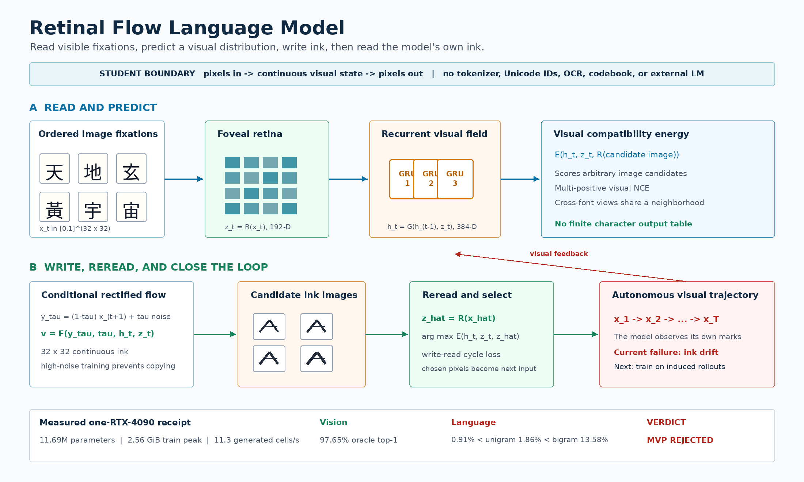

# Imagized Language Model

Version: 0.2, retinal-flow experimental paradigm

Date: 2026-08-12

## Thesis

An Imagized Language Model (ILM) should treat visible writing as its native
language substrate, not as decoration around a symbolic language model:

```text
image of writing -> continuous visual language state -> image of writing
```

Typed prompts remain convenient, but a deterministic renderer converts them to
images before the learned model boundary. Uploaded pages, handwriting,
historical characters, damaged print, and forms absent from Unicode can enter
the same boundary directly. The primary output is an image. OCR is an optional
post-process, never the model's hidden language channel.

## Strict model boundary

The independent student may receive:

- grayscale or RGB writing images;
- continuous convolutional feature fields;
- continuous recurrent states;
- noise fields and continuous flow time; and
- source image regions selected by an explicit provenance gate.

It may not receive:

- text strings after rasterization;
- BPE, word, byte, character, or Unicode IDs;
- OCR transcripts;
- character-class labels as model inputs;
- a finite visual or glyph codebook;
- an inverse table that decodes hidden IDs into writing; or
- calls to an external language model at inference.

A fixed image grid is a sensor layout, not a vocabulary. A continuous retinal
state is a visual observation, not a renamed token.

## Current paradigm: read, predict, write, reread

The implemented **Retinal Flow Language Model (RFLM)** is a causal probability
model over image fixations:

\[
p_\Theta(x_{1:T}) = p(x_1)\prod_{t=1}^{T-1}
p_\Theta(x_{t+1}\mid x_{\le t}),
\qquad x_t\in[0,1]^{H\times W}.
\]



### Read

A compact convolutional retina maps each `32x32` image fixation to a normalized
continuous visual state:

\[
z_t=R_\theta(x_t)/\lVert R_\theta(x_t)\rVert_2.
\]

Independent font views train the retina to preserve visible identity across
typographic nuisance. A target retina updated by exponential moving average
provides stable image-space targets.

### Remember

A recurrent visual field integrates the ordered history:

\[
h_t=G_\phi(h_{t-1},z_t).
\]

It is supervised only through consequences for future image prediction and
writing. There is no text-semantic teacher in the current checkpoint.

### Predict

A compatibility energy scores an arbitrary candidate image after the retina
reads it:

\[
s(c\mid x_{\le t}) = E_\psi(h_t,z_t,R_{\bar\theta}(c)).
\]

This avoids a finite character output layer. Multi-positive visual contrastive
training admits several renderings of the same visible form.

### Write

A conditional rectified flow learns a continuous path between target ink and
noise:

\[
y_\tau=(1-\tau)x_{t+1}+\tau\epsilon,
\qquad
\hat u=F_\omega(y_\tau,\tau,h_t,z_t).
\]

The model writes directly in pixel space. High-noise training forces it to use
context instead of copying visible target pixels.

### Reread

Generated endpoints are passed back through the target retina. A write-read
cycle loss aligns generated and real visual identity without OCR. During
autonomous inference, the model samples candidate ink images, rereads each,
selects by visual energy, pastes the selected pixels, and treats them as its next
observation.

This final feedback step is part of the language model, not a UI feature.

## Why the paradigm is useful

Visible writing carries information that symbolic normalization deletes:

- stroke topology and spatial composition;
- historical and regional form;
- handwriting, emphasis, correction, and damage;
- layout, reading order, annotation, and marginalia;
- continuity between pictorial and conventional writing; and
- forms that have no stable computer encoding.

A successful ILM could place modern explanation and ancient visual evidence in
one native answer object. For example, a question about `言` could return an
image page with readable Chinese or English prose and attested oracle, bronze,
seal, manuscript, and modern forms.

This does not imply that images are automatically more compute-efficient than
tokens or that human neural processing is identical to RFLM. Both remain
empirical questions.

## What the current experiment proves

The first complete RFLM has 11,690,244 parameters and trained on one RTX 4090
with 2.56 GiB peak VRAM. On a fixed 512-character Chinese visual bank:

- retina-oracle top-1 is 97.65%;
- recurrent full-context top-1 is 0.91%;
- last-fixation-only top-1 is 1.36%;
- unigram top-1 is 1.86%;
- symbolic bigram top-1 is 13.58%; and
- generated images have a positive `+0.0211` context cosine signal.

The visual alphabet is strong, but the language state is weak. Autonomous
feedback begins with glyph-like ink and then drifts into unreadable fragments.
The current MVP is rejected as a useful language model.

## What comes next

The next intervention is not immediate scale. It is **model-induced visual
trajectory training**:

1. Run short autonomous image rollouts from clean prefixes.
2. Store generated image states in a bounded replay queue.
3. Mix clean, perturbed, and generated prefixes during training.
4. Align clean and rollout recurrent trajectories in continuous visual space.
5. Measure whether full context beats last-fixation, unigram, and bigram
   baselines.
6. Require readable 32-cell autonomous output before widening the model.

After the causal visual gate passes, add a slow line/page state, image-to-image
instruction tuning, and provenance-gated historical glyph composition. A local
LLM may help create or critique offline curricula, but its strings and weights
must not enter the deployed ILM.

## Research contract

- Preserve negative results and compare against simple baselines.
- Separate retina identity from language prediction.
- Separate generated style from attested historical evidence.
- Record dataset rights, transforms, fonts, hashes, checkpoints, VRAM, and
  throughput.
- Claim efficiency only at matched quality on a named benchmark.
- Claim Qwen-8B parity only on a fixed published benchmark, never generally.

The detailed equations, measured receipt, acceptance gates, and staged
capabilities are in
[`first-imagized-language-model-goal.md`](first-imagized-language-model-goal.md).
The literature dossier is in
[`references/image-native-language-model-research.md`](../references/image-native-language-model-research.md),
and the compiled paper is in
[`publication/ilm-image-native/ilm-image-native.pdf`](../publication/ilm-image-native/ilm-image-native.pdf).
