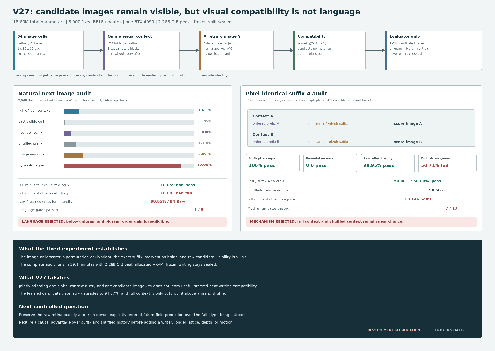

# Joint Visual Compatibility V27: Development Result

Date: 2026-08-13

## Verdict

V27 is **rejected as both a visual-compatibility mechanism and a natural-
Chinese language model** under its preregistered development protocol.

The experiment resolves the ambiguity left by V26. Candidate images are
visible: the unchanged V16 retina assigns cross-font identity at
`99.9512%`, candidate-order permutation changes scores by exactly `0.0`,
and the image-only boundary passes. Joint optimization nevertheless reduces
learned cross-font candidate identity to `94.8730%` and does not learn a
useful context-conditioned relation. On pixel-identical suffix pairs, full
context reaches `50.7080%` arm accuracy versus `50.5615%` after shuffling
the earlier prefix. The difference is `0.1465` percentage point, effectively
chance under the fixed gate.

On natural language, full-context top-1 is `1.6113%`, below the image unigram
(`2.0508%`) and symbolic bigram (`12.5977%`). Full context improves target
log probability over the same four-cell suffix by `0.05925` nat, but only
`0.00273` nat over a suffix-preserving prefix shuffle. This is not evidence
that sequence order controls the prediction. Seven of thirteen mechanism gates
and one of five language gates pass. The frozen partition remains sealed and no
writer is authorized.



## Fixed Experiment

Every input is a sequence of 64 ordered grayscale glyph images and every
candidate is another image:

```text
context:   B x 64 x 1 x 32 x 32
candidate: B x K  x 1 x 32 x 32
score:     B x K continuous compatibility
```

The student receives floating image tensors only. It receives no strings,
bytes, token or Unicode IDs, character labels, OCR transcript, glyph lookup,
discrete codebook, persistent candidate bank, or external language-model state.
Candidate collections and symbolic controls exist only in the evaluator.

An online retina initialized from V16 feeds an eight-layer, width-384 causal
rotary field. Its final state becomes a normalized context query. An EMA retina
and residual candidate projector map an arbitrary candidate image to a
normalized key:

\[
q(X)=\operatorname{normalize} Q(F(R_o(X))_{64}),\qquad
k(Y)=\operatorname{normalize} G_t(R_t(Y)),
\]

\[
s(X,Y)=\exp(\alpha)q(X)^\top k(Y),\qquad \exp(\alpha)\leq100.
\]

Candidate order is independently randomized for each paired visual view.
Training combines multi-positive cross-font natural-image contrast, symmetric
two-by-two assignment on suffix-matched pairs, cross-font candidate identity,
and VICReg-style variance and covariance regularization. The target retina and
projector are exponential-moving-average copies; no vocabulary table or
stochastic writer is present.

The complete system has `18,599,553` parameters, of which `17,118,401` are
trainable. The one fixed run performs 8,000 BF16 AdamW updates on one RTX 4090.
Training plus the complete development audit takes `2,347.47` seconds
(`39.12` minutes), with `2.267916 GiB` peak allocated CUDA memory.

The fixed receipts are:

- 7,017 public-domain Chinese records from 16 Wikisource works;
- 6,608 training, 190 development, and 219 sealed frozen identifiers;
- corpus SHA-256:
  `76048753b52735d14c98f0d9e4eb8d751401fe8810e82eaaaebff517f6866c03`;
- V16 initialization SHA-256:
  `90791001203640f0de66316cf2e30b3e2c588480fef0e3d9d4f6283ba043ecbe`;
- protocol SHA-256:
  `0c386dd2bb5198dd358613040e22297b16fbc5950f6b0bacda676f63cb223310`;
  and
- final checkpoint SHA-256:
  `49dc07f2f9bf369cd19c563be48145d93bd723bd4450bb09e76ce02c1e77e539`.

The deployed final checkpoint contains neither optimizer nor RNG state. Its
embedded source digests match the committed implementation.

## Natural-Language Evidence

The fixed natural audit contains 2,048 development windows and a shared
evaluator-only bank of 1,024 candidate images.

| Development measure | Measured | Fixed requirement | Result |
|---|---:|---:|:---:|
| Full-context top-1 | `0.016113` | diagnostic | - |
| Full-context top-5 | `0.023926` | diagnostic | - |
| Last-only top-1 | `0.001953` | diagnostic | - |
| Suffix-4 top-1 | `0.008301` | diagnostic | - |
| Shuffled-prefix top-1 | `0.013184` | diagnostic | - |
| Image-unigram top-1 | `0.020508` | control | below |
| Symbolic-bigram top-1 | `0.125977` | benchmark | below |
| Full minus unigram top-1 | `-0.004395` | `>0.03` | fail |
| Full minus bigram top-1 | `-0.109863` | `>0.01` | fail |
| Full minus bigram log probability | `-1.856770` nat | `>0.05` | fail |
| Full minus suffix-4 log probability | `+0.059248` nat | `>0.03` | pass |
| Full minus shuffled log probability | `+0.002726` nat | `>0.03` | fail |
| Learned cross-font identity top-1 | `0.948730` | `>=0.99` | fail |
| Student boundary clean | `1.0` | required | pass |
| Peak allocated CUDA memory | `2.267916 GiB` | `<18 GiB` | pass |

The `+0.059248` nat full-versus-suffix improvement is the sole passing
natural-language gate. It does not survive the order control: preserving the
same images while shuffling cells 1--60 removes only `0.002726` nat. The
full model is also worse than both frequency baselines. The fixed evidence
therefore supports, at most, weak order-insensitive context use.

## Pixel-Identical Suffix Intervention

The primary causal audit contains 512 cross-record suffix-4 pairs rendered in
two unseen development fonts. This yields 1,024 assignments and 2,048 scored
arms.

| Suffix-4 pair measure | Measured | Fixed requirement | Result |
|---|---:|---:|:---:|
| Suffix pixel equality | `1.0` | exact | pass |
| Candidate permutation score error | `0.0` | `<1e-5` | pass |
| Candidate permutation accuracy agreement | `1.0` | exact | pass |
| Raw V16 cross-font identity | `0.999512` | `>=0.99` | pass |
| Learned cross-font identity | `0.948730` | `>=0.99` | fail |
| Full-context arm accuracy | `0.507080` | `>0.65` | fail |
| Full-context both-correct rate | `0.088867` | `>0.40` | fail |
| Last-only arm accuracy | `0.500000` | exact chance | pass |
| Suffix-4 arm accuracy | `0.500000` | exact chance | pass |
| Shuffled-prefix arm accuracy | `0.505615` | control | near chance |
| Full minus suffix-4 accuracy | `+0.007080` | `>0.15` | fail |
| Full minus shuffled accuracy | `+0.001465` | `>0.05` | fail |
| Full minus shuffled margin | `+0.002265` | `>0.02` | fail |

Candidate permutation equivariance excludes a fixed diagonal or row-position
shortcut. The raw retina control excludes inability to distinguish target
forms. The exact last and suffix controls confirm that the paired evaluator is
balanced. The remaining result is direct: the jointly trained context query
does not select its associated candidate above chance, and preserving all
prefix images while changing only their order has negligible effect.

## What The Result Means

V27 falsifies a specific proposed mechanism: under this corpus, budget, and
objective, jointly adapting a visual retina, a causal global query, and a
dot-product image-candidate key does not produce useful next-writing
compatibility.

The failure is more localized than V26:

1. **Candidate pixels are sufficient.** The untouched V16 geometry gives
   `99.9512%` cross-font identity.
2. **The evaluator is equivariant.** Independently permuting candidates changes
   scores by exactly zero after undoing the permutation.
3. **Joint adaptation damages form geometry.** Learned candidate identity falls
   by `5.0781` percentage points to `94.8730%`, despite the identity loss.
4. **Context does not bind the candidate.** Pair assignment is `50.7080%`,
   only `0.1465` point above shuffled context.
5. **The weak natural score is not useful language.** It is below unigram and
   bigram, and its log-probability advantage disappears under prefix shuffling.
6. **Low resource use is not an efficiency result.** Capability-normalized
   efficiency remains unestablished.

This result rejects V27, not the broader image-native language hypothesis.
However, another global-query/candidate-dot-product tuning pass is not
justified by this evidence.

## Next Controlled Question

The next experiment should keep each full-resolution glyph image as the
authoritative visual stream and preserve the already strong raw retinal
geometry exactly. A reversible two-dimensional fold may provide parallel
computation, but it must retain sequence order and invert exactly back to the
`N x 1 x 32 x 32` glyph stream. Geometric depth and movies remain later
observable axes, not hidden identity channels.

The predictive objective should become dense and explicitly ordered: every
eligible position predicts a future visual field, and training must force the
correct history to outperform a suffix-preserving shuffle for the same
candidate images. Candidate interaction should be local or cross-attentive
rather than compressed to one global dot product. A raw-retina-preserving route
and exact order intervention must pass before a writer, longer context, 3D
stream, or historical-etymology answer page is authorized.

## Reproduction

Run the fixed evidence path:

```bash
CUDA_VISIBLE_DEVICES=0 PYTHONPATH=. \
  python scripts/train_joint_visual_compatibility_v27.py \
  --device cuda \
  --num-workers 4 \
  --log-every 100
```

Re-run only the fixed development audit:

```bash
CUDA_VISIBLE_DEVICES=0 PYTHONPATH=. \
  python scripts/eval_joint_visual_compatibility_v27.py \
  --checkpoint artifacts/joint_visual_compatibility_v27_evidence/checkpoint_final.pt
```

Regenerate the checked figure:

```bash
python publication/ilm-image-native/generate_v27_result_figure.py
```

Primary local receipts:

- `artifacts/joint_visual_compatibility_v27_evidence/development_audit.json`;
- `artifacts/joint_visual_compatibility_v27_evidence/checkpoint_final.pt`; and
- `artifacts/joint_visual_compatibility_v27_evidence/train.jsonl`.

The model artifacts are intentionally ignored by Git. Code, frozen protocol,
result document, and the evidence-derived figure are tracked.
