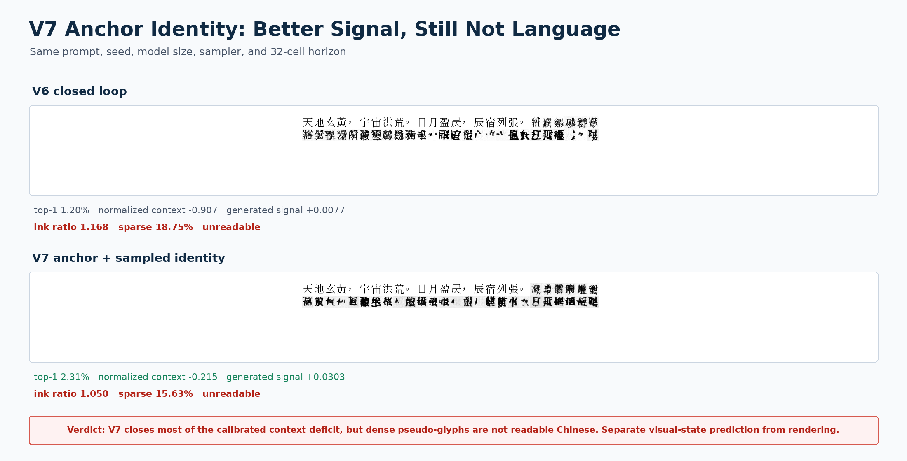

# RFLM V7 Anchor-Identity Experiment

Date: 2026-08-12

## Question

V6 learned to preserve ink under autonomous visual feedback, but it did not
learn useful visual language. Its raw full-versus-last target-energy gain was
positive even though full context had worse normalized target probability and
worse top-1 retrieval. V7 tested a narrower hypothesis:

> Can an independent image-anchor contrast set, a normalized visual-context
> advantage, and differentiable sampled-endpoint identity make full visual
> history useful without introducing character IDs into the student?

The answer is **partly, but not enough**. V7 improves four failed measurements
and crosses the unigram and generated-target-signal gates. It still fails the
calibrated context gate, remains far below a symbolic bigram, and writes
unreadable pseudo-glyphs.

## Corrected context objective

Raw energy differences are not comparable when a learned scorer can change the
scale or the scores of every candidate. For a candidate image set
\(\mathcal C\), the relevant quantity is the normalized target log probability

\[
\ell(y\mid h,\mathcal C)=
s(y\mid h)-\log\sum_{c\in\mathcal C}\exp s(c\mid h).
\]

V7 trains the full visual state against a detached last-fixation state with

\[
\mathcal L_{\mathrm{ctx}}=
\max\left(0,m-\ell(y\mid h_{\mathrm{full}},\mathcal C)
+\ell(y\mid h_{\mathrm{last}},\mathcal C)\right).
\]

The candidate set contains 2,048 independently rendered image anchors covering
512 common Han forms and four views. Character strings choose the offline
curriculum only. The student receives candidate image embeddings, discovers
positives by visual similarity, and receives neither anchor IDs nor target
indices. The anchor pixels use a rendering seed disjoint from the frozen
evaluator bank and are not stored with or used by the deployed model.

V7 also differentiates through a two-step flow endpoint:

\[
\hat x_0=\operatorname{Flow}_{K=2}(\epsilon,h_t),\qquad
\mathcal L_{\mathrm{sample}}=
\operatorname{NCE}\left(R_{\bar\theta}(\hat x_0),
\{R_{\bar\theta}(y^{(v)})\}_{v=1}^{V}\right).
\]

This is real gradient flow through the deployed numerical image integrator, not
a one-step denoising proxy. V6's stop-gradient model-induced rollouts remain as
stability regularizers.

## Run receipt

V7 resumed V6 step 5,200 and trained for 800 updates on one RTX 4090. The model
remained 11,690,244 parameters. The continuation added about 261 seconds of
training and peaked near 3.0 GiB allocated VRAM.

```bash
CUDA_VISIBLE_DEVICES=0 PYTHONPATH=. python scripts/train_retinal_flow_lm.py \
  --manifest data/visual_grammar/chinese_wikisource_public_domain.jsonl \
  --out artifacts/retinal_flow_chinese_mvp_v7_anchor_identity \
  --resume artifacts/retinal_flow_chinese_mvp_v6_closed_loop/checkpoint_step_0005200.pt \
  --sequence-length 48 --energy-positions-per-sequence 8 --batch-size 32 \
  --epochs 5 --maximum-steps 6000 --num-workers 10 \
  --lr 6e-5 --lr-cycle-start-step 5200 --warmup-steps 50 \
  --minimum-lr-ratio 0.08 \
  --context-advantage-weight 0.5 --context-advantage-margin 0.5 \
  --context-anchor-bank-size 512 --context-anchor-views 4 \
  --context-anchor-positive-similarity 0.85 \
  --context-anchor-batch-size 32 --context-anchor-refresh-steps 200 \
  --context-anchor-seed-offset 17000009 \
  --sampled-identity-weight 0.2 --sampled-identity-batch-size 4 \
  --sampled-identity-steps 2 --sampled-identity-guidance-scale 1.5 \
  --context-identity-start-step 5200 --context-identity-ramp-steps 200 \
  --rollout-start-step 3600 --rollout-ramp-steps 400 \
  --rollout-batch-size 8 --rollout-steps 2 --rollout-candidates 2 \
  --rollout-sample-steps 2 --rollout-guidance-scale 1.5 \
  --log-every 20 --validate-every 200 --save-every 200 \
  --precision bf16 --device cuda --seed 20260812
```

The preregistered validation checkpoints showed positive anchor-bank context
gain after step 5,400. Step 5,800 had the strongest combination of held-out
anchor gain (`+0.1798`) and sampled-image F1 (`0.3636`), so it was selected
before reading its frozen-bank result. Step 6,000 was also evaluated as the
terminal checkpoint.

## Frozen-bank result

All rows use the same 512-character, four-view bank and the same SHA-256:

```text
543987ddd754135cff34dbee0f6f91ce1971741d0807754c65650031121181c4
```

| Measurement | V6 step 5,200 | V7 step 5,800 | V7 step 6,000 |
|---|---:|---:|---:|
| Full-context top-1 | 1.197% | **2.311%** | 2.022% |
| Full-context top-5 | 3.219% | **5.613%** | 5.324% |
| Last-fixation top-1 | 1.692% | 2.022% | 1.940% |
| Unigram top-1 | 1.857% | 1.857% | 1.857% |
| Symbolic bigram top-1 | 13.578% | 13.578% | 13.578% |
| Retina-oracle top-1 | 98.184% | **98.267%** | 98.225% |
| Raw target-score gain | +2.806 | +2.463 | +2.510 |
| Normalized target-log-probability gain | **-0.9066** | **-0.2155** | -0.2195 |
| Generated context cosine gain | +0.0077 | **+0.0303** | +0.0318 |
| Generated best pixel F1 | 0.4253 | **0.4282** | 0.4164 |
| Generated sample target hit | 1.0417% | 0.5208% | 0.5208% |
| Accepted | false | false | false |

V7 closes about 76% of V6's normalized context deficit and raises full-context
top-1 above both last-only and unigram at the selected checkpoint. This is a
real improvement. It does not establish useful long context: the mean target
log probability is still lower under full history, and its top-1 is only about
one-sixth of the corpus bigram baseline.

The mismatch between positive raw score gain and negative normalized gain is
the main calibration lesson. A scorer can raise the target score while raising
competitors even more. Future acceptance uses normalized log probability and
rank, never raw target energy alone.

## Autonomous result

V6 and V7 used the same prompt, seed, model size, 32-cell horizon, eight image
candidates, eight flow steps, guidance, and soft pixel feedback.



| Autonomous measure | V6 | V7 step 5,800 |
|---|---:|---:|
| Cells per second | 21.51 | **25.28** |
| Mean ink | 0.2418 | 0.2987 |
| Late/early ink ratio | 1.168 | **1.050** |
| Sparse cells | 18.75% | **15.63%** |
| First/last candidate cosine | 0.443 / 0.444 | 0.539 / 0.554 |
| Human-readable continuation | false | false |

V7 produces denser, more character-like stroke masses and less occupancy drift,
but visual inspection remains decisive: the second line is a sequence of dense
pseudo-glyphs, not readable Chinese. Increased ink and visual self-similarity
are not language.

## Verdict and architectural consequence

V7 is **rejected as a language model**. It validates normalized visual
calibration and differentiable image endpoints as useful interventions, but it
also falsifies the assumption that the same pixel writer should discover both
future visual identity and stroke rendering.

The next model separates these roles while retaining a strict image-only
boundary:

1. A frozen or slowly moving retina defines a continuous visual manifold from
   independently rendered and scanned writing images.
2. A causal predictive visual field models the distribution of the next
   retinal state with flow matching in that continuous image-derived space.
3. A pixel flow renders a sampled visual state; it no longer has to infer
   linguistic identity and draw the glyph in one operation.
4. The rendered pixels are reread, and the resulting state is fed back.
5. No nearest-character lookup or unembedding table is allowed at deployment.

This **Predictive Visual Field** is related to recurrent JEPA, D-JEPA, and
continuous embedded language flow, but its source and endpoint are both images:
retinal image state replaces token embeddings, and a learned pixel writer
replaces discrete unembedding. It is a hypothesis for V8, not a capability
claim.
