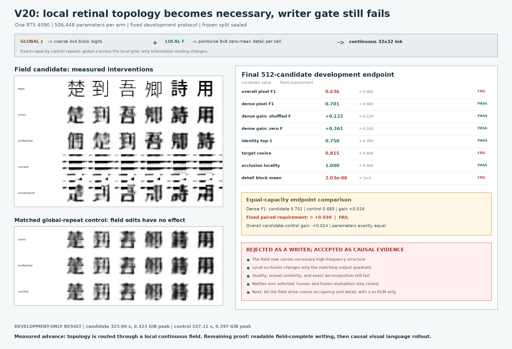

# Retinal Topology Router V20: Development Result

Date: 2026-08-12

## Verdict

V20 is **rejected as a selected visual writer** and **retained as positive
causal-routing evidence**.

The candidate made a continuous `4x4x192` retinal field necessary for local
stroke detail. Shuffling that field reduced dense F1 by `0.12177`; zeroing it
reduced dense F1 by `0.36128`. Occluding one field quadrant changed only the
matching output quadrant, with measured locality `1.0`. The exact-capacity
global-repeat control was invariant to all field interventions.

The stronger writer claim fails. Candidate overall F1 (`0.63608`) and target
cosine (`0.81519`) missed their fixed gates. Its floating-point detail mean
(`2.03e-6`) missed the strict `<1e-6` decomposition tolerance. At the final
endpoint it exceeded the matched control by only `0.01791` dense F1, below the
preregistered `>0.03` paired margin. Neither arm selected a checkpoint, so the
paired evaluator correctly refused to run, blinded review was not authorized,
and the frozen partition stayed sealed.



## Fixed Test

The candidate and control each have exactly `506,448` trainable parameters.
Both receive an image-derived global state, image-derived style, and a
`4x4x192` continuous field-shaped input. They differ only in routing:

- **field candidate:** each local field cell independently emits an `8x8`
  zero-block-mean detail patch; the global branch emits only `4x4` coarse block
  logits;
- **global-repeat control:** the same local decoder and parameter count receive
  the global state repeated over all `4x4` locations instead of the retinal
  field.

The target image supplies loss only. No token ID, string, Unicode ID, OCR
transcript, character label, glyph lookup, finite visual codebook, candidate
answer table, or external language model enters the learned path.

The split and gates were fixed before training in
[`references/retinal_topology_router_v20_protocol.md`](../references/retinal_topology_router_v20_protocol.md).
The salted partition contains `6,611` training records, `196` development
records, and `210` frozen records. Validation renders `512` development
candidates, including `146` dense forms. Candidate and control each trained for
exactly `1,600` updates on one RTX 4090.

## Candidate Gates

| Fixed development gate | Measured | Required | Result |
|---|---:|---:|:---:|
| Overall pixel F1 | `0.63608` | `>0.66` | fail |
| Dense pixel F1 | `0.70131` | `>0.68` | pass |
| Dense gain over shuffled field | `+0.12177` | `>0.12` | pass |
| Dense gain over zero field | `+0.36128` | `>0.10` | pass |
| Identity top-1 | `75.000%` | `>70%` and above shuffled | pass |
| Target cosine | `0.81519` | `>0.82` and above shuffled | fail |
| Correct-vs-shuffled field L1 | `0.10860` | `>0.08` | pass |
| Correct-vs-zero field L1 | `0.23857` | `>0.08` | pass |
| Occlusion pixel change | `0.05964` | `>0.02` | pass |
| Occlusion locality | `1.00000` | `>0.40` | pass |
| Semantic-target L1 | `0.12287` | `>0.05` | pass |
| Coarse within-block variation | `0.0` | `<1e-6` | pass |
| Detail block-mean magnitude | `2.03e-6` | `<1e-6` | fail |
| Frozen images instantiated | `0` | `0` | pass |

The candidate passes every causal field-use gate. It fails three independent
selection requirements, so its visually recognizable endpoint is still an
unselected development model.

## Matched Control

| Final endpoint diagnostic | Field candidate | Global-repeat control | Difference |
|---|---:|---:|---:|
| Parameters | `506,448` | `506,448` | `0` |
| Overall F1 | `0.63608` | `0.61213` | `+0.02395` |
| Dense F1 | `0.70131` | `0.68339` | `+0.01791` |
| Identity top-1 | `75.000%` | `68.359%` | `+6.641 pp` |
| Target cosine | `0.81519` | `0.77946` | `+0.03573` |
| Field intervention effect | nonzero and local | exactly zero | expected |

The endpoint overall noninferiority condition is satisfied, but the dense gain
does not exceed `0.03`. This table is diagnostic, not a substitute for the
formal paired evaluator: the preregistered evaluator accepts only checkpoints
that first pass their own selection rules, and neither arm did.

## What V20 Establishes

V19 showed that exposing local features as an additive residual does not force
a complete global writer to use them. V20 changes the causal graph rather than
only the loss. Its global branch cannot represent within-block detail, and the
measured interventions confirm that the local continuous field carries that
detail. The exact `1.0` occlusion-locality score rules out a merely global
field-dependent effect in this implementation.

This result establishes a useful structural fact: a compact, image-only,
continuous writer can be forced to use topographically corresponding retinal
information without a discrete character bottleneck. It does not establish
readable broad Chinese generation, autonomous language continuation,
instruction following, historical etymology, Qwen parity, or end-to-end
efficiency over token models.

The invariant miss is also informative. Both matched arms exceed the
`1e-6` detail-mean tolerance only after detail magnitude grows. V21 should use a
fixed zero-mean basis, or an equivalently algebraic projection, rather than
depending on floating-point recentering at the acceptance boundary.

## Next Decisive Proof

V21 should be a **field-complete visual writer**, not a wider V20:

1. The continuous local field determines both coarse occupancy and fine stroke
   detail through a bounded topographic decoder.
2. The global state may provide only spatially uniform channel modulation,
   scale, or style; it cannot draw a spatial plan.
3. A fixed basis makes the coarse/detail decomposition exact by construction.
4. The equal-capacity global-repeat control, shuffled field, zero field, four
   local occlusions, and sealed split remain mandatory.
5. Reread consistency is optimized and gated alongside pixel topology.
6. Only after a selected writer passes automatic, blinded, and frozen gates may
   the causal model predict its local/global state and close a 32-region
   image-write-reread rollout.

The first end-to-end proof remains intentionally small: learn a bounded Chinese
visual stream, predict the next continuous visual field, render it as pixels,
reread those pixels, and retain legibility without any deployed symbolic path.

## Reproduction Receipt

```bash
PYTHONPATH=. python scripts/train_retinal_topology_router.py \
  --route-mode field \
  --output artifacts/retinal_topology_router_v20_field_evidence_20260812

PYTHONPATH=. python scripts/train_retinal_topology_router.py \
  --route-mode global_control \
  --output artifacts/retinal_topology_router_v20_control_evidence_20260812

PYTHONPATH=. python scripts/eval_retinal_topology_router_development.py \
  --candidate artifacts/retinal_topology_router_v20_field_evidence_20260812/checkpoint_latest.pt \
  --control artifacts/retinal_topology_router_v20_control_evidence_20260812/checkpoint_latest.pt
```

The last command is expected to reject these unselected checkpoints before
evaluation. Evidence paths are intentionally ignored by Git; the result figure
is tracked and reproducible from them.

| Artifact | SHA-256 |
|---|---|
| Candidate checkpoint | `2f61cf72fb93afa7b6ccbad9852645e5c3ac199b56cf65cdc50c9873c94658aa` |
| Control checkpoint | `0127b9bdfc13576552f5e428a0caad5226108704970578fe84e450428154ade0` |
| Candidate log | `1860b945b8c34f189e1c26c31064ee78a6414c488888b15cc857f8c3de10245a` |
| Control log | `1e205aaa7a6e60018b73e35c3ba21bb9ba010bb1adad8632b7f83d9588670cd2` |
| Candidate final grid | `0b3cdd8391a5b4eb27376ec85ba2dd30cbe8b533c4ed263ad86f4d0c2b32ca7d` |
| Control final grid | `222507a70db4652f813b26d80bcf221a52f45fc2444394e99aa4ffabc4c8aecd` |
| Candidate protocol | `0268458432ac2f295525105bb37b11c7a9e0f551dd69c6a2b4ea204bdaa41595` |
| Control protocol | `feb7f9458d9ee42cb9bdc4969c74fc9476dec3d0ce1006b036ec23dc843d32d9` |

Candidate training took `325.90 s` at `0.323 GiB` peak allocated CUDA memory.
Control training took `327.11 s` at `0.397 GiB`. These are mechanism-test
measurements, not full-model efficiency claims.
