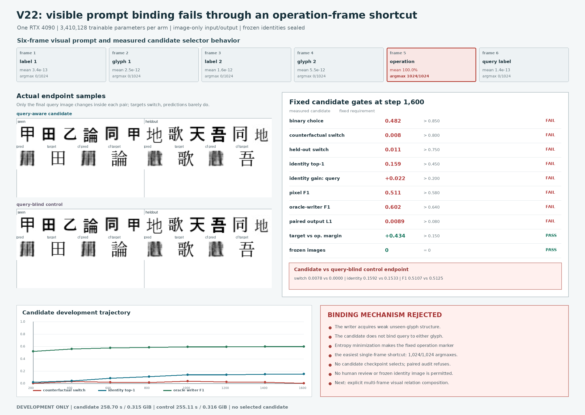

# Visual Binding Stream V22: Development Result

Date: 2026-08-13

## Verdict

V22 is **rejected as a visual prompt binder**.

The experiment is still useful because it separates three facts. The image-only
student can produce a weak glyph-like canonical answer, its overlapping writer
improves steadily, and its output remains almost independent of the visible
query. At the fixed step-`1,600` endpoint, the query-aware candidate obtains
only `0.00781` paired counterfactual switch accuracy and changes its pixels by
only `0.00890` mean L1 when the final query-label image changes. The query-blind
control obtains `0.0` and `0.0`. Candidate and control identity top-1
(`0.15918` and `0.15332`) and pixel F1 (`0.51067` and `0.51252`) are nearly the
same.

A reproducible development-only attention audit identifies the shortcut. The
candidate assigns the operation frame the maximum selector weight in all
`1,024/1,024` original and counterfactual prompts. Mean operation attention is
`1.0`; mean query-label attention is `1.37e-13`, and neither source-glyph frame
ever wins. The positive entropy-minimization term therefore rewarded the
easiest stable single-frame marker while the writer learned an
operation-conditioned average form. This is a binding-objective failure, not a
GPU-capacity failure.

No candidate checkpoint selected. The paired evaluator correctly refuses the
endpoint before constructing a new dataset. Blinded human review and frozen
evaluation are forbidden, and frozen image count remains zero.



## Fixed Test

Each prompt is a six-frame continuous image stream:

```text
[label_1, glyph_1, label_2, glyph_2, operation, query_label]
```

The visible operation `同` asks for the glyph bound to the query label; `异`
asks for the other glyph. The paired counterfactual changes only the final
query-label image, so the correct answer must switch. Source glyphs use
noncanonical fonts and augmentation; targets use an independent canonical
face. The `1,024`-identity bank is split by a preregistered salted hash into
`815` training, `104` development, and `105` frozen identities. Two
operation/label combinations are compositionally held out.

The candidate and query-blind control each contain exactly `3,410,128`
trainable parameters with identical parameter shapes. Both use the same frozen
V16 visual retina, four-block continuous visual Transformer, six learned
sensory-time positions, and overlapping partition-of-unity local writer. The
control replaces only the final query retinal state with a learned continuous
null state. No string, token ID, Unicode ID, OCR transcript, character label,
operation ID, target index, visual codebook, glyph lookup, candidate answer
table, or external language model enters either student.

The complete architecture, split, losses, thresholds, controls, and frozen
policy were fixed before implementation and evidence training in the
[`V22 protocol`](../references/visual_binding_stream_v22_protocol.md). Each arm
trained for exactly `1,600` updates with batch size `64` and BF16 on one RTX
4090. Validation used `512` paired development episodes at every `200` steps.

## Candidate Gates

The final candidate endpoint fails every prompt-dependence and output-quality
gate except the two anti-copy margins and structural receipts.

| Fixed development gate | Measured | Required | Result |
|---|---:|---:|:---:|
| Binary choice accuracy | `0.48242` | `>0.85` | fail |
| Counterfactual switch accuracy | `0.00781` | `>0.80` | fail |
| Held-out-combination switch | `0.01128` | `>0.75` | fail |
| Global identity top-1 | `0.15918` | `>0.45` | fail |
| Identity gain over query shuffle | `+0.02246` | `>0.20` | fail |
| Generated target cosine | `0.46007` | `>0.78` | fail |
| Generated pixel F1 | `0.51067` | `>0.58` | fail |
| Oracle-writer pixel F1 | `0.60196` | `>0.64` | fail |
| Paired output pixel L1 | `0.00890` | `>0.08` | fail |
| Target margin over operation image | `+0.43351` | `>0.15` | pass |
| Target margin over query-label image | `+0.55887` | `>0.15` | pass |
| Student boundary clean | `true` | `true` | pass |
| Frozen images instantiated | `0` | `0` | pass |

The trajectory rules out a late prompt-binding transition. Writer metrics rise,
but switch behavior remains close to chance failure throughout.

| Step | Switch accuracy | Identity top-1 | Pixel F1 | Oracle-writer F1 |
|---:|---:|---:|---:|---:|
| 200 | `0.00586` | `0.02246` | `0.47354` | `0.52448` |
| 400 | `0.03516` | `0.04492` | `0.48683` | `0.56171` |
| 600 | `0.02344` | `0.08691` | `0.49826` | `0.57788` |
| 800 | `0.01953` | `0.11328` | `0.50345` | `0.58849` |
| 1,000 | `0.04297` | `0.14648` | `0.50480` | `0.59483` |
| 1,200 | `0.02734` | `0.14453` | `0.50898` | `0.59894` |
| 1,400 | `0.02344` | `0.15137` | `0.51022` | `0.60098` |
| 1,600 | `0.00781` | `0.15918` | `0.51067` | `0.60196` |

## Matched Control

The query-blind control passes its structural invariant and selects step
`1,600` only as the required control checkpoint. It does not have a quality
minimum. The following endpoint comparison is descriptive, not the forbidden
formal paired audit.

| Development endpoint | Query-aware candidate | Query-blind control | Difference |
|---|---:|---:|---:|
| Parameters | `3,410,128` | `3,410,128` | `0` |
| Binary choice | `0.48242` | `0.50000` | `-0.01758` |
| Counterfactual switch | `0.00781` | `0.00000` | `+0.00781` |
| Identity top-1 | `0.15918` | `0.15332` | `+0.00586` |
| Query-shuffled identity top-1 | `0.13672` | `0.13672` | `0.00000` |
| Pixel F1 | `0.51067` | `0.51252` | `-0.00185` |
| Oracle-writer F1 | `0.60196` | `0.60176` | `+0.00020` |
| Paired output pixel L1 | `0.00890` | `0.00000` | `+0.00890` |

These near-overlapping endpoints reject the claim that V22 learned to use the
query. Candidate output differs slightly because the query state is present,
but that difference neither chooses the correct source nor switches the answer.

## Mechanism Audit

The endpoint audit replays the exact `512` development pairs used during
training validation and concatenates each original and counterfactual prompt,
for `1,024` image streams per arm. It reads only the model's six continuous
selector weights. It does not construct the identity bank, score checkpoint
selection, inspect frozen records, or alter any gate.

| Prompt role | Candidate mean attention | Candidate argmax | Control mean attention | Control argmax |
|---|---:|---:|---:|---:|
| Label 1 | `3.37e-13` | `0` | `0.06055` | `62` |
| Glyph 1 | `2.49e-12` | `0` | `1.22e-21` | `0` |
| Label 2 | `1.61e-12` | `0` | `0.06286` | `64` |
| Glyph 2 | `5.53e-12` | `0` | `6.28e-27` | `0` |
| Operation | **`1.00000`** | **`1,024`** | `0.87659` | `898` |
| Query label | `1.37e-13` | `0` | `1.24e-28` | `0` |

The task is relational: the answer depends jointly on the query-to-label match,
the two label/glyph bindings, and the operation. A softmax that must collapse
the whole prompt into one selected frame cannot represent that computation
reliably. The entropy penalty makes the mismatch worse by rewarding certainty.
V23 must therefore remove single-frame selection as the binding primitive. It
should form two visual label/glyph slots, compare the visual query against both
label images with shared weights, read the operation image as a continuous
gate, and compose those relations before routing either glyph state to a frozen
or independently qualified writer. Query-blind and operation-blind controls
must intervene at those exact relation inputs.

## What V22 Establishes

V22 establishes a real six-frame image-input to image-output training and
evaluation path under the strict student boundary. It also shows that the
overlapping writer learns weak unseen-form structure: endpoint oracle F1 is
`0.60196`, and full-model identity top-1 is `15.92%` over `104` unseen
identities, above the `0.96%` uniform-bank rate. Those facts are actuator and
generalization diagnostics only.

V22 does **not** establish visual prompt understanding, compositional binding,
open-domain Chinese generation, book continuation, etymology knowledge,
historical-form synthesis, page or movie generation, parity with Qwen, or
efficiency superiority. Its `0.315` GiB peak allocation shows that compute
capacity was available; it does not make a task-level efficiency claim.

## Reproduction Receipt

```bash
CUDA_VISIBLE_DEVICES=0 PYTHONPATH=. python scripts/train_visual_binding_stream.py \
  --pvf-checkpoint artifacts/predictive_visual_field_v16_memory_pilot/checkpoint_step_0002200.pt \
  --route-mode query_aware \
  --out artifacts/visual_binding_stream_v22_candidate_20260813

CUDA_VISIBLE_DEVICES=0 PYTHONPATH=. python scripts/train_visual_binding_stream.py \
  --pvf-checkpoint artifacts/predictive_visual_field_v16_memory_pilot/checkpoint_step_0002200.pt \
  --route-mode query_blind \
  --out artifacts/visual_binding_stream_v22_control_20260813

CUDA_VISIBLE_DEVICES=0 PYTHONPATH=. python scripts/audit_visual_binding_attention_v22.py \
  --candidate-checkpoint artifacts/visual_binding_stream_v22_candidate_20260813/checkpoint_latest.pt \
  --control-checkpoint artifacts/visual_binding_stream_v22_control_20260813/checkpoint_latest.pt \
  --out artifacts/visual_binding_stream_v22_attention_audit_20260813/attention_roles.json

CUDA_VISIBLE_DEVICES=0 PYTHONPATH=. python scripts/eval_visual_binding_stream_development.py \
  --candidate-checkpoint artifacts/visual_binding_stream_v22_candidate_20260813/checkpoint_latest.pt \
  --control-checkpoint artifacts/visual_binding_stream_v22_control_20260813/checkpoint_selected_development.pt \
  --out artifacts/visual_binding_stream_v22_paired_audit_20260813
```

The last command must raise
`ValueError: candidate has no selected development checkpoint` before creating
the output directory. Candidate training took `258.70 s` at `0.31511 GiB` peak
allocated CUDA memory. Control training took `255.11 s` at `0.31625 GiB`.

| Artifact | SHA-256 |
|---|---|
| Candidate endpoint checkpoint | `0839ce4fee735100fb1a8622ae3e6c45a4cf1104d4208533be8e7e05b5423701` |
| Candidate training log | `abce2bf55931cb2ab62f55b9515b91af831f45313acdb176d7acdc14f0c25330` |
| Candidate endpoint sample sheet | `c7a003285518cdc044eaff463cfb0f45cd0d98afbaccf32099ba7e06137696b2` |
| Control endpoint checkpoint | `794ebeb35bb8eb2f999afcf30a6abd8a4b673f9915808e8a169c777addc7ebff` |
| Control selected checkpoint | `4e4e3391e47bc7e1195ab88f71569aec18150eb35509ee08021f639167d0d829` |
| Control training log | `1547d96638e5bceee902c310553a74194a1606313bedd06214bf902ba5efa716` |
| Control endpoint sample sheet | `e8f30b12d2baa1ed6e478b195340f5836a4a600f9e42c19d62d2223144c8ca58` |
| Fixed protocol | `112c9d6ad87cdb8cc88c35bb5d908ebc75e8e531ccf4a8a1c0a350e3b2e0a191` |
| Development attention audit | `f2c8200964e0c79a0e6c67cf11ef2016dc4484047e93768646b1d252fc97acdb` |
| Tracked result figure | `43d68ef80eb6d19cf03ffe64d63ac78ce784edc4a5ae5498390d61b562729541` |

Generated checkpoints and logs remain ignored by Git. The protocol, diagnostic
code, result generator, figure, and this interpretation are tracked.
