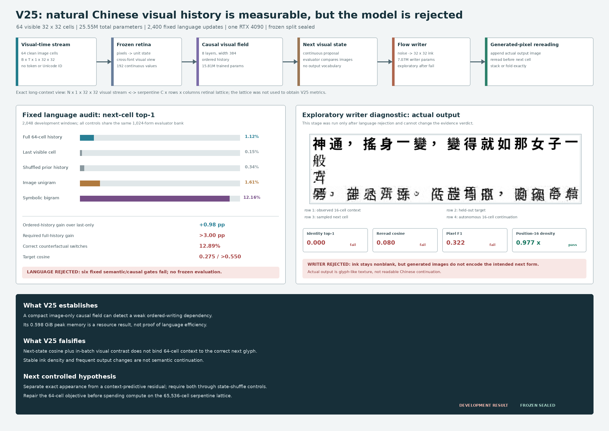

# Visual Cell Stream V25: Development Result

Date: 2026-08-13

## Verdict

V25 is **rejected as a natural-Chinese visual language model** under its fixed
development protocol.

The experiment does detect a small ordered-history signal. With 64 visible
`32x32` writing cells, full-history top-1 is `1.123%`, versus `0.146%` with
only the last cell and `0.342%` after shuffling prior history. Full history also
improves target log probability over last-only by `0.04882` nat. These effects
show that the causal image field uses more than the final glyph.

They are not enough to establish useful language prediction. Full-history
top-1 remains below the image-unigram control (`1.611%`) and far below the
symbolic bigram benchmark (`12.158%`). Six fixed language-quality and
counterfactual gates fail. The frozen partition remains sealed.



## Fixed Experiment

The student receives an ordered volume of visible writing,

\[
X\in[0,1]^{B\times64\times1\times32\times32},
\]

and predicts a continuous visual state for the next cell. A convolutional flow
writer can then draw the next `32x32` image, append the actual generated pixels,
and reread them before another prediction. The learned path receives no
strings, token or Unicode IDs, character labels, OCR transcripts, glyph lookup,
discrete codebook, or external language model.

The model has `25,549,714` total parameters. The fixed language stage trains
`15,810,241` parameters in an eight-layer, width-384 causal visual field while
freezing the V16 image retina and pixel writer. Two independently rendered
font views and gradient accumulation give an effective batch of 24 streams per
update. The evidence run completed all 2,400 updates on one RTX 4090.

The data manifest contains 7,017 public-domain Chinese records from 16 works:

- manifest SHA-256:
  `76048753b52735d14c98f0d9e4eb8d751401fe8810e82eaaaebff517f6866c03`;
- training groups: `6,608`;
- development groups: `190`;
- sealed frozen groups: `219`; and
- protocol SHA-256:
  `dbe724443971ee8ba25932734cc950404cff6c67eb12aa794b257164c1df4019`.

The evaluator alone opens character strings to build a 1,024-form visual bank
and symbolic frequency baselines. The student never receives that bank or its
labels. The audit uses 2,048 fixed development windows and 512 paired
counterfactuals.

## Language Evidence

| Development measure | Measured | Fixed requirement | Result |
|---|---:|---:|:---:|
| Full-history top-1 | `0.011230` | diagnostic | - |
| Last-only top-1 | `0.001465` | diagnostic | - |
| Shuffled-history top-1 | `0.003418` | diagnostic | - |
| Image-unigram top-1 | `0.016113` | diagnostic | - |
| Symbolic-bigram top-1 | `0.121582` | benchmark | below |
| Full minus last top-1 | `+0.009766` | `>0.030` | fail |
| Full minus unigram top-1 | `-0.004883` | `>0.030` | fail |
| Full minus last target log probability | `+0.048825` | `>0.050` | fail |
| Full minus shuffled top-1 | `+0.007812` | `>0.015` | fail |
| Counterfactual switch accuracy | `0.128906` | `>0.550` | fail |
| Full-history target cosine | `0.275127` | `>0.550` | fail |
| Student boundary clean | `1.0` | required | pass |
| Peak allocated CUDA memory | `0.597629 GiB` | `<18 GiB` | pass |

The counterfactual top-1 output changes frequently (`0.77930`), but it changes
to the correct history-dependent target only `0.12891` of the time. This is a
critical distinction: sensitivity to context is not the same as correct use of
context.

The evidence run therefore stops at the language gate. Writer training and a
frozen query are not authorized by the fixed protocol.

## Exploratory Writer Diagnostic

To localize the downstream failure, a second command explicitly used
`--exploratory --continue-writer-after-failed-language`. This run is not part of
the accepted evidence path and cannot repair the rejected language stage. It
freezes the failed language checkpoint and trains only the `7,073,617` writer
parameters for 1,200 updates.

On 256 development targets plus 16 autonomous continuations:

| Exploratory writer measure | Measured | Fixed gate | Result |
|---|---:|---:|:---:|
| Generated identity top-1 | `0.000000` | `>0.20` | fail |
| Reread target cosine | `0.080154` | `>0.60` | fail |
| Generated pixel F1 | `0.322101` | `>0.45` | fail |
| Blank rate | `0.000000` | `<0.05` | pass |
| Position-16 density ratio | `0.976574` | `[0.50,1.50]` | pass |
| Adjacent autonomous repeat rate | `0.000000` | diagnostic | - |
| Actual generated pixels reread | `1.0` | required | pass |

The writer learns ink occupancy and avoids blank or immediately repeated
cells, but it does not draw the intended forms. The measured sample must be
read in four rows: 16 observed context cells, one held-out next cell, one
sampled next cell, and a 16-cell autonomous continuation. The latter rows are
glyph-like textures rather than correct Chinese writing.

## What The Result Means

V25 falsifies the specific assumption that a generic causal Transformer over a
fixed cross-font retinal embedding, optimized by next-state cosine plus
in-batch visual contrast, will become a useful next-writing model after 2,400
updates. The inexpensive runtime is real, but low VRAM does not imply language
efficiency when predictive quality is below a bigram.

The likely bottleneck is not page packing or geometric resolution. A single
retinal target must simultaneously preserve glyph appearance, cross-font
identity, and context-predictive meaning. The objective can move toward a
frequent visual centroid and gain cosine without selecting the correct next
form. The writer then receives an under-specified intent and reproduces average
stroke density.

The next experiment should first repair this 64-cell binding problem under a
new frozen protocol. A defensible direction is a two-scale continuous state:

1. a high-resolution appearance field that preserves exact visible form;
2. a separate context-predictive residual trained against future visual blocks
   and balanced hard histories; and
3. a decoder required to use both through matched state-shuffle interventions.

Only after that state beats last-only, shuffled-history, and unigram controls
should context grow through the exact serpentine lattice. The lattice already
provides reversible mappings among `N x 1 x 32 x 32` cells, a flat inspectable
page, and a `C x R x C_col` retinal field, but it was not used in V25 and is not
a cure for the rejected objective.

## Reproduction

Fixed language evidence:

```bash
CUDA_VISIBLE_DEVICES=0 PYTHONPATH=. python scripts/train_visual_cell_stream_v25.py \
  --device cuda \
  --out artifacts/visual_cell_stream_v25_evidence
```

Explicitly exploratory writer diagnostic:

```bash
CUDA_VISIBLE_DEVICES=0 PYTHONPATH=. python scripts/train_visual_cell_stream_v25.py \
  --device cuda \
  --resume artifacts/visual_cell_stream_v25_evidence/checkpoint_language_final.pt \
  --exploratory \
  --continue-writer-after-failed-language \
  --out artifacts/visual_cell_stream_v25_exploratory_writer
```

Primary local receipts:

- `artifacts/visual_cell_stream_v25_evidence/development_language.json`;
- `artifacts/visual_cell_stream_v25_evidence/checkpoint_language_final.pt`;
- `artifacts/visual_cell_stream_v25_exploratory_writer/development_writer.json`;
- `artifacts/visual_cell_stream_v25_exploratory_writer/checkpoint_writer_final.pt`;
  and
- `artifacts/visual_cell_stream_v25_exploratory_writer/writer_sample.png`.

These model artifacts are intentionally ignored by Git. Code, protocol,
results, and the evidence-derived figure are tracked.
