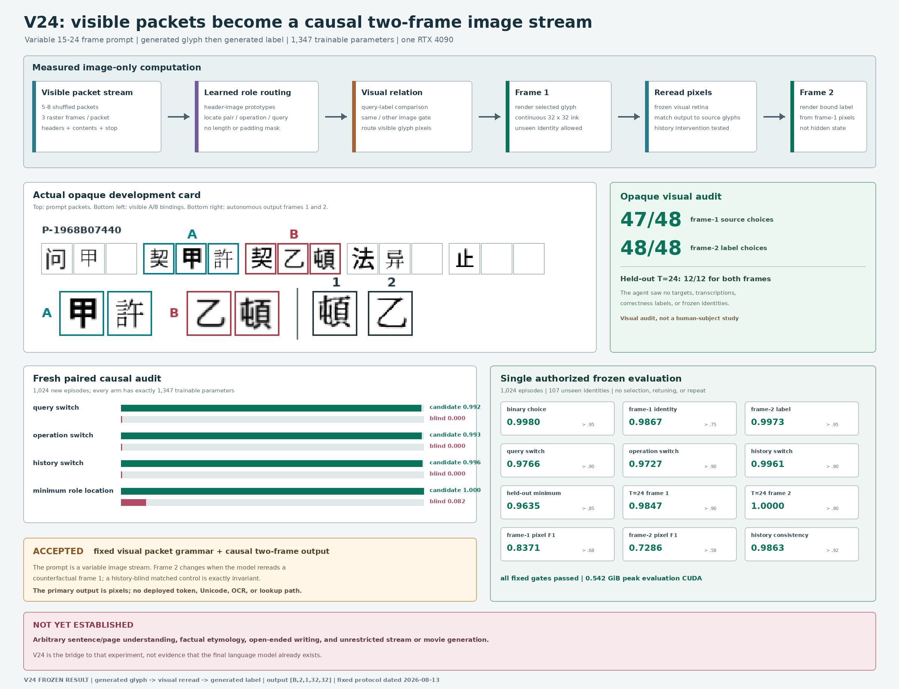

# Visual Packet Reread Stream V24: Frozen Result

Date: 2026-08-13

## Verdict

V24 is **accepted for the fixed visual packet grammar and causal two-frame
image output**.

It is the first experiment in this repository to accept all of the following
in one image-only student:

- a variable-length prompt containing `15`, `18`, `21`, or `24` raster frames;
- role localization from visible packet-header images rather than absolute
  frame positions;
- a generated first answer frame depicting an unseen Chinese identity;
- visual rereading of the actual generated frame-1 pixels;
- a generated second answer frame depicting the visibly bound label; and
- matched interventions showing that query, operation, header, and generated
  history are causally required.

On the single authorized frozen evaluation over `107` previously sealed
Chinese identities, the candidate reaches:

- `0.99805` frame-1 binary-choice accuracy;
- `0.98672` frame-1 identity top-1;
- `0.99727` frame-2 label top-1;
- `0.97656` query-counterfactual switch accuracy;
- `0.97266` operation-counterfactual switch accuracy;
- `0.99609` generated-history switch accuracy;
- `0.96353` minimum switch accuracy on held-out compositions;
- `0.98473` frame-1 identity and `1.00000` frame-2 label accuracy at the
  held-out `T=24` prompt length;
- `0.83714` frame-1 and `0.72860` frame-2 pixel F1; and
- `0.95072` frame-1 and `0.93297` frame-2 frozen-retina target cosine.

Every preregistered frozen gate passes. The frozen evaluator ran once, performed
no model selection, changed no threshold, and was not repeated.

This is a bounded causal result, not open-domain language understanding. Packet
arity, header meanings, the two-pair same/other relation, and the two-frame
answer format remain fixed. V24 does not parse arbitrary sentences, recall
facts, explain etymology, continue a page, or generate an unrestricted stream
or movie. Its accepted claim is narrower: continuous writing images can carry
visible roles and causal generated history through a variable prompt and a
short autoregressive image answer without a deployed token or Unicode channel.

## Fixed Visual Task

The student input and autonomous output are

\[
X\in[0,1]^{B\times T\times1\times32\times32},
\qquad T\in\{15,18,21,24\},
\]

\[
\hat Y\in[0,1]^{B\times2\times1\times32\times32}.
\]

Each consecutive three-frame packet is `[header, content_A, content_B]`:

~~~text
[契, label, glyph]       binding packet, exactly two
[法, 同 or 异, blank]    operation packet, exactly one
[问, label, blank]       query packet, exactly one
[旁, distractor, blank]  distractor packet, zero to three
[止, blank, blank]       end packet, exactly one and last
~~~

All packets before `止` are shuffled. Training uses five through seven packets,
or `T=15,18,21`. Development and frozen evaluation additionally contain the
held-out eight-packet length, `T=24`, with three distractors. Dynamic batching
pads only with zero-image triples. The model receives neither active lengths
nor a padding mask.

There are two visibly bound label/glyph pairs. `同` asks for the glyph bound to
the query label; `异` asks for the other glyph. Frame 1 renders that glyph.
Frame 2 renders the label bound to the glyph that frame 1 actually depicts.
The latter distinction is tested by overriding generated history before the
reread boundary.

Each episode supplies exact image interventions:

1. change only the visible query content;
2. change only the visible operation content;
3. permute complete packets;
4. insert or change only a distractor;
5. substitute a teacher-forced frame 1; and
6. replace frame 1 with the other source glyph before frame-2 rereading.

## Image-Only Student Boundary

The deployed student receives only raster prompt tensors, frozen-retina states
computed from those tensors, routed continuous image fields, generated pixels,
and frozen-retina states computed by rereading generated pixels.

It does not receive strings, token IDs, Unicode IDs, OCR transcripts, character
or operation labels, target indices, role IDs, packet indices, active lengths,
padding masks, a discrete visual codebook, glyph lookup, evaluator scores, or
an external language model. Offline renderer strings and evaluation metadata
are deleted before every student call. The architecture knows only the
within-packet relative offsets `header/content/content`.

The inherited V16 retina, V23 operation reader and comparison temperature, and
V23 visual canonicalizer are frozen. Only `1,347` parameters are trained:

- three `192`-dimensional role prototypes: `576`;
- four `192`-dimensional continuous null states: `768`; and
- three positive role-temperature scalars: `3`.

Every candidate and blind-control arm has exactly the same parameter names,
shapes, and count.

## Visual Computation

For packet `j`, the frozen retina produces normalized states for the header and
two contents, \(H_j,A_j,B_j\). Learned image prototypes locate visible roles:

\[
e_{jr}=\tau_r\langle H_j,p_r\rangle,
\qquad r\in\{\mathrm{pair},\mathrm{operation},\mathrm{query}\}.
\]

Straight-through hard routing selects one operation packet, one query packet,
and two binding packets. Its backward path uses the corresponding softmax.
Header scores never inspect packet contents.

For located query state \(q\), operation state \(o\), pair-label states \(A_j\),
and visible pair-glyph images \(B_j^{\mathrm{image}}\), frame 1 reuses the frozen
V23 visual relation:

\[
m_j=\operatorname{softmax}_{j\in\mathrm{pair}}
\left(\tau_{23}\langle q,A_j\rangle\right),
\]

\[
s=\sigma(U_{23}(o)),\qquad
w_j=s m_j+(1-s)(1-m_j),
\]

\[
x_1=\sum_{j\in\mathrm{pair}}w_jB_j^{\mathrm{image}},
\qquad \hat y_1=C_{23}(x_1).
\]

Frame 2 then rereads the actual generated pixels, rather than a hidden
pre-render state:

\[
r_1=R(\hat y_1),\qquad
b_j=\operatorname{softmax}_{j\in\mathrm{pair}}
\left(\tau_{23}\langle r_1,B_j\rangle\right),
\]

\[
x_2=\sum_{j\in\mathrm{pair}}b_jA_j^{\mathrm{image}},
\qquad \hat y_2=C_{23}(x_2).
\]

All weighted image and state reductions accumulate in FP64. There is no
positional embedding, vocabulary projection, identity embedding, or recurrent
symbolic state.

## Training And Development Selection

Each arm receives exactly `800` AdamW updates in BF16 with episode batch `64`,
eight workers, a `2e-3` peak learning rate, 25-step warmup, cosine decay, and
validation every `100` updates. Training is sequential on one RTX 4090.
Training identities number `829`; development identities number `88`; frozen
identities number `107`.

The packet-aware candidate selected step `100` under the fixed lexicographic
rule and completed all `800` updates. Its checkpoint-selection development
metrics include:

| Candidate development gate | Measured | Required | Result |
|---|---:|---:|:---:|
| Frame-1 binary choice | `0.99935` | `>0.95` | pass |
| Query switch | `0.99023` | `>0.90` | pass |
| Operation switch | `0.99023` | `>0.90` | pass |
| History switch | `1.00000` | `>0.90` | pass |
| Held-out minimum switch | `0.98535` | `>0.85` | pass |
| Frame-1 identity top-1 | `0.99492` | `>0.75` | pass |
| Frame-2 label top-1 | `0.99922` | `>0.95` | pass |
| Frame-1 pixel F1 | `0.83772` | `>0.68` | pass |
| Frame-2 pixel F1 | `0.72692` | `>0.58` | pass |
| Frame-2 history consistency | `0.99414` | `>0.92` | pass |
| Pair / operation / query localization | `1.00000` | `>0.99` | pass |
| Held-out `T=24`, frame 1 / frame 2 | `0.99632 / 1.00000` | each `>0.90` | pass |
| Packet-permutation consistency | `1.00000 / 1.00000` | each `>0.99` | pass |

The five full arms and selected steps are:

| Arm | Selected step | Full-run wall time | Peak allocated CUDA |
|---|---:|---:|---:|
| Packet-aware candidate | `100` | `394.18 s` | `2.32163 GiB` |
| Header-blind | `100` | `342.97 s` | `2.32164 GiB` |
| Query-blind | `200` | `376.29 s` | `2.31716 GiB` |
| Operation-blind | `400` | `279.67 s` after exact resume | `2.31962 GiB` |
| History-blind | `100` | `342.73 s` | `2.16975 GiB` |

The operation-blind job was interrupted by a DataLoader worker failure and
resumed from the exact saved step-100 checkpoint. Its reported `279.67 s`
completion time excludes the discarded pre-resume segment.

## Fresh Paired Controls

The paired audit uses `1,024` newly rendered development episodes at seed
`22260832`, not checkpoint-selection samples. All fixed paired margins pass.

| Fresh paired metric | Candidate | Corresponding blind control |
|---|---:|---:|
| Query switch | `0.99219` | **`0.00000`** query-blind |
| Query output L1 | `0.16766` | **`0.00000`** query-blind |
| Operation switch | `0.99316` | **`0.00000`** operation-blind |
| Operation output L1 | `0.16759` | **`0.00000`** operation-blind |
| Frame-2 history switch | `0.99609` | **`0.00000`** history-blind |
| History output L1 | `0.14214` | **`0.00000`** history-blind |
| Minimum role localization | `1.00000` | `0.08203` header-blind |
| Frame-1 identity top-1 | `0.99609` | `0.34102 / 0.31973 / 0.27402` query / operation / header blind |
| Frame-2 label top-1 | `0.99688` | `0.48730 / 0.37168` history / header blind |
| Held-out minimum switch | `0.98851` | diagnostic controls |
| Packet-permutation consistency | `1.00000 / 1.00000` | structural |
| Distractor consistency | `1.00000 / 1.00000` | structural |

The exact-zero blind-factor outputs are architectural invariants, not rounded
small values. All five arms have `1,347` trainable parameters with matching
names and shapes.

The paired report SHA-256 is
`0b2cb99228539e2655270fbb9ff28ed0dd29ffe95b8d041a26a08a0c82c722e9`.

## Opaque Visual Review

After the paired gate passed, the builder generated `48` opaque development
cards: `36` seen-length and `12` held-out `T=24` cases. Each card contained only
the visible prompt, its two visible A/B bindings, and the candidate's two
generated frames. It contained no target image, transcription, correctness
label, or frozen identity.

A Codex agent inspected only those image pages and committed its A/B choices
before the scoring program opened the sealed key:

| Opaque visual gate | Measured | Required | Result |
|---|---:|---:|:---:|
| Frame-1 source choice | `47/48` | `44/48` | pass |
| Frame-2 label choice | `48/48` | `44/48` | pass |
| Held-out `T=24` frame 1 | `12/12` | `11/12` | pass |
| Held-out `T=24` frame 2 | `12/12` | `11/12` | pass |

This is a blinded agent visual audit, not a human-subject study. Review-result
SHA-256 is
`b1fe4a8b02518cce8ce268ae13f50249ba814ac93fc63496d4dccf7ab9318b29`;
the committed-choice response SHA-256 is
`8ae4b9905cd1ff90c29db735566f3b3d02ab257e8933baa710f5fa5ddf6cec0b`.

## Single Frozen Evaluation

Only after candidate selection, the paired controls, and the opaque review
passed did the evaluator instantiate the `107` frozen identities. It evaluated
`1,024` episodes against four image-bank views (`428` reference images). Every
fixed gate passes:

| Frozen gate | Measured | Required | Result |
|---|---:|---:|:---:|
| Frame-1 binary choice | `0.99805` | `>0.95` | pass |
| Query switch | `0.97656` | `>0.90` | pass |
| Operation switch | `0.97266` | `>0.90` | pass |
| Held-out minimum switch | `0.96353` | `>0.85` | pass |
| Frame-1 identity top-1 | `0.98672` | `>0.75` | pass |
| Frame-1 pixel F1 | `0.83714` | `>0.68` | pass |
| Frame-1 target cosine | `0.95072` | `>0.82` | pass |
| Frame-2 label top-1 | `0.99727` | `>0.95` | pass |
| Frame-2 pixel F1 | `0.72860` | `>0.58` | pass |
| Frame-2 target cosine | `0.93297` | `>0.80` | pass |
| Teacher-forced label agreement | `0.99805` | `>0.95` | pass |
| Generated-history consistency | `0.98633` | `>0.92` | pass |
| History switch | `0.99609` | `>0.90` | pass |
| History output L1 | `0.14381` | `>0.10` | pass |
| Pair / operation / query localization | `1.00000` | `>0.99` | pass |
| Packet-permutation consistency, both frames | `1.00000` | `>0.99` | pass |
| Packet-permutation L1, frame 1 / frame 2 | `5.87e-11 / 7.75e-12` | `<1e-6` | pass |
| Distractor consistency, both frames | `1.00000` | `>0.95` | pass |
| Held-out `T=24`, frame 1 / frame 2 | `0.98473 / 1.00000` | each `>0.90` | pass |
| Image-only boundary | `1.00000` | exact | pass |

The run took `8.13 s` and peaked at `0.54215 GiB` allocated CUDA memory. These
are evaluation-resource measurements, not an end-to-end efficiency comparison
with a language model.

Frozen-report SHA-256 is
`d55203759617ae3e0b306bbfe16fabdfe7180c4a0442db4f85571394da99e57d`.

## What The Result Establishes

Within the fixed task, V24 gives causal operational evidence for four distinct
forms of image-prompt use:

1. visible header images determine where relation-bearing content is found;
2. changing the query image changes which bound identity frame 1 renders;
3. changing the operation image changes the relation and frame-1 answer; and
4. changing the generated frame-1 pixels changes frame 2 after visual rereading.

The blind controls localize those dependencies, while packet permutation and
distractor interventions reject fixed-position and nuisance-content shortcuts.
Generalization covers unseen identities, held-out operation/label
compositions, and a held-out prompt length.

That is a meaningful transition from V23's fixed six-role input and one output
image. It is still not semantic evidence for unconstrained natural language.
An architecture can solve this packet algebra without learning grammar,
world knowledge, discourse, factual grounding, or arbitrary typography.

## Required Next Proof

The next experiment must replace the hand-authored packet algebra with a
learned rendered-language curriculum while preserving the strict image-only
student boundary. A credible next milestone should:

- accept ordinary rendered Chinese prompts and short source passages;
- predict a variable number of image patches or lines with a learned stop
  decision;
- separate visual perception, semantic predictive state, layout/motor output,
  and visual rereading;
- test prompt paraphrase, fact substitution, evidence removal, answer-order,
  and generated-history counterfactuals;
- hold out entire questions, answers, identities, fonts, layouts, and source
  pages;
- compare against retrieval, OCR-plus-text, image-copy, and blind-history
  controls; and
- report both readability and semantic correctness through sealed evaluation.

An answer page or movie is then a longer instance of the same output stream,
not a claim licensed by the present two-frame result.

## Reproduction

The exact five-arm training requires the frozen V16/V23 checkpoints and corpus
manifest already referenced by the defaults:

~~~bash
for arm in packet_aware header_blind query_blind operation_blind history_blind
do
  PYTHONPATH=. python scripts/train_visual_packet_stream_v24.py \
    --route-mode "$arm" \
    --out artifacts/visual_packet_stream_v24_evidence
done
~~~

Then run the fresh paired audit:

~~~bash
PYTHONPATH=. python scripts/eval_visual_packet_stream_development_v24.py
~~~

Prepare a new opaque development pack, record choices without opening its
answer key, and score it:

~~~bash
PYTHONPATH=. python scripts/prepare_visual_packet_opaque_review_v24.py

PYTHONPATH=. python scripts/score_visual_packet_opaque_review_v24.py \
  --receipt artifacts/visual_packet_stream_v24_opaque_review/review_receipt.json \
  --answer-key artifacts/visual_packet_stream_v24_opaque_review/sealed/answer_key.json \
  --responses artifacts/visual_packet_stream_v24_opaque_review/responses.json \
  --out artifacts/visual_packet_stream_v24_opaque_review/review_result.json \
  --reviewer independent-visual-reviewer
~~~

The committed historical frozen result must not be rerun for model development.
The command below documents how it was produced once:

~~~bash
PYTHONPATH=. python scripts/eval_visual_packet_stream_frozen_v24.py
~~~

Regenerate the measured publication figure without evaluating the model:

~~~bash
python publication/ilm-image-native/generate_v24_result_figure.py
~~~

Run verification:

~~~bash
pytest -q
make -C publication
~~~

## Integrity Receipts

### Protocol And Source

| Item | SHA-256 |
|---|---|
| Fixed protocol | `95d2232fa85aebc638fc1eeaa4b32fcea478a339ee8b201ffa8e0259a5a93422` |
| Packet dataset | `c86f42ed4634af1200eeb3efd8faa4d012229304d2f6a8ab013010ab8264b770` |
| Packet model | `195cc4b31c7f09d98112845294bb91e42747d434b538354ff58935774e6870e3` |
| Trainer | `a7e1e22088c73b4c535d562acab75a5bebc15be21c5e52b029b60351d2426139` |
| Paired evaluator | `15fdddff31760bcf8f696ef45ac4d224afa24332335ea6bcfb8130329be1753c` |
| Review builder | `211cb2e4a2b87aeb09ca3bce9689b13e67a7bb23380421b37cd4b20972b94de0` |
| Review scorer | `0b39de54e12c20105709be8090e37c30c3a63b9e7c99c458f5879c6527b96e50` |
| Frozen evaluator | `1a9cfdb966df9f3915702de305ef8c39507849c59d841305354f334b32485b3c` |

### Selected Checkpoints

| Arm | SHA-256 |
|---|---|
| Packet-aware | `4d72f1c52cae43fc1eb712fb941422b186b05fce170acce2bf4091700eda406e` |
| Header-blind | `cfbaa6c5e902caaa4e5ff644e7b82a23c12af15801b3e33f5ac68c24d16fff90` |
| Query-blind | `127681fb4fe2234eff56f9cfe04b787bced95049a361fa4303df874378fea92f` |
| Operation-blind | `e2c9195fc5f507c4db0e1836990ea66b1fd759dd7995e308af2a8228ff32bcb7` |
| History-blind | `d8db004c100e65d2179df4c69701b11ec8335a4975fe490acdbd57d4f9fdb019` |

### Frozen Foundations

| Item | SHA-256 |
|---|---|
| V16 retina checkpoint | `90791001203640f0de66316cf2e30b3e2c588480fef0e3d9d4f6283ba043ecbe` |
| V23 canonicalizer checkpoint | `26cf1bab490abe867e7055a679eff6a9e26e81ad78e6cd9694afd3e425c06135` |
| V23 relation checkpoint | `69c5cb06a5f02b5bed26b8687042534e9481fec96bea6ab41e2e00df7c23df43` |
| Corpus manifest | `76048753b52735d14c98f0d9e4eb8d751401fe8810e82eaaaebff517f6866c03` |
