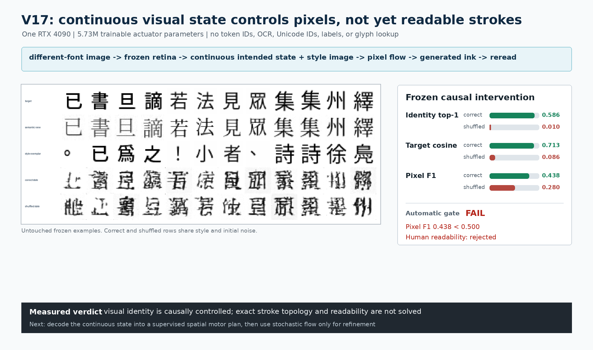

# Visual State Actuator V17: Causal Control Without Readable Topology

Date: 2026-08-12

## Verdict

V17 is an accepted **continuous-state causal-control result** and a rejected
**readable visual actuator**.

A `5,729,921`-parameter actuator learned to turn a continuous image-derived
state and a separate style image into `32x32` ink pixels. On one untouched
frozen split, the generated image rereads as the intended visual form **58.59%**
of the time in a global 512-candidate retrieval, versus **0.98%** when only the
intended state is batch-shuffled while style and initial noise remain fixed.
Mean target cosine is `0.7130` versus `0.0861`, a gain of `+0.6269`.

The model nevertheless fails its preregistered pixel gate: target pixel F1 is
`0.4385`, below `0.5000`. Direct inspection also rejects readability. Generated
marks are state-dependent, glyph-sized pseudo-characters rather than reliable
instances of the intended forms. V17 therefore proves that a lightweight
continuous visual state can causally control generated writing pixels on one
RTX 4090. It does not prove readable writing, next-language generation,
instruction following, etymology answers, or superiority to token models.



## Student Boundary

The trained path is:

```text
different-font image of intended form -> frozen retina -> continuous state --+
                                                                       visual actuator -> ink pixels
previous-form style image -----------> continuous style encoder --------------+
```

The target image is used only as pixel supervision. Its spatial pixels never
enter the condition. The learned student receives no token IDs, Unicode IDs,
OCR, strings, character labels, output vocabulary, visual codebook, candidate
classifier, or external language model. Evaluator candidates and their offline
identity grouping do not enter training or inference.

This is an isolated actuation experiment. The intended state comes from a
different-font image of the target form, not yet from PVF V16's causal next-state
proposal. Consequently, V17 tests whether a continuous visual plan can be
rendered; it is not a test of autonomous language generation.

## Architecture

Let the frozen retina read a semantic reference image as

\[
z=\frac{R(x^{\mathrm{semantic}})}{\lVert R(x^{\mathrm{semantic}})\rVert_2}
\in\mathbb S^{191},
\]

and let a convolutional style encoder produce

\[
s=E_\omega(x^{\mathrm{style}})\in\mathbb R^{64}.
\]

A conditioned U-Net velocity field receives `[z, s]`, current noisy pixels, and
continuous flow time. It integrates an eight-step rectified flow from Gaussian
noise to ink. Unlike an image-copying autoencoder, its spatial condition is a
constant blank plane; only the global continuous state and style vector carry
information about the requested output.

Training combines weighted flow matching, endpoint reconstruction, retinal
cosine, multi-positive retinal contrast, and losses differentiated through a
two-step deployed sampler. The sampled path receives only a weak `0.10` pixel
L1 weight, while retinal identity receives much stronger effective weight. The
frozen result shows that this imbalance permits retina-compatible marks with
incorrect stroke topology.

## Preregistered Selection

Records were partitioned by the first 64 bits of
`SHA-256(record.identifier)`: `6,609` train, `203` development, and `205`
frozen records. The frozen identifier hash is:

```text
33006130985d21841567c1cf37db3b861fe981ac8842deef2e632c5ec571991c
```

Before training, checkpoint selection was fixed to maximize development
`correct_identity_top1` while requiring:

1. correct-state top-1 above shuffled-state top-1;
2. correct target cosine above shuffled target cosine;
3. target cosine gain above `0.02`;
4. correct target cosine above `0.30`; and
5. correct pixel F1 above `0.40`.

| Step | Correct top-1 | Shuffled top-1 | Correct cosine | Cosine gain | Pixel F1 | Eligible |
|---:|---:|---:|---:|---:|---:|:---:|
| 800 | 18.75% | 0.59% | 0.5118 | +0.4439 | 0.3127 | no |
| 1,000 | 35.16% | 0.59% | 0.5994 | +0.5243 | 0.3591 | no |
| 1,200 | 44.92% | 0.59% | 0.6650 | +0.5932 | 0.4056 | yes |
| 1,400 | 55.86% | 0.78% | 0.6897 | +0.6145 | 0.4184 | yes |
| **1,600** | **58.20%** | **1.76%** | **0.7015** | **+0.6287** | **0.4292** | **yes** |

Step 1,600 was selected without instantiating a frozen example. Its checkpoint
SHA-256 is:

```text
7ae4172806e3dc275c7cea5959676d4b318deeb9d9b5ce463f0a80de02fa37aa
```

## Frozen Evaluation

The frozen evaluator instantiated `128` unseen image sequences and selected
four positions from each, producing `512` global retrieval candidates. Correct
and shuffled branches used identical style images and initial noise. The only
intervention was a one-row roll of the intended continuous states.

| Frozen metric | Correct state | Shuffled state | Result |
|---|---:|---:|---|
| Global visual identity top-1 | **58.594%** | 0.977% | strong causal control |
| Target cosine | **0.71301** | 0.08612 | gain `+0.62689` |
| Pixel F1 | **0.43849** | 0.28001 | automatic gate fails |
| Pixel L1 | **0.14407** | 0.18346 | correct state helps |
| Ink fraction | 0.15947 | 0.15967 | occupancy is not the cause |
| Style-copy cosine | 0.05858 | - | output does not copy style exemplar |

Automatic gates pass state dependence, cosine level, cosine gain, and
non-copying. They fail the required `0.50` pixel F1. Human review independently
fails: most correct-state outputs are not readable as their targets. The final
`actuator_accepted` decision is therefore false.

## Compute Receipt

| Property | V17 receipt |
|---|---:|
| Trainable actuator parameters | `5,729,921` |
| Frozen PVF V16 parameters | `16,471,809` |
| Token/classifier parameters | `0` |
| Training updates | `1,600` |
| Logged training time | `339.67 s` |
| Peak allocated CUDA memory | `1.588 GiB` |
| Throughput | about `500-800` selected glyph images/s |
| Device / precision | one RTX 4090 / BF16 |
| Frozen generation throughput | `346.96` images/s including paired control |

## What The Result Breaks

V17 falsifies the categorical claim that a consumer GPU cannot train a compact,
non-token visual state to control generated writing. The shuffled intervention
is important: high retinal scores are not merely a font prior, style copy, or
noise artifact. The intended continuous state changes the generated pixels and
their recovered identity on unseen records.

It does not falsify the harder claim that language prediction is solved by an
image generator. V16 still trails a symbolic bigram, and V17 is given the
intended target state. The combined evidence instead supports a factorization:

```text
visual language dynamics decide what to write
visual motor planning establishes stroke topology
stochastic rendering supplies style and surface variation
```

## V18 Correction

The next actuator should not ask a generic stochastic flow to discover topology
from a global state at every integration step. It should first decode the
continuous state into a deterministic spatial **visual motor plan**, supervise
that plan directly with stroke-weighted BCE and soft Dice, and let a small flow
model only refine style and raster texture. This remains image-native: the plan
is predicted from continuous visual state and style, not retrieved from an ID
table or copied from target pixels.

V18 must be selected on development data using readable topology metrics and a
shuffled-state intervention. The V17 frozen split is now spent and must not be
queried during V18 design or selection; a new frozen receipt is required after
the corrected architecture passes development review.

## Reproduction

The selected run used:

```bash
CUDA_VISIBLE_DEVICES=0 PYTHONPATH=. python scripts/train_visual_state_actuator.py \
  --pvf-checkpoint artifacts/predictive_visual_field_v16_memory_pilot/checkpoint_step_0002200.pt \
  --out artifacts/visual_state_actuator_v17_pilot \
  --maximum-steps 1600 --samples-per-epoch 100000 --development-samples 128 \
  --sequence-length 24 --positions-per-sequence 4 \
  --batch-size 32 --num-workers 8 \
  --style-dim 64 --style-base-channels 32 \
  --flow-base-channels 64 --flow-context-dim 256 \
  --condition-dropout 0.10 \
  --endpoint-weight 0.10 --stroke-weight 2.0 \
  --identity-weight 0.25 --contrastive-weight 0.25 \
  --sampled-identity-weight 0.50 --sampled-pixel-weight 0.10 \
  --sampled-batch-size 16 --sampled-steps 2 \
  --duplicate-similarity 0.90 --logit-scale 12.5 \
  --eval-steps 8 --guidance-scale 1.0 \
  --lr 3e-4 --minimum-lr-ratio 0.10 --warmup-steps 100 \
  --weight-decay 0.03 --gradient-clip 1.0 \
  --log-every 20 --validate-every 200 --validation-batches 4 \
  --save-every 200 --sample-count 8 \
  --precision bf16 --device cuda --seed 20260812
```

The selected checkpoint was evaluated once with:

```bash
CUDA_VISIBLE_DEVICES=0 PYTHONPATH=. python scripts/eval_visual_state_actuator.py \
  --checkpoint artifacts/visual_state_actuator_v17_pilot/checkpoint_step_0001600.pt \
  --out artifacts/visual_state_actuator_v17_frozen_eval \
  --samples 128 --batch-size 32 --num-workers 8 \
  --sample-count 12 --device cuda --precision bf16
```

Training checkpoints and frozen artifacts remain git-ignored. The implementation,
selection rule, hashes, measured figure, and this receipt are tracked.
