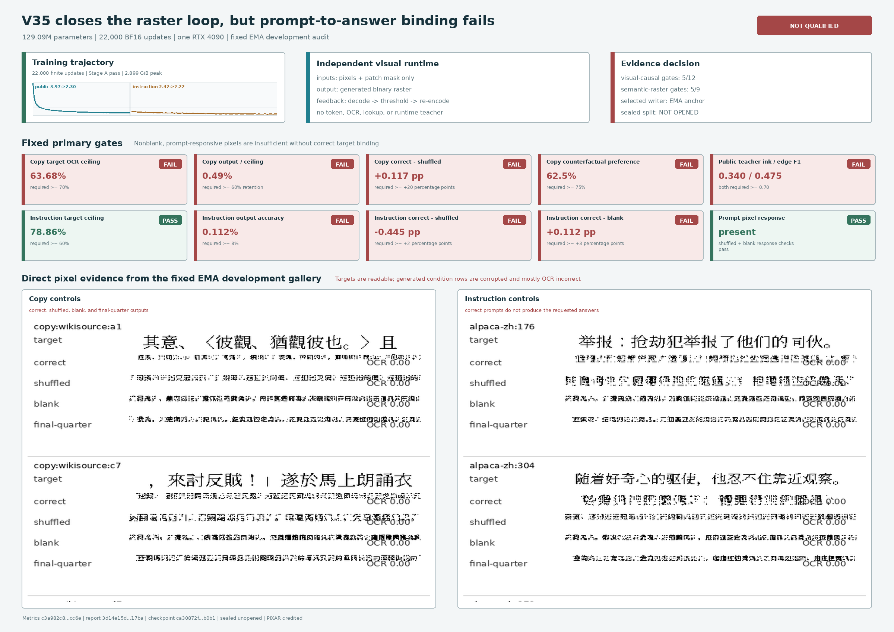
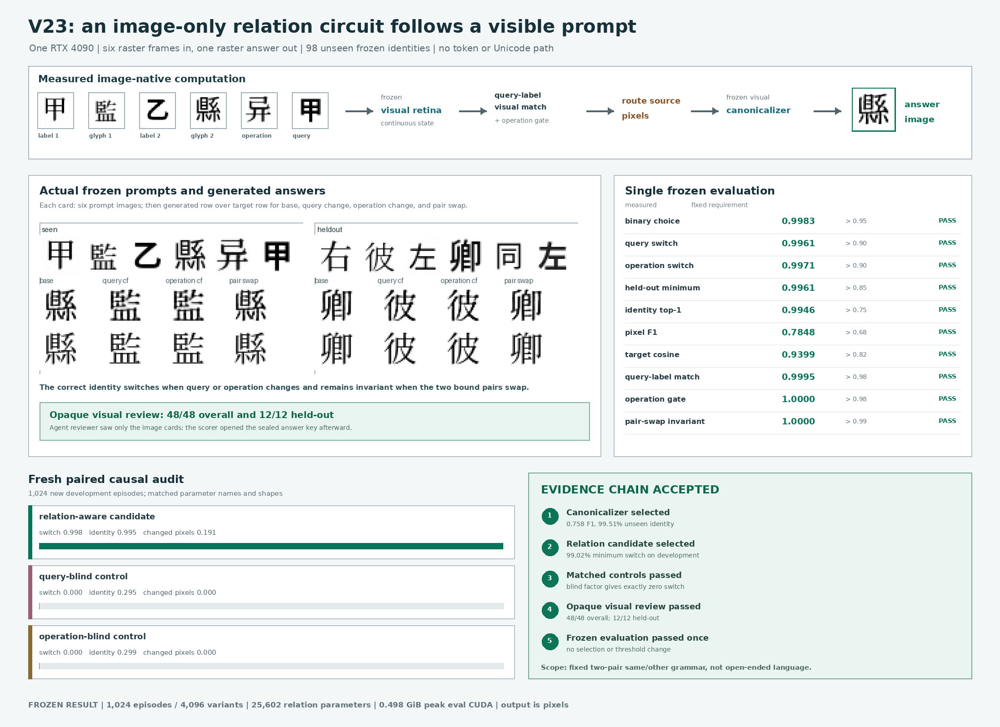
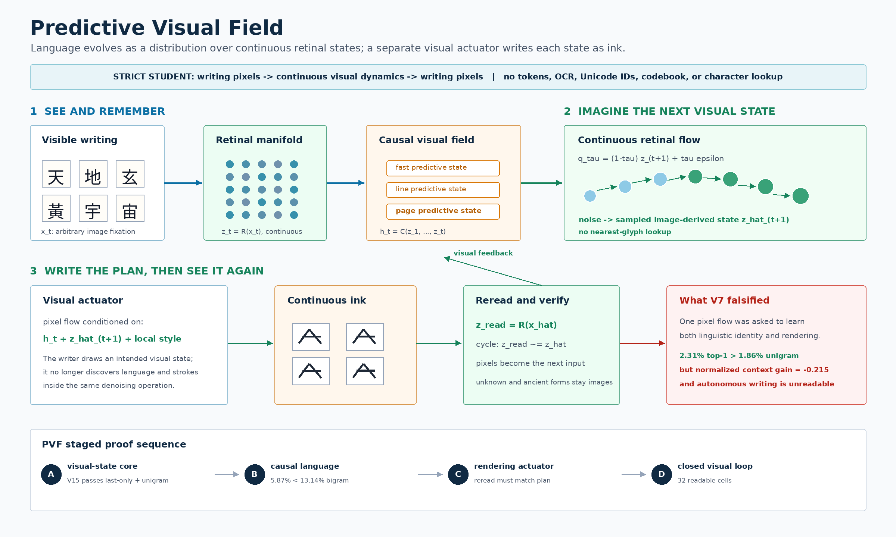

[English](../README.md) · [العربية](README.ar.md) · [Español](README.es.md) · [Français](README.fr.md) · [日本語](README.ja.md) · [한국어](README.ko.md) · [Tiếng Việt](README.vi.md) · [中文 (简体)](README.zh-Hans.md) · [中文（繁體）](README.zh-Hant.md) · [Deutsch](README.de.md) · [Русский](README.ru.md)


[](https://github.com/lachlanchen/lachlanchen/blob/main/figs/banner.png)

# Imagized Language Model (ILM)


ILM은 언어를 **보이는 글쓰기 이미지**로 학습하고 생성합니다. 이미지에서 연속
시각 상태로, 다시 이미지로 이어지는 경로를 연구하며 숨은 기호 채널을 두지 않습니다.

## 현재 증거: V35는 래스터 루프를 닫았지만 의미 결합에는 실패



V35는 `129,092,738`개 파라미터의 중국어 시각 언어 모델입니다. RTX 4090 한 장에서
BF16 업데이트 `22,000`회를 모두 완료했으며, `2.770`시간과 최대 `2.899 GiB`
GPU 메모리를 사용했습니다. 배포 경로는 글쓰기 픽셀과 시각 마스크만 받아 래스터를
직접 생성하고 다시 읽습니다. 실행 중 tokenizer, Unicode/문자 ID, OCR, 검색,
시각 코드북 또는 교사 모델을 사용하지 않습니다.

실측 판정은 **`not-qualified`**입니다. 올바른 프롬프트의 복사 정확도는
`0.3125%`, 지시 정확도는 `0.1116%`이며 지시 정확도는 섞인 프롬프트 대조군보다
낮았습니다. 시각 인과 게이트는 `5/12`, 의미 래스터 게이트는 `5/9`만 통과했습니다.
출력은 비어 있지 않고 프롬프트 변화에 반응하지만 글자 모양이 손상되어 요청한 답과
결합되지 않았습니다. 따라서 봉인된 분할은 열지 않았습니다.

V35는 전이 학습을 사용합니다. V34 연속 글쓰기 코덱은 이 프로젝트의 작업이지만,
인과 코어는 외부 PIXAR 체크포인트로 초기화했습니다. PIXAR는 외부 기반으로 명확히
표기하며 이 프로젝트의 기여로 주장하지 않습니다. 여기서 “독립”은 자체 완결된 배포
산출물을 뜻하며 모든 구성 요소를 처음부터 학습했다는 뜻이 아닙니다. 자세한 내용은
[영문 실측 보고서](../references/causal_glyph_flow_v35_result.md), [구현 안내](../docs/causal-glyph-flow-v35.md),
[논문](../publication/ilm-image-native/ilm-image-native.pdf)을 참조하십시오.

## 이전 제한 프롬프트 실험: V23 시각 관계 회로 통과



V23은 이 저장소에서 전체 증거 절차를 통과한 첫 이미지-프롬프트 입력 및
이미지-답변 출력 실험입니다. 학생 모델은 여섯 장의 `32x32` 글쓰기 이미지만 받고
한 장의 `32x32` 답변 이미지를 출력합니다. 배포 경로에는 문자열, token, Unicode ID,
OCR, 글리프 조회, 답변 인덱스, 외부 언어 모델이 없습니다.

단 한 번 허가된 동결 평가에서 보지 못한 한자 98자, 1,024개 에피소드, 4,096개 프롬프트
변형에 대해 이진 선택 `0.99829`, 질의 전환 `0.99609`, 연산 전환 `0.99707`, 출력
글리프 top-1 `0.99463`, pixel F1 `0.78478`을 얻었습니다. 질의 맹검 및 연산 맹검
대조군은 각자 볼 수 없는 요인에 대해 정확히 전환 0을 유지합니다.

이 결과는 고정된 여섯 역할, 두 쌍의 결합, same/other 관계에 한정된 시각 프롬프트
추종을 입증하며 자유 형식 언어 이해를 뜻하지 않습니다. V24는 고정 프레임 역할을 없애고
가변 길이 2D 글쓰기 이미지 스트림을 읽은 뒤 첫 출력을 다시 읽어 두 번째 프레임을
생성합니다. 전체 증거는 [영문 V23 결과 기록](../docs/visual-relation-circuit-v23-result.md)에 있습니다.

## 이전 연구 기준: Predictive Visual Field의 출발점



RFLM V7은 하나의 픽셀 흐름이 언어적 정체성을 추론하면서 획까지 동시에 그리도록 한
구조의 한계를 보였습니다. 전체 문맥 top-1은 `1.20%`에서 `2.31%`로 올라
last-only (`2.02%`)와 unigram (`1.86%`)을 넘었지만 bigram (`13.58%`)에는
크게 못 미쳤습니다. 정규화 로그확률 이득도 `-0.9066`에서 `-0.2155`로
개선됐지만 여전히 음수이고 자율 출력은 읽을 수 없습니다. 따라서 **V7은 언어
모델로서 불합격**입니다.

다음 PVF는 다음 망막 상태를 예측하는 연속 흐름과 그 상태를 잉크로 렌더링한 뒤
다시 읽는 시각 액추에이터를 분리합니다. 최근접 문자 검색이나 출력 테이블은 없습니다.
경계는 `글쓰기 픽셀 -> 연속 시각 동역학 -> 잉크 픽셀`이며 token, Unicode ID,
OCR, 시각 코드북, 외부 언어 모델을 받지 않습니다. PVF는 검증 가능한 V8 가설이지
입증된 능력이 아닙니다.

> 저장소는 실용적인 어원 파이프라인과 장기 ILM 실험을 나란히 유지합니다.

## 📌 개요

이 저장소에는 세 개의 연결된 트랙이 있습니다.

1. Retinal Flow 이미지 네이티브 언어 모델링과 엄격한 외부 평가.
2. 출처를 보존하는 역사적 중국어 글리프 어원 수집.
3. 재현성을 위해 보존한 이전 글리프, 코드북, 확산, folio, InkStream 기준선.

이 README는 세 트랙을 문서화하며 어원 워크플로를 재현 가능한 핵심 경로로 유지합니다.

## 🔗 주요 링크

| 영역 | 경로 |
|---|---|
| 개념 정리 문서 | `docs/imagized-language-model.md` |
| 현재 엔지니어링 목표 | `docs/first-imagized-language-model-goal.md` |
| 연구 자료와 실험 근거 | `references/image-native-language-model-research.md` |
| 코드 계획 및 지표 | `docs/ilm-visual-diffusion-code-plan.md` |
| 임베딩 "색상" 계획 | `docs/embedding-color-plan.md` |
| 개발 노트/계획 | `docs/development-plan.md` |
| 어원 모듈 README | `ilm/etymology/README.md` |

## ✨ 기능

- 🏺 `hanziyuan` 및 `chineseetymology` 계열 소스에서 어원 수집.
- 🌐 재시도, 속도 제한, 캐시가 포함된 강건한 AJAX + HTML 수집 경로.
- 🧩 `` 및 CSS `background-image` data URI를 포함한 단계 라벨 글리프 추출.
- 🗃️ 문자/글리프 메타데이터 및 파일 시스템 자산 배치를 위한 SQLite 기반 저장소.
- 🖥️ 임시 수집 + 갤러리 미리보기를 위한 Tornado 웹 UI.
- 🔤 다국어 토큰 이미지용 글리프 렌더링 유틸리티.
- 🧠 제품 코드 스타일 임베딩/코드북 모듈.
- 🧱 문장 프레임 패킹 및 확산/인페인팅 학습·평가 스크립트.
- 📊 임베딩 및 파이프라인 점검용 리포팅/시각화 스크립트.
- 📄 `publication/` 아래 LaTeX/PDF 출판물 아티팩트.

## 🧱 프로젝트 구조

```text
.
├── README.md
├── AGENTS.md
├── configs/
│   ├── color.yaml
│   └── diffusion.yaml
├── docs/
├── i18n/
├── ilm/
│   ├── code/
│   ├── data/
│   ├── datasets/
│   ├── db/
│   ├── diffusion/
│   ├── encoders/
│   ├── english_tiles/
│   ├── etymology/
│   ├── frames/
│   ├── models/
│   └── utils/
├── scripts/
├── publication/
├── assets/
├── logs/
└── *.ipynb
```

## 🧰 필수 조건

| 요구 사항 | 참고 |
|---|---|
| Python `3.10+` | 핵심 런타임 |
| `pip` | 패키지 설치 |
| 선택적 GPU | PyTorch CUDA 학습 스크립트에 유용 |
| 선택적 LaTeX 툴체인 | 출판물 빌드에 필요 |

가정 메모: 현재 루트에 단일한 의존성 잠금/명세 파일(`pyproject.toml`, `requirements.txt` 등)이 없으므로, 의존성은 import와 스크립트 사용 방식에서 추론됩니다.

## ⚙️ 설치

### 최소(어원 툴킷)

```bash
python -m venv .venv
source .venv/bin/activate
pip install --upgrade pip
pip install requests beautifulsoup4 tornado
```

### 확장(모델링/학습 워크플로우)

```bash
python -m venv .venv
source .venv/bin/activate
pip install --upgrade pip
pip install requests beautifulsoup4 tornado pyyaml numpy pillow matplotlib torch
```

특정 스크립트가 추가 패키지를 필요로 한다면 해당 스크립트에서 발생한 import 에러를 보고 설치하세요.

## 🚀 사용법

### 빠른 시작: 역사적 글리프 수집(CLI)

1. Hanziyuan(권장): 문자 전용 AJAX 흐름

```bash
PYTHONPATH=. python scripts/ingest_etymology.py --site hanziyuan --char 中
```

2. ChineseEtymology(직접 URL)

```bash
PYTHONPATH=. python scripts/ingest_etymology.py --site chineseetymology --url "https://www.chineseetymology.org/CharacterEtymology.aspx?characterInput=%E4%B8%AD"
```

3. 배치 파일 수집(행 형식: `char\turl`, `url`, `char url`)

```bash
PYTHONPATH=. python scripts/ingest_etymology.py --from-file urls.txt
```

### 출력

| 출력 유형 | 위치 |
|---|---|
| 파일 | `data/historic/glyphs/<char>/<stage>/<label>.<ext>` |
| 캐시 | `data/historic/cache/*.html` |
| DB | `data/historic/etymology.sqlite3` |

### 웹 데모(선택)

```bash
PYTHONPATH=. python scripts/serve_etymology.py
```

`http://127.0.0.1:8888`을 열고 사이트를 선택한 뒤, 문자(예: `中`)를 입력합니다.

### 예의 있는 크롤링과 사이트 존중

- 페처는 호스트별 속도 제한, 지수 백오프 재시도, 캐시를 사용합니다.
- 지연을 `>= 0.5s`로 유지하고 요청 폭주를 피하며, 사이트 약관/robots/라이선스를 준수하세요.
- paywall나 인터랙티브 방어를 우회하지 마세요.
- `403`/`429`가 나타나면 속도를 늦추고 나중에 다시 시도하세요.

### 추가 ILM 워크플로우

아래 스크립트는 저장소에 존재하며 실무적으로 활용되고 있지만, 연구 워크플로우이므로 준비된 로컬 데이터셋/체크포인트가 필요할 수 있습니다.

1. 데이터 다운로드/준비

```bash
python scripts/download_alpaca.py --outdir data/raw
python scripts/download_corpora.py --out data/raw
python scripts/sample_paragraphs.py --out data/processed/test_100.jsonl
python scripts/build_images_common_freq.py --out data/processed/images_common_freq --size 128 --en 5000 --zh 5000
```

2. Glyph DB 라이프사이클

```bash
python scripts/glyphdb_init.py --db data/glyphdb/glyphs.sqlite3
python scripts/glyphdb_ingest_index.py --db data/glyphdb/glyphs.sqlite3 --index data/processed/images_common_freq/index.tsv
```

3. 코드/색상 모델 학습

```bash
python scripts/train_color_codes.py --config configs/color.yaml
python scripts/train_codes_from_qa.py --en-json data/raw/alpaca_en.json --zh-json data/raw/alpaca_zh.json --epochs 1
python scripts/train_ilmglyph_codes.py --en data/raw/alpaca_en.json --zh data/raw/alpaca_zh.json --out artifacts/ilm_glyph_train
```

4. 확산/인페인팅

```bash
python scripts/train_diffusion.py --config configs/diffusion.yaml
python scripts/train_inpaint_frames.py --ckpt-code artifacts/ilm_glyph_train/ckpt_epoch1.pt --out artifacts/inpaint
```

5. 평가/리포팅

```bash
python scripts/eval_color_codes.py --checkpoint artifacts/color_codes_e1.pt
python scripts/eval_diffusion.py --checkpoint artifacts/diffusion_unet.pt
python scripts/eval_qa_retrieval.py --checkpoint artifacts/color_codes_qa.pt
python scripts/report_ilmglyph_pipeline.py --ckpt artifacts/ilm_glyph_train/ckpt_epoch1.pt --lang en --text "hello world"
```

## 🧩 설정

주요 YAML 구성:

- `configs/color.yaml`
  - 데이터 경로: `data/processed/images_common_freq/index.tsv`
  - 모델/코드 파라미터: `d_glyph`, `d_code`, `K`, `C`, temperature/anneal
  - optimizer/log 설정

- `configs/diffusion.yaml`
  - 입력 JSONL: `data/processed/test_100.jsonl`
  - 프레임/그리드 + 모델 크기 설정
  - 학습 마스크 비율 범위 및 체크포인트 설정

지원되는 경우 CLI 플래그(`--epochs`, `--batch-size`, `--lr` 등)로 설정을 덮어쓸 수 있습니다.

## 🧪 예시

- 단일 영어 타일 글리프 생성:

```bash
python scripts/build_english_tile_glyph.py "language" artifacts/language_tile --save-tensor
```

- 학습된 체크포인트로 인페인팅 데모 실행:

```bash
python scripts/inpaint_demo.py \
  --ckpt-code artifacts/ilm_glyph_train/ckpt_epoch1.pt \
  --ckpt-inpaint artifacts/inpaint/ckpt_epoch1.pt \
  --lang en \
  --text "the quick brown fox jumps" \
  --mode infill \
  --out artifacts/inpaint_demo
```

- Hanziyuan에서 공통 문자 대량 수집:

```bash
PYTHONPATH=. python scripts/bulk_ingest_hanziyuan.py --limit 200 --resume
```

## 📝 개발 노트

- 이 저장소는 탄탄한 CLI와 탐색적 산출물(노트북 및 프로토타입 스크립트 포함)을 함께 다루는 연구 저장소입니다.
- 대용량 산출물은 `data/` 및 `artifacts/`에 두는 것을 전제로 하며(두 위치 모두 `.gitignore`에 포함).
- 출판 소스와 PDF는 `publication/` 아래 있고, 보조 빌드 스크립트는 `scripts/latex_build.sh`입니다.
- 협업/프로세스 규범은 `AGENTS.md`에 문서화되어 있습니다.

## 🛠️ 문제 해결

- `ModuleNotFoundError: ilm...`
  - 저장소 루트에서 스크립트를 실행하세요.
  - 로컬 패키지 해석이 필요한 스크립트는 `PYTHONPATH=.`를 사용하세요.

- 데이터/인덱스/체크포인트에 대한 `FileNotFoundError`
  - 먼저 필수 데이터/빌드 스크립트를 실행하세요.
  - `data/processed/images_common_freq/index.tsv`, `data/processed/test_100.jsonl`과 같은 기본 경로가 존재하는지 확인하세요.

- CUDA/디바이스 이슈
  - 스크립트 플래그나 설정(`device: cpu` 또는 `--device cpu`)으로 CPU로 전환하세요.

- 패키지 누락 에러
  - 특정 스크립트에서 요구하는 의존성(`torch`, `pyyaml`, `Pillow` 등)을 해당 스크립트의 import 경로에 맞춰 설치하세요.

- 스크래핑 중 HTTP `403` / `429`
  - `--delay`를 늘리고 나중에 재시도하며 예의 바른 요청 속도를 유지하세요.

## 🗺️ 로드맵

- 어원 중심 빠른 시작을 넘어 텍스트-이미지 ILM 학습/평가 런북을 계속 고도화합니다.
- 환경 재현성 개선(단일 권위 의존성 명세).
- 연구 스크립트와 파이프라인 연결부에 대한 테스트/CI 범위 확대.
- 계층형 코드북, 확산 목적 함수, 제어 채널을 반복 개선.
- `docs/`, 스크립트 도움말, 출판 아티팩트를 가로질러 문서 일관성 통합.

깊은 개념 및 단계적 계획은 아래를 참조하세요.

- `docs/imagized-language-model.md`
- `docs/ilm-visual-diffusion-code-plan.md`
- `docs/development-plan.md`

## 🤝 Contributing

- `AGENTS.md`의 규칙을 따르세요 (`원자적 커밋`, 변경 후 `push`, 코드 내 자격 증명 금지).
- 관련 있는 변경은 주제별로 묶어 컨벤셔널 메시지로 커밋하세요.
- 재현 가능한 스크립트 실행은 명시적인 플래그/입력 경로를 우선하세요.
- 스크래핑 관련 변경에서는 스로틀링/캐시 동작과 사이트 존중 규칙을 유지하세요.

## ❤️ Support

| Donate | PayPal | Stripe |
| --- | --- | --- |
| [](https://chat.lazying.art/donate) | [](https://paypal.me/RongzhouChen) | [](https://buy.stripe.com/aFadR8gIaflgfQV6T4fw400) |

## 📄 License

현재 이 저장소에는 최상위 라이선스 파일이 없습니다.

가정 메모: 관리자가 `LICENSE` 파일을 추가할 때까지, 이 프로젝트는 라이선스가 미정된 연구 코드로 취급하세요.
